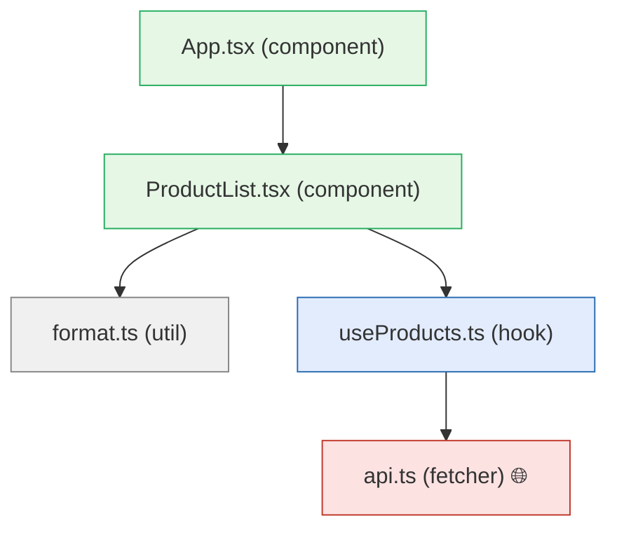

# Mock Maker

Real apps are multi-module and networked — a component can't be tested without faking its **input boundary** (network, dependency modules, props, time). The mock maker synthesizes that boundary deterministically, hands it to the model, and (M4) chains each module's captured output into the next module's input.

## Pipeline (`src/mock/`)

```
buildGraph(dir)            import graph of src/, classify nodes, topo-order
   ↓                       (fetcher / hook / component / util)
synthForModule(node)       per module: detect network calls, dep imports, props
   ↓                       → HandlerSpec[] (+ sample data), depMocks, props
buildMockPlan(dir)         dedupe handlers across the app → MockPlan + digest
   ↓
writeMocks(dir, handlers)  src/mocks/handlers.ts (MSW) + server.ts
                           + patch vitest.setup.ts to start the server GLOBALLY
```

## Data sources (priority)
1. **OpenAPI/JSON schema** — if `data/openapi.json` (or `openapi.filtered.json`) exists, responses are sampled from the matched path's schema (`sampleSchema`, ported from qaforge analyzer). URL templates `${id}` → `:id` match OpenAPI `{id}`.
2. **TS types** — prop interfaces become fixture hints; return types shape fallbacks.
3. **Recorded traffic** — (future) replay captured requests.
4. **LLM** — the model fills realistic + edge values; it writes the spec, we hand it real handlers.

## What gets mocked (all four boundaries)
- **Network** → MSW handlers, started globally in `vitest.setup.ts` with `onUnhandledRequest: 'error'` (un-mocked calls throw — runtime hermeticity). Per-test overrides via `server.use(...)`.
- **Dependency modules** → `vi.mock` targets (a hook/fetcher a component imports).
- **Props** → typed fixtures from the component's `*Props` interface.
- **Time/random** → fake timers / seeds (enforced by `hermetic_gate`).

## Loop integration
- `mock_inject` rune injects the plan digest + the "server is global, use findBy / server.use" policy.
- [`hermetic_gate`](Runes-and-Gates.md) rejects any spec that bypasses the mocks (real URL, un-mocked fetch, uncontrolled clock).
- CLI: `probevane mock <dir>` (synthesize only) or `generate --mock` (default for unit; synthesize → gated, hermetic generation).

## Proof (M3)
On `react-shop` (api → useProducts → ProductList → App; real fetch; OpenAPI schema): synthesized 2 handlers from schema, wired global MSW, model wrote **31 hermetic tests** driving success/loading/error paths via `server.use` overrides — **flake 0** over 3 runs, **90.81% coverage**, **zero real backend**.

## The module graph

`probevane graph <dir>` renders the dependency graph the mock maker walks — an ASCII tree in the terminal and a Mermaid diagram (`--mermaid <file>`) for the wiki/GitHub. Nodes are classified (🌐 fetcher · 🪝 hook · 🧩 component · ⚙️ util) and network-touching modules are flagged.

`react-shop`:

```
🧩 App.tsx
└─ 🧩 ProductList.tsx
   ├─ 🪝 useProducts.ts
   │  └─ 🌐 api.ts 🌐net
   └─ ⚙️ format.ts
```



The leaf-first topological order of this graph is exactly the chaining order: `api` → `useProducts`/`format` → `ProductList` → `App`.

## Chaining (M4)
The topological order lets an upstream module's captured **output contract** become the downstream module's **input fixture** — see [Phase Log](Phase-Log.md) M4.
