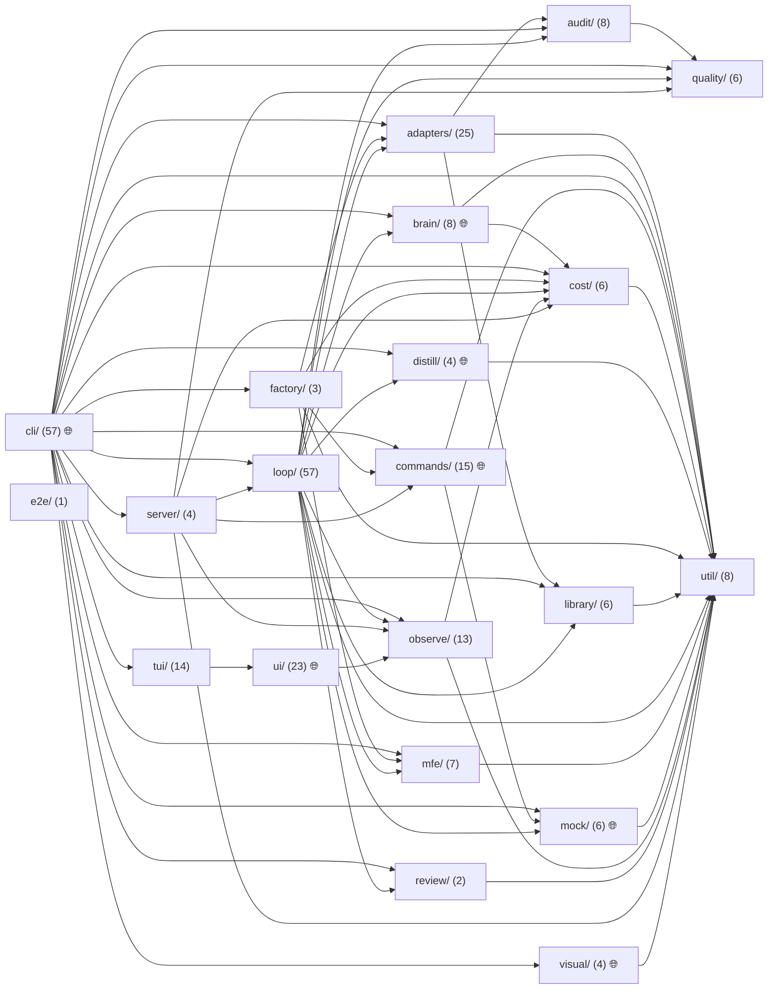

# probevane — Specification

_Generated by probevane (node-vitest) on 2026-07-05._

## Overview

- 277 modules (246 util, 11 fetcher, 20 component); 11 touch the network
- 9 network endpoint(s)
- test coverage: 96.04% statements, 91.18% branches

## Module graph

```
⚙️ adapters/adapter.ts
⚙️ brain/brain.ts
⚙️ cli/a11y.ts
├─ ⚙️ audit/core.ts ⇗ shared
└─ ⚙️ audit/a11y-rules.ts
⚙️ cli/ado.ts
├─ ⚙️ commands/ado/ado.ts
└─ ⚙️ cli/args.ts ⇗ shared
⚙️ cli/arch.ts
├─ 🌐 commands/arch/critique.ts 🌐net
│  ├─ ⚙️ mock/graph.ts ⇗ shared
│  ├─ ⚙️ mock/render.ts
│  └─ ⚙️ commands/arch/metrics.ts
└─ ⚙️ cli/args.ts ⇗ shared
⚙️ cli/assert-score.ts
├─ ⚙️ adapters/registry.ts ⇗ shared
└─ ⚙️ audit/assertion-score.ts
⚙️ cli/audit.ts
├─ ⚙️ adapters/registry.ts ⇗ shared
└─ ⚙️ audit/core.ts ⇗ shared
⚙️ cli/bench.ts
├─ ⚙️ adapters/registry.ts ⇗ shared
├─ ⚙️ loop/passk.ts
│  └─ ⚙️ audit/core.ts ⇗ shared
├─ ⚙️ loop/mutation.ts
│  ├─ ⚙️ mock/graph.ts ⇗ shared
│  ├─ ⚙️ quality/analyze-detect.ts
│  └─ ⚙️ loop/mutants.ts
└─ ⚙️ cli/args.ts ⇗ shared
⚙️ cli/ci.ts
├─ ⚙️ adapters/registry.ts ⇗ shared
├─ ⚙️ loop/triage.ts
├─ ⚙️ cost/simulate.ts
├─ ⚙️ util/config.ts ⇗ shared
├─ ⚙️ util/git.ts ⇗ shared
├─ ⚙️ review/diff-review.ts
│  ├─ ⚙️ util/exec.ts ⇗ shared
│  └─ ⚙️ util/json.ts
├─ ⚙️ review/verify.ts
│  └─ ⚙️ util/json.ts ↺
├─ ⚙️ brain/select.ts ⇗ shared
├─ ⚙️ util/exec.ts ⇗ shared
└─ ⚙️ cli/args.ts ⇗ shared
⚙️ cli/coverage.ts
└─ ⚙️ adapters/registry.ts ⇗ shared
🌐 cli/daemon.ts 🌐net
├─ ⚙️ util/state.ts ⇗ shared
├─ ⚙️ cost/ledger.ts ⇗ shared
├─ ⚙️ util/jsonl.ts ⇗ shared
├─ ⚙️ observe/aggregate.ts
│  └─ ⚙️ cost/ledger.ts ⇗ shared
├─ ⚙️ observe/alerts.ts
├─ ⚙️ observe/notify.ts
├─ ⚙️ server/daemon-control.ts
│  ├─ ⚙️ util/jsonl.ts ⇗ shared
│  ├─ ⚙️ observe/quarantine.ts
│  ├─ ⚙️ observe/jobs.ts
│  │  └─ ⚙️ observe/queue.ts
│  ├─ ⚙️ observe/queue.ts ↺
│  ├─ ⚙️ observe/launch.ts
│  ├─ ⚙️ cost/budget.ts
│  ├─ ⚙️ commands/ship/ship.ts
│  │  ├─ ⚙️ util/git.ts ⇗ shared
│  │  └─ ⚙️ commands/ship/pr.ts
│  └─ ⚙️ loop/observe.ts
├─ ⚙️ server/daemon-routes.ts
│  ├─ ⚙️ observe/aggregate.ts ↺
│  ├─ ⚙️ observe/alerts.ts ↺
│  ├─ ⚙️ observe/audit.ts
│  │  ├─ ⚙️ util/state.ts ⇗ shared
│  │  └─ ⚙️ util/jsonl.ts ⇗ shared
│  ├─ ⚙️ observe/otel.ts
│  │  └─ ⚙️ cost/ledger.ts ⇗ shared
│  ├─ ⚙️ observe/queue.ts ↺
│  ├─ ⚙️ observe/projects.ts
│  ├─ ⚙️ observe/run-detail.ts
│  ├─ ⚙️ loop/events.ts
│  ├─ ⚙️ loop/transcript.ts
│  ├─ ⚙️ quality/scan.ts
│  │  └─ ⚙️ quality/analyze.ts
│  │     ├─ ⚙️ quality/analyze-detect.ts ↺
│  │     └─ ⚙️ quality/analyze-violations.ts
│  ├─ ⚙️ server/daemon-control.ts ↺
│  └─ ⚙️ server/terminal-routes.ts
│     ├─ ⚙️ server/daemon-control.ts ↺
│     └─ ⚙️ server/terminal.ts
│        └─ ⚙️ loop/observe.ts ↺
├─ ⚙️ server/terminal.ts ↺
├─ ⚙️ server/terminal-routes.ts ↺
└─ ⚙️ cli/args.ts ⇗ shared
⚙️ cli/design.ts
├─ ⚙️ visual/design.ts
│  ├─ 🌐 visual/vision.ts 🌐net
│  └─ ⚙️ visual/improve.ts
│     ├─ ⚙️ visual/capture.ts
│     ├─ 🌐 visual/vision.ts 🌐net ↺
│     └─ ⚙️ util/exec.ts ⇗ shared
└─ ⚙️ cli/args.ts ⇗ shared
⚙️ cli/distill.ts
├─ ⚙️ distill/collect.ts
│  ├─ ⚙️ util/state.ts ⇗ shared
│  └─ ⚙️ util/jsonl.ts ⇗ shared
├─ ⚙️ distill/dataset.ts
├─ 🌐 distill/bases.ts 🌐net
├─ ⚙️ adapters/registry.ts ⇗ shared
├─ ⚙️ util/git.ts ⇗ shared
└─ ⚙️ loop/passk.ts ↺
⚙️ cli/docs.ts
├─ ⚙️ util/config.ts ⇗ shared
├─ ⚙️ loop/run-docs.ts
│  ├─ ⚙️ brain/select.ts ⇗ shared
│  ├─ ⚙️ loop/complexity.ts
│  │  ├─ ⚙️ mock/graph.ts ⇗ shared
│  │  └─ ⚙️ brain/select.ts ⇗ shared
│  ├─ ⚙️ loop/engine.ts
│  │  ├─ ⚙️ loop/ctx.ts
│  │  ├─ ⚙️ util/git.ts ⇗ shared
│  │  ├─ ⚙️ cost/ledger.ts ⇗ shared
│  │  ├─ ⚙️ loop/engine-phases.ts
│  │  │  ├─ ⚙️ loop/ctx.ts ↺
│  │  │  ├─ ⚙️ loop/rune.ts ⇗ shared
│  │  │  ├─ ⚙️ loop/tools.ts
│  │  │  ├─ ⚙️ util/exec.ts ⇗ shared
│  │  │  ├─ ⚙️ loop/events.ts ↺
│  │  │  ├─ ⚙️ loop/transcript.ts ↺
│  │  │  ├─ ⚙️ loop/engine-prompts.ts
│  │  │  └─ ⚙️ loop/extract.ts
│  │  ├─ ⚙️ loop/transcript.ts ↺
│  │  └─ ⚙️ loop/engine-escalation.ts
│  │     ├─ ⚙️ loop/tools.ts ↺
│  │     ├─ ⚙️ loop/difficulty.ts
│  │     └─ ⚙️ loop/engine-phases.ts ↺
│  ├─ ⚙️ adapters/null-adapter.ts
│  ├─ ⚙️ loop/digest.ts
│  ├─ ⚙️ loop/runes/plan_first.ts
│  │  ├─ ⚙️ loop/rune.ts ⇗ shared
│  │  └─ ⚙️ loop/tools.ts ↺
│  ├─ ⚙️ loop/runes/session_diary.ts
│  ├─ ⚙️ loop/runes/caveat_harvest.ts
│  │  └─ ⚙️ library/caveats.ts
│  │     └─ ⚙️ library/store.ts
│  │        ├─ ⚙️ util/state.ts ⇗ shared
│  │        └─ ⚙️ util/jsonl.ts ⇗ shared
│  └─ ⚙️ loop/runes/docs.ts
│     ├─ ⚙️ loop/rune.ts ⇗ shared
│     └─ ⚙️ loop/tools.ts ↺
└─ ⚙️ cli/args.ts ⇗ shared
⚙️ cli/doctor.ts
├─ ⚙️ commands/doctor/checks.ts
│  ├─ ⚙️ util/exec.ts ⇗ shared
│  ├─ ⚙️ commands/doctor/shared.ts
│  └─ ⚙️ commands/doctor/lanes.ts
│     ├─ ⚙️ util/exec.ts ⇗ shared
│     └─ ⚙️ commands/doctor/shared.ts ↺
├─ ⚙️ adapters/registry.ts ⇗ shared
└─ ⚙️ cli/args.ts ⇗ shared
⚙️ cli/document.ts
├─ ⚙️ cli/path-cli.ts
│  ├─ ⚙️ adapters/registry.ts ⇗ shared
│  ├─ ⚙️ cli/args.ts ⇗ shared
│  ├─ ⚙️ util/config.ts ⇗ shared
│  └─ ⚙️ loop/run-path.ts
│     ├─ ⚙️ brain/select.ts ⇗ shared
│     ├─ ⚙️ loop/complexity.ts ↺
│     ├─ ⚙️ loop/profiles.ts
│     │  └─ ⚙️ loop/runes/index.ts
│     ├─ ⚙️ loop/engine.ts ↺
│     ├─ ⚙️ mock/graph.ts ⇗ shared
│     ├─ ⚙️ loop/scout.ts
│     ├─ ⚙️ loop/dep-digest.ts
│     │  ├─ ⚙️ loop/tools.ts ↺
│     │  └─ ⚙️ adapters/ast-probe.ts
│     ├─ ⚙️ loop/worktree.ts
│     │  ├─ ⚙️ util/git.ts ⇗ shared
│     │  └─ ⚙️ review/diff-review.ts ↺
│     └─ ⚙️ review/diff-review.ts ↺
└─ ⚙️ cli/args.ts ⇗ shared
⚙️ cli/enqueue.ts
├─ ⚙️ util/state.ts ⇗ shared
├─ ⚙️ util/jsonl.ts ⇗ shared
├─ ⚙️ observe/jobs.ts ↺
└─ ⚙️ observe/launch.ts ↺
⚙️ cli/eval.ts
├─ ⚙️ adapters/registry.ts ⇗ shared
├─ ⚙️ library/improvement-log.ts
└─ ⚙️ cli/args.ts ⇗ shared
⚙️ cli/factory.ts
├─ ⚙️ util/state.ts ⇗ shared
├─ ⚙️ util/config.ts ⇗ shared
├─ ⚙️ factory/run.ts
│  ├─ ⚙️ cost/ledger.ts ⇗ shared
│  ├─ ⚙️ adapters/registry.ts ⇗ shared
│  ├─ ⚙️ util/git.ts ⇗ shared
│  ├─ ⚙️ commands/ship/ship.ts ↺
│  ├─ ⚙️ util/concurrent.ts
│  ├─ ⚙️ factory/report.ts
│  ├─ ⚙️ mfe/scan.ts
│  │  ├─ ⚙️ mfe/federation.ts
│  │  └─ ⚙️ mfe/standards.ts
│  └─ ⚙️ mfe/standards.ts ↺
├─ ⚙️ factory/report.ts ↺
└─ ⚙️ factory/matrix.ts
   └─ ⚙️ factory/report.ts ↺
⚙️ cli/feature.ts
├─ ⚙️ cli/path-cli.ts ↺
└─ ⚙️ cli/args.ts ⇗ shared
⚙️ cli/fix.ts
├─ ⚙️ cli/path-cli.ts ↺
└─ ⚙️ cli/args.ts ⇗ shared
⚙️ cli/generate.ts
├─ ⚙️ adapters/registry.ts ⇗ shared
├─ ⚙️ loop/triage.ts ↺
├─ ⚙️ loop/draft-local.ts
│  ├─ ⚙️ loop/extract.ts ↺
│  ├─ ⚙️ audit/core.ts ⇗ shared
│  ├─ ⚙️ loop/runes/validation_gate.ts
│  │  ├─ ⚙️ loop/rune.ts ⇗ shared
│  │  └─ ⚙️ util/exec.ts ⇗ shared
│  ├─ ⚙️ loop/fact-digest.ts
│  ├─ ⚙️ loop/property.ts
│  └─ ⚙️ util/exec.ts ⇗ shared
├─ ⚙️ brain/select.ts ⇗ shared
├─ ⚙️ util/concurrent.ts ↺
├─ ⚙️ brain/anthropic-sdk.ts
│  └─ ⚙️ brain/limiter.ts
├─ ⚙️ loop/run-generation.ts
│  ├─ ⚙️ loop/profiles.ts ↺
│  ├─ ⚙️ loop/engine.ts ↺
│  ├─ ⚙️ library/retrieve.ts
│  │  └─ ⚙️ library/store.ts ↺
│  ├─ ⚙️ distill/collect.ts ↺
│  ├─ ⚙️ library/similar.ts
│  ├─ ⚙️ loop/extract.ts ↺
│  ├─ ⚙️ loop/property.ts ↺
│  ├─ ⚙️ loop/runes/mock_inject.ts
│  ├─ ⚙️ mock/index.ts
│  │  ├─ ⚙️ mock/graph.ts ⇗ shared
│  │  ├─ 🌐 mock/synth.ts 🌐net
│  │  ├─ ⚙️ mock/contract.ts
│  │  │  └─ ⚙️ util/exec.ts ⇗ shared
│  │  └─ ⚙️ mock/store.ts
│  ├─ ⚙️ brain/select.ts ⇗ shared
│  └─ ⚙️ loop/complexity.ts ↺
├─ ⚙️ util/config.ts ⇗ shared
├─ ⚙️ cli/args.ts ⇗ shared
└─ ⚙️ cli/generate-opts.ts
   ├─ ⚙️ brain/select.ts ⇗ shared
   ├─ ⚙️ adapters/registry.ts ⇗ shared
   ├─ ⚙️ loop/run-generation.ts ↺
   ├─ ⚙️ util/config.ts ⇗ shared
   └─ ⚙️ cli/args.ts ⇗ shared
⚙️ cli/graph.ts
├─ ⚙️ mock/index.ts ↺
├─ ⚙️ mock/render.ts ↺
└─ ⚙️ cli/args.ts ⇗ shared
⚙️ cli/help.ts
└─ ⚙️ commands/skill/catalog.ts
⚙️ cli/history.ts
├─ ⚙️ cost/ledger.ts ⇗ shared
├─ ⚙️ observe/aggregate.ts ↺
├─ ⚙️ observe/alerts.ts ↺
└─ ⚙️ cli/args.ts ⇗ shared
⚙️ cli/impact.ts
├─ ⚙️ adapters/registry.ts ⇗ shared
├─ ⚙️ util/git.ts ⇗ shared
├─ ⚙️ mock/graph.ts ⇗ shared
├─ ⚙️ loop/impact.ts
└─ ⚙️ cli/args.ts ⇗ shared
⚙️ cli/improve-cycle.ts
├─ ⚙️ distill/improve.ts
│  └─ ⚙️ util/state.ts ⇗ shared
└─ ⚙️ cli/args.ts ⇗ shared
⚙️ cli/improve.ts
├─ ⚙️ visual/improve.ts ↺
└─ ⚙️ cli/args.ts ⇗ shared
⚙️ cli/init.ts
└─ ⚙️ adapters/registry.ts ⇗ shared
⚙️ cli/learn.ts
├─ ⚙️ adapters/registry.ts ⇗ shared
├─ ⚙️ audit/core.ts ⇗ shared
├─ ⚙️ library/store.ts ↺
├─ ⚙️ observe/audit.ts ↺
└─ ⚙️ cli/args.ts ⇗ shared
⚙️ cli/mfe-audit.ts
├─ ⚙️ mfe/scan.ts ↺
├─ ⚙️ mfe/standards.ts ↺
├─ ⚙️ factory/report.ts ↺
└─ ⚙️ cli/args.ts ⇗ shared
⚙️ cli/mfe-contract.ts
├─ ⚙️ mfe/contract-scan.ts
│  ├─ ⚙️ mfe/scan.ts ↺
│  └─ ⚙️ mfe/contract.ts
└─ ⚙️ cli/args.ts ⇗ shared
⚙️ cli/mfe.ts
├─ ⚙️ mfe/driver.ts
│  ├─ ⚙️ mfe/scan.ts ↺
│  ├─ ⚙️ mfe/contract-scan.ts ↺
│  ├─ ⚙️ mfe/standards.ts ↺
│  ├─ ⚙️ util/concurrent.ts ↺
│  └─ ⚙️ mfe/report.ts
├─ ⚙️ factory/report.ts ↺
├─ ⚙️ mfe/standards.ts ↺
└─ ⚙️ cli/args.ts ⇗ shared
⚙️ cli/migrate.ts
├─ ⚙️ cli/path-cli.ts ↺
└─ ⚙️ cli/args.ts ⇗ shared
⚙️ cli/mock.ts
└─ ⚙️ mock/index.ts ↺
⚙️ cli/mutation.ts
├─ ⚙️ adapters/registry.ts ⇗ shared
├─ ⚙️ loop/mutation.ts ↺
└─ ⚙️ cli/args.ts ⇗ shared
🌐 cli/otel.ts 🌐net
├─ ⚙️ cost/ledger.ts ⇗ shared
├─ ⚙️ util/state.ts ⇗ shared
├─ ⚙️ observe/otel.ts ↺
└─ ⚙️ cli/args.ts ⇗ shared
⚙️ cli/peek.ts
├─ ⚙️ loop/events.ts ↺
└─ ⚙️ loop/observe.ts ↺
⚙️ cli/pipeline.ts
├─ ⚙️ loop/describe.ts
│  ├─ ⚙️ loop/profiles.ts ↺
│  └─ ⚙️ loop/rune-descriptions.ts
└─ ⚙️ cli/args.ts ⇗ shared
⚙️ cli/plan.ts
├─ ⚙️ adapters/registry.ts ⇗ shared
├─ ⚙️ quality/scan.ts ↺
├─ ⚙️ mfe/scan.ts ↺
├─ ⚙️ commands/plan/build.ts
└─ ⚙️ cli/args.ts ⇗ shared
⚙️ cli/quality.ts
├─ ⚙️ util/config.ts ⇗ shared
├─ ⚙️ quality/analyze.ts ↺
├─ ⚙️ quality/scan.ts ↺
├─ ⚙️ util/git.ts ⇗ shared
├─ ⚙️ quality/baseline.ts
├─ ⚙️ quality/sarif.ts
└─ ⚙️ cli/args.ts ⇗ shared
⚙️ cli/refactor.ts
├─ ⚙️ cli/path-cli.ts ↺
└─ ⚙️ cli/args.ts ⇗ shared
⚙️ cli/repair.ts
├─ ⚙️ cli/path-cli.ts ↺
├─ ⚙️ cli/args.ts ⇗ shared
└─ ⚙️ util/git.ts ⇗ shared
⚙️ cli/revert.ts
└─ ⚙️ util/git.ts ⇗ shared
⚙️ cli/review.ts
├─ ⚙️ adapters/registry.ts ⇗ shared
├─ ⚙️ audit/core.ts ⇗ shared
└─ ⚙️ cli/args.ts ⇗ shared
⚙️ cli/run.ts
├─ ⚙️ adapters/registry.ts ⇗ shared
└─ ⚙️ cli/args.ts ⇗ shared
⚙️ cli/scan.ts
├─ ⚙️ util/state.ts ⇗ shared
├─ ⚙️ util/jsonl.ts ⇗ shared
├─ ⚙️ observe/queue.ts ↺
├─ ⚙️ factory/report.ts ↺
└─ ⚙️ cli/args.ts ⇗ shared
⚙️ cli/search.ts
├─ ⚙️ adapters/registry.ts ⇗ shared
├─ ⚙️ commands/search/index.ts
│  ├─ ⚙️ mock/graph.ts ⇗ shared
│  └─ ⚙️ commands/search/embed.ts
├─ ⚙️ commands/search/embed.ts ↺
└─ ⚙️ cli/args.ts ⇗ shared
⚙️ cli/serve.ts
├─ ⚙️ loop/observe.ts ↺
└─ ⚙️ cli/args.ts ⇗ shared
⚙️ cli/simcost.ts
├─ ⚙️ adapters/registry.ts ⇗ shared
├─ ⚙️ loop/triage.ts ↺
├─ ⚙️ cost/simulate.ts ↺
├─ ⚙️ cost/ledger.ts ⇗ shared
├─ ⚙️ cost/project.ts
│  └─ ⚙️ cost/pricing.ts
└─ ⚙️ cli/args.ts ⇗ shared
⚙️ cli/skill.ts
├─ ⚙️ commands/skill/build.ts
│  └─ ⚙️ commands/skill/catalog.ts ↺
└─ ⚙️ commands/skill/catalog.ts ↺
⚙️ cli/spec.ts
├─ ⚙️ adapters/registry.ts ⇗ shared
├─ ⚙️ brain/select.ts ⇗ shared
├─ ⚙️ commands/spec/build.ts
│  ├─ ⚙️ mock/graph.ts ⇗ shared
│  ├─ ⚙️ mock/index.ts ↺
│  └─ ⚙️ mock/render.ts ↺
└─ ⚙️ cli/args.ts ⇗ shared
⚙️ cli/status.ts
└─ ⚙️ adapters/registry.ts ⇗ shared
🌐 cli/tui.ts 🌐net
├─ ⚙️ cli/args.ts ⇗ shared
└─ 🌐 cli/tui-app.ts 🌐net
   ├─ ⚙️ tui/screen.ts
   ├─ ⚙️ tui/views.ts
   │  ├─ ⚙️ tui/screen.ts ↺
   │  ├─ ⚙️ tui/frame.ts
   │  │  ├─ ⚙️ tui/screen.ts ↺
   │  │  └─ ⚙️ tui/draw.ts ⇗ shared
   │  ├─ ⚙️ tui/draw.ts ⇗ shared
   │  ├─ ⚙️ tui/anim.ts
   │  ├─ ⚙️ tui/tabs.ts
   │  │  └─ ⚙️ ui/theme.ts ⇗ shared
   │  ├─ ⚙️ tui/table.ts
   │  │  ├─ ⚙️ tui/screen.ts ↺
   │  │  ├─ ⚙️ tui/draw.ts ⇗ shared
   │  │  └─ ⚙️ ui/theme.ts ⇗ shared
   │  ├─ ⚙️ tui/graph.ts
   │  │  ├─ ⚙️ tui/screen.ts ↺
   │  │  ├─ ⚙️ tui/anim.ts ↺
   │  │  ├─ ⚙️ tui/layout.ts
   │  │  └─ ⚙️ tui/draw.ts ⇗ shared
   │  ├─ ⚙️ tui/facet.ts
   │  │  ├─ ⚙️ tui/screen.ts ↺
   │  │  └─ ⚙️ tui/draw.ts ⇗ shared
   │  └─ ⚙️ ui/theme.ts ⇗ shared
   ├─ ⚙️ tui/screens.ts
   │  ├─ ⚙️ tui/views.ts ↺
   │  ├─ ⚙️ tui/panes.ts
   │  │  ├─ ⚙️ tui/screen.ts ↺
   │  │  ├─ ⚙️ tui/frame.ts ↺
   │  │  ├─ ⚙️ tui/draw.ts ⇗ shared
   │  │  └─ ⚙️ tui/facet.ts ↺
   │  ├─ ⚙️ tui/console-widgets.ts
   │  │  ├─ ⚙️ tui/facet.ts ↺
   │  │  └─ ⚙️ tui/draw.ts ⇗ shared
   │  ├─ ⚙️ tui/cost-widgets.ts
   │  │  ├─ ⚙️ tui/facet.ts ↺
   │  │  └─ ⚙️ tui/draw.ts ⇗ shared
   │  ├─ ⚙️ ui/theme.ts ⇗ shared
   │  └─ ⚙️ tui/draw.ts ⇗ shared
   ├─ ⚙️ tui/tabs.ts ↺
   ├─ ⚙️ tui/draw.ts ⇗ shared
   ├─ ⚙️ observe/pipeline.ts
   ├─ ⚙️ observe/constellation.ts
   └─ ⚙️ observe/launch.ts ↺
⚙️ cli/watch.ts
├─ ⚙️ adapters/registry.ts ⇗ shared
├─ ⚙️ util/config.ts ⇗ shared
├─ ⚙️ util/git.ts ⇗ shared
└─ ⚙️ cli/args.ts ⇗ shared
⚙️ commands/doctor/full.ts
⚙️ loop/delegate.ts
├─ ⚙️ audit/core.ts ⇗ shared
└─ ⚙️ cost/ledger.ts ⇗ shared
⚙️ loop/runes/a11y_gate.ts
├─ ⚙️ loop/rune.ts ⇗ shared
└─ ⚙️ loop/runes/validation_gate.ts ↺
⚙️ loop/runes/acceptance_gate.ts
├─ ⚙️ loop/rune.ts ⇗ shared
├─ ⚙️ util/exec.ts ⇗ shared
└─ ⚙️ loop/runes/validation_gate.ts ↺
⚙️ loop/runes/assertion_gate.ts
├─ ⚙️ loop/rune.ts ⇗ shared
├─ ⚙️ loop/runes/validation_gate.ts ↺
└─ ⚙️ audit/assertion-score.ts ↺
⚙️ loop/runes/audit_gate.ts
├─ ⚙️ loop/rune.ts ⇗ shared
└─ ⚙️ audit/core.ts ⇗ shared
⚙️ loop/runes/behavior_lock.ts
├─ ⚙️ loop/rune.ts ⇗ shared
└─ ⚙️ util/exec.ts ⇗ shared
⚙️ loop/runes/context_inject.ts
├─ ⚙️ library/prompt.ts ⇗ shared
├─ ⚙️ library/retrieve.ts ↺
└─ ⚙️ library/caveats.ts ↺
⚙️ loop/runes/distill_trace.ts
└─ ⚙️ distill/collect.ts ↺
⚙️ loop/runes/flake_gate.ts
├─ ⚙️ loop/rune.ts ⇗ shared
└─ ⚙️ loop/runes/validation_gate.ts ↺
⚙️ loop/runes/hermetic_gate.ts
└─ ⚙️ loop/rune.ts ⇗ shared
⚙️ loop/runes/library_promote.ts
├─ ⚙️ library/store.ts ↺
└─ ⚙️ observe/audit.ts ↺
⚙️ loop/runes/mfe_gate.ts
├─ ⚙️ loop/rune.ts ⇗ shared
├─ ⚙️ mfe/scan.ts ↺
└─ ⚙️ mfe/standards.ts ↺
⚙️ loop/runes/mutation_gate.ts
├─ ⚙️ loop/rune.ts ⇗ shared
└─ ⚙️ loop/mutation.ts ↺
⚙️ loop/runes/no_regression.ts
└─ ⚙️ loop/rune.ts ⇗ shared
⚙️ loop/runes/path_guard.ts
├─ ⚙️ loop/rune.ts ⇗ shared
└─ ⚙️ loop/tools.ts ↺
⚙️ loop/runes/quality_gate.ts
├─ ⚙️ loop/rune.ts ⇗ shared
├─ ⚙️ util/git.ts ⇗ shared
└─ ⚙️ quality/analyze.ts ↺
⚙️ loop/runes/red_first.ts
└─ ⚙️ loop/rune.ts ⇗ shared
⚙️ loop/runes/visual_gate.ts
├─ ⚙️ loop/rune.ts ⇗ shared
└─ ⚙️ loop/runes/validation_gate.ts ↺
⚙️ loop/types.ts
🧩 ui/app/components/ConsolePanel.tsx
└─ ⚙️ ui/theme.ts ⇗ shared
🧩 ui/app/components/CostPanel.tsx
🧩 ui/app/components/Drawer.tsx
🧩 ui/app/components/Gauge.tsx
└─ ⚙️ ui/theme.ts ⇗ shared
🧩 ui/app/components/Header.tsx
🧩 ui/app/components/LaunchPanel.tsx
🧩 ui/app/components/NodeGraph.tsx
└─ 🌐 ui/app/lib.ts 🌐net
   └─ ⚙️ ui/theme.ts ⇗ shared
🧩 ui/app/components/ProjectCard.tsx
└─ 🌐 ui/app/lib.ts 🌐net ↺
🧩 ui/app/components/ProjectsPanel.tsx
🧩 ui/app/components/QualityPanel.tsx
🧩 ui/app/components/RunRow.tsx
├─ 🌐 ui/app/lib.ts 🌐net ↺
└─ ⚙️ ui/theme.ts ⇗ shared
🧩 ui/app/components/RunsPanel.tsx
└─ ⚙️ ui/theme.ts ⇗ shared
🧩 ui/app/components/ScanFrame.tsx
🧩 ui/app/components/Spark.tsx
└─ ⚙️ ui/theme.ts ⇗ shared
🧩 ui/app/components/Tabs.tsx
└─ ⚙️ ui/theme.ts ⇗ shared
🧩 ui/app/components/TerminalPanel.tsx
🧩 ui/app/components/Turn.tsx
🧩 ui/app/components/WikiPanel.tsx
🧩 ui/app/console.tsx
├─ 🌐 ui/app/lib.ts 🌐net ↺
├─ ⚙️ ui/theme.ts ⇗ shared
├─ ⚙️ observe/constellation.ts ↺
└─ ⚙️ observe/pipeline.ts ↺
🌐 ui/app/terminal.ts 🌐net
└─ 🌐 ui/app/lib.ts 🌐net ↺
🧩 ui/runtime.ts

Shared (imported by >=8):
cli/args.ts (41)
adapters/registry.ts (24)
util/exec.ts (21)
loop/rune.ts (18)
ui/theme.ts (13)
util/git.ts (12)
util/state.ts (11)
tui/draw.ts (10)
cost/ledger.ts (9)
library/prompt.ts (9)
audit/core.ts (8)
brain/select.ts (8)
mock/graph.ts (8)
util/config.ts (8)
util/jsonl.ts (8)
```



## Modules

### src/adapters/adapter.ts — util

### src/util/exec.ts — util

  - exported functions: capOutput(s: string, headLines, tailLines): string; sh(cmd: string, cwd: string, timeoutMs): Promise<ExecResult>
  - pure vitest unit test; `import { describe, it, expect } from "vitest"` explicitly; import the function and assert real values.

### src/quality/analyze-detect.ts — util

  - exported functions: stripToCode(lines: string[], keepStrings): string[]; detectFunctions(source: string): FnMetric[]
  - pure vitest unit test; `import { describe, it, expect } from "vitest"` explicitly; import the function and assert real values.

### src/audit/rules-js.ts — util

- depends on: src/quality/analyze-detect.ts

  - exported functions: jsAuditRules(): AuditRule[]
  - pure vitest unit test; `import { describe, it, expect } from "vitest"` explicitly; import the function and assert real values.

### src/adapters/ast-probe.ts — util

  - exported functions: astExtract(src: string, fileName): AstFacts | null
  - pure vitest unit test; `import { describe, it, expect } from "vitest"` explicitly; import the function and assert real values.

### src/library/prompt.ts — util

  - exported functions: async loadPrompt(name: string): Promise<string>
  - pure vitest unit test; `import { describe, it, expect } from "vitest"` explicitly; import the function and assert real values.

### src/adapters/coverage-summary.ts — util

  - exported functions: async readCoverageSummary(dir: string): Promise<CoverageResult>
  - pure vitest unit test; `import { describe, it, expect } from "vitest"` explicitly; import the function and assert real values.

### src/adapters/walk.ts — util

  - exported functions: async walkFiles(dir: string): Promise<string[]>
  - pure vitest unit test; `import { describe, it, expect } from "vitest"` explicitly; import the function and assert real values.

### src/adapters/angular/index.ts — util

- depends on: src/util/exec.ts, src/audit/rules-js.ts, src/adapters/ast-probe.ts, src/library/prompt.ts, src/adapters/coverage-summary.ts, src/adapters/walk.ts

  - exported functions: angularAdapter (ObjectLiteral)
  - pure vitest unit test; `import { describe, it, expect } from "vitest"` explicitly; import the function and assert real values.

### src/audit/rules-go.ts — util

  - exported functions: goAuditRules(): AuditRule[]
  - pure vitest unit test; `import { describe, it, expect } from "vitest"` explicitly; import the function and assert real values.

### src/adapters/go-test/index.ts — util

- depends on: src/util/exec.ts, src/audit/rules-go.ts, src/library/prompt.ts

  - exported functions: goAdapter (ObjectLiteral)
  - pure vitest unit test; `import { describe, it, expect } from "vitest"` explicitly; import the function and assert real values.

### src/adapters/vitest-runner.ts — util

- depends on: src/util/exec.ts, src/adapters/coverage-summary.ts

  - exported functions: async runVitest(dir: string, files: string[]): Promise<RunResult>; async runPlaywright(dir: string, files: string[]): Promise<RunResult>; mergeResults(parts: RunResult[]): RunResult; async coverageVitest(dir: string): Promise<CoverageResult>
  - pure vitest unit test; `import { describe, it, expect } from "vitest"` explicitly; import the function and assert real values.

### src/util/specfiles.ts — util

  - exported functions: async findSpecFiles(dir: string, sub): Promise<string[]>
  - pure vitest unit test; `import { describe, it, expect } from "vitest"` explicitly; import the function and assert real values.

### src/adapters/pkg-deps.ts — util

  - exported functions: async readPackageDeps(dir: string): Promise<Record<string, string>>
  - pure vitest unit test; `import { describe, it, expect } from "vitest"` explicitly; import the function and assert real values.

### src/adapters/node-vitest/index.ts — util

- depends on: src/util/exec.ts, src/adapters/vitest-runner.ts, src/util/specfiles.ts, src/library/prompt.ts, src/audit/rules-js.ts, src/adapters/ast-probe.ts, src/adapters/pkg-deps.ts, src/adapters/walk.ts

  - exported functions: nodeAdapter (ObjectLiteral)
  - pure vitest unit test; `import { describe, it, expect } from "vitest"` explicitly; import the function and assert real values.

### src/adapters/null-adapter.ts — util

  - exported functions: nullAdapter (ObjectLiteral)
  - pure vitest unit test; `import { describe, it, expect } from "vitest"` explicitly; import the function and assert real values.

### src/audit/rules-py.ts — util

  - exported functions: pyAuditRules(): AuditRule[]
  - pure vitest unit test; `import { describe, it, expect } from "vitest"` explicitly; import the function and assert real values.

### src/adapters/python-pytest/index.ts — util

- depends on: src/util/exec.ts, src/audit/rules-py.ts, src/library/prompt.ts

  - exported functions: pythonAdapter (ObjectLiteral)
  - pure vitest unit test; `import { describe, it, expect } from "vitest"` explicitly; import the function and assert real values.

### src/adapters/react-vitest-playwright/detect.ts — util

  - exported functions: async detectReact(dir: string): Promise<number>
  - pure vitest unit test; `import { describe, it, expect } from "vitest"` explicitly; import the function and assert real values.

### src/adapters/react-vitest-playwright/discover.ts — util

  - exported functions: async discoverReact(dir: string, kind: TestKind): Promise<TestTarget[]>
  - pure vitest unit test; `import { describe, it, expect } from "vitest"` explicitly; import the function and assert real values.

### src/adapters/react-vitest-playwright/install.ts — util

- depends on: src/util/exec.ts

  - exported functions: async installReact(dir: string): Promise<void>
  - pure vitest unit test; `import { describe, it, expect } from "vitest"` explicitly; import the function and assert real values.

### src/adapters/react-vitest-playwright/run.ts — util

- depends on: src/adapters/vitest-runner.ts

  - exported functions: async runReact(dir: string, scope: RunScope, files: string[]): Promise<RunResult>; coverageReact(dir: string): Promise<CoverageResult>
  - pure vitest unit test; `import { describe, it, expect } from "vitest"` explicitly; import the function and assert real values.

### src/adapters/react-vitest-playwright/probe.ts — util

- depends on: src/adapters/ast-probe.ts

  - exported functions: async probeReactUnit(dir: string, target: TestTarget): Promise<ProbeResult>; async probeReactE2e(dir: string, target: TestTarget): Promise<ProbeResult>
  - pure vitest unit test; `import { describe, it, expect } from "vitest"` explicitly; import the function and assert real values.

### src/adapters/react-vitest-playwright/index.ts — util

- depends on: src/adapters/react-vitest-playwright/detect.ts, src/adapters/react-vitest-playwright/install.ts, src/adapters/react-vitest-playwright/discover.ts, src/adapters/react-vitest-playwright/run.ts, src/adapters/react-vitest-playwright/probe.ts, src/audit/rules-js.ts, src/util/specfiles.ts, src/library/prompt.ts

  - exported functions: reactAdapter (ObjectLiteral)
  - pure vitest unit test; `import { describe, it, expect } from "vitest"` explicitly; import the function and assert real values.

### src/adapters/vue-vitest-playwright/install.ts — util

- depends on: src/util/exec.ts

  - exported functions: async installVue(dir: string): Promise<void>
  - pure vitest unit test; `import { describe, it, expect } from "vitest"` explicitly; import the function and assert real values.

### src/adapters/vue-vitest-playwright/probe.ts — util

- depends on: src/adapters/ast-probe.ts

  - exported functions: async probeVueUnit(dir: string, target: TestTarget): Promise<ProbeResult>; async discoverVue(dir: string, _kind: string): Promise<TestTarget[]>
  - pure vitest unit test; `import { describe, it, expect } from "vitest"` explicitly; import the function and assert real values.

### src/adapters/vue-vitest-playwright/run.ts — util

- depends on: src/adapters/vitest-runner.ts

  - exported functions: async runVue(dir: string, scope: RunScope, files: string[]): Promise<RunResult>; coverageVue(dir: string): Promise<CoverageResult>
  - pure vitest unit test; `import { describe, it, expect } from "vitest"` explicitly; import the function and assert real values.

### src/audit/rules-vue.ts — util

- depends on: src/audit/rules-js.ts

  - exported functions: vueAuditRules(): AuditRule[]
  - pure vitest unit test; `import { describe, it, expect } from "vitest"` explicitly; import the function and assert real values.

### src/adapters/vue-vitest-playwright/index.ts — util

- depends on: src/adapters/pkg-deps.ts, src/adapters/vue-vitest-playwright/install.ts, src/adapters/vue-vitest-playwright/probe.ts, src/adapters/vue-vitest-playwright/run.ts, src/util/specfiles.ts, src/library/prompt.ts, src/audit/rules-vue.ts

  - exported functions: vueAdapter (ObjectLiteral)
  - pure vitest unit test; `import { describe, it, expect } from "vitest"` explicitly; import the function and assert real values.

### src/adapters/svelte-vitest/run.ts — util

- depends on: src/adapters/vitest-runner.ts

  - exported functions: runSvelte(dir: string, _scope: RunScope, files: string[]): Promise<RunResult>; coverageSvelte(dir: string): Promise<CoverageResult>
  - pure vitest unit test; `import { describe, it, expect } from "vitest"` explicitly; import the function and assert real values.

### src/adapters/svelte-vitest/index.ts — util

- depends on: src/util/exec.ts, src/adapters/svelte-vitest/run.ts, src/util/specfiles.ts, src/library/prompt.ts, src/audit/rules-js.ts, src/adapters/ast-probe.ts, src/adapters/pkg-deps.ts

  - exported functions: svelteAdapter (ObjectLiteral)
  - pure vitest unit test; `import { describe, it, expect } from "vitest"` explicitly; import the function and assert real values.

### src/audit/rules-rust.ts — util

  - exported functions: rustAuditRules(): AuditRule[]
  - pure vitest unit test; `import { describe, it, expect } from "vitest"` explicitly; import the function and assert real values.

### src/adapters/rust-cargo/index.ts — util

- depends on: src/util/exec.ts, src/audit/rules-rust.ts, src/library/prompt.ts

  - exported functions: parseLlvmCovSummary(jsonText: string): CoverageResult; rustAdapter (ObjectLiteral)
  - pure vitest unit test; `import { describe, it, expect } from "vitest"` explicitly; import the function and assert real values.

### src/adapters/registry.ts — util

- depends on: src/adapters/react-vitest-playwright/index.ts, src/adapters/python-pytest/index.ts, src/adapters/vue-vitest-playwright/index.ts, src/adapters/go-test/index.ts, src/adapters/svelte-vitest/index.ts, src/adapters/node-vitest/index.ts, src/adapters/rust-cargo/index.ts, src/adapters/angular/index.ts

  - exported functions: async selectAdapter(dir: string): Promise<StackAdapter | null>; async selectAdapterOrThrow(dir: string): Promise<StackAdapter>; ADAPTERS (ArrayLiteral)
  - pure vitest unit test; `import { describe, it, expect } from "vitest"` explicitly; import the function and assert real values.

### src/audit/a11y-rules.ts — util

  - exported functions: a11yRules(): AuditRule[]
  - pure vitest unit test; `import { describe, it, expect } from "vitest"` explicitly; import the function and assert real values.

### src/audit/assertion-score.ts — util

  - exported functions: scoreAssertions(source: string): AssertionScore; aggregateScore(perFile: Array<{ file: string; s: AssertionScore }>): { score: number; total: number; weak: number }
  - pure vitest unit test; `import { describe, it, expect } from "vitest"` explicitly; import the function and assert real values.

### src/audit/core.ts — util

  - exported functions: auditSource(file: string, source: string, rules: AuditRule[]): Violation[]; async auditFiles(files: string[], rules: AuditRule[]): Promise<AuditReport>; formatViolations(v: Violation[]): string
  - pure vitest unit test; `import { describe, it, expect } from "vitest"` explicitly; import the function and assert real values.

### src/brain/limiter.ts — util

  - exported functions: Limiter; apiLimiter (New)
  - pure vitest unit test; `import { describe, it, expect } from "vitest"` explicitly; import the function and assert real values.

### src/brain/anthropic-sdk.ts — util

- depends on: src/brain/limiter.ts

  - exported functions: flushBuffer(buffer: string, flushAt: number): { chunks: string[]; rest: string }; anthropicBrain(model): Brain; withCacheBreakpoint(am: any): any; toApiMsg(m: Msg): any; fromApi(resp: any): BrainResponse
  - pure vitest unit test; `import { describe, it, expect } from "vitest"` explicitly; import the function and assert real values.

### src/brain/brain.ts — util

### src/util/state.ts — util

  - exported functions: stateRoot(): string; statePath(parts: string[]): string
  - pure vitest unit test; `import { describe, it, expect } from "vitest"` explicitly; import the function and assert real values.

### src/cost/estimate.ts — util

  - exported functions: estimateTokens(text: string): number; estimateRequestTokens(req: Pick<BrainRequest, 'system' | 'messages' | 'tools'>): number; estimateOutputTokens(text: string, toolCalls: ToolCall[]): number
  - pure vitest unit test; `import { describe, it, expect } from "vitest"` explicitly; import the function and assert real values.

### src/brain/bridge.ts — util

- depends on: src/util/state.ts, src/cost/estimate.ts

  - exported functions: bridgeBrain(): Brain; toResponse(res: any, estimatedInput): BrainResponse
  - pure vitest unit test; `import { describe, it, expect } from "vitest"` explicitly; import the function and assert real values.

### src/util/json.ts — util

  - exported functions: extractJsonValue(text: string): unknown | null; extractJsonStrict(text: string, validate: (x: unknown) => x is T): T | null
  - pure vitest unit test; `import { describe, it, expect } from "vitest"` explicitly; import the function and assert real values.

### src/brain/claude-code.ts — util

- depends on: src/util/json.ts

  - exported functions: claudeCodeBrain(model: string): Brain; parseDecision(text: string): { text?: string; toolCalls: ToolCall[] }; extractJson(text: string): any | null
  - pure vitest unit test; `import { describe, it, expect } from "vitest"` explicitly; import the function and assert real values.

### src/brain/openai-compat.ts — fetcher 🌐

  - exported functions: openaiCompatBrain(model: string): Brain; ollamaCloudBrain(model): Brain; toApiMessages(req: BrainRequest): any[]; fromApi(resp: any): BrainResponse; OLLAMA_DEFAULT_MODEL (StringLiteral)
  - pure vitest unit test; `import { describe, it, expect } from "vitest"` explicitly; import the function and assert real values.

### src/brain/replay.ts — util

  - exported functions: recordingBrain(inner: Brain, cassettePath: string): Brain; replayBrain(cassettePath: string, model): Brain
  - pure vitest unit test; `import { describe, it, expect } from "vitest"` explicitly; import the function and assert real values.

### src/brain/select.ts — util

- depends on: src/brain/anthropic-sdk.ts, src/brain/openai-compat.ts, src/brain/claude-code.ts, src/brain/bridge.ts, src/brain/replay.ts

  - exported functions: brainFor(model: string): Brain; isDirectModel(m: string): boolean
  - pure vitest unit test; `import { describe, it, expect } from "vitest"` explicitly; import the function and assert real values.

### src/cli/a11y.ts — util

- depends on: src/audit/core.ts, src/audit/a11y-rules.ts

### src/commands/ado/ado.ts — util

  - exported functions: htmlToText(s: string): string; authHeader(pat: string): string; witBase(org: string, project: string): string; fieldPatch(fields: Record<string, string>): Array<{ op: string; path: string; value: string }>; triggerWiql(tag: string, state: string): string; parseDirective(title: string, description): AdoDirective | null; summarize(out: string): string; adoClient(cfg: AdoConfig, doFetch: typeof fetch)
  - pure vitest unit test; `import { describe, it, expect } from "vitest"` explicitly; import the function and assert real values.

### src/cli/args.ts — util

  - exported functions: flag(args: string[], name: string): string | undefined; num(args: string[], name: string, dflt: number): number; dirArg(args: string[]): string
  - pure vitest unit test; `import { describe, it, expect } from "vitest"` explicitly; import the function and assert real values.

### src/cli/ado.ts — util

- depends on: src/commands/ado/ado.ts, src/cli/args.ts

### src/mock/graph.ts — util

  - exported functions: async buildGraph(dir: string): Promise<ModuleGraph>; resolveLocalImports(src: string, fromAbs: string, dir: string, files: string[]): string[]
  - pure vitest unit test; `import { describe, it, expect } from "vitest"` explicitly; import the function and assert real values.

### src/mock/render.ts — util

  - exported functions: toMermaid(graph: ModuleGraph): string; sharedModules(graph: ModuleGraph, minImporters): { path: string; importedBy: number }[]; toAscii(graph: ModuleGraph, opts: { collapseHubs?: number }): string; toFolderTree(paths: string[]): string; graphSummary(graph: ModuleGraph): string
  - pure vitest unit test; `import { describe, it, expect } from "vitest"` explicitly; import the function and assert real values.

### src/commands/arch/metrics.ts — util

  - exported functions: topDir(path: string): string; archMetrics(graph: ModuleGraph): ArchMetrics; archDrift(prev: ArchMetrics, next: ArchMetrics, minEdgeDelta): string[]; archDigest(m: ArchMetrics): string
  - pure vitest unit test; `import { describe, it, expect } from "vitest"` explicitly; import the function and assert real values.

### src/commands/arch/critique.ts — fetcher 🌐

- depends on: src/mock/graph.ts, src/mock/render.ts, src/commands/arch/metrics.ts

  - exported functions: archPrompt(folderTree: string, depTree: string, summary: string, digest: string): string; async archCritique(dir: string, opts: { llm?: boolean }): Promise<ArchReport>
  - pure vitest unit test; `import { describe, it, expect } from "vitest"` explicitly; import the function and assert real values.

### src/cli/arch.ts — util

- depends on: src/commands/arch/critique.ts, src/cli/args.ts

### src/cli/assert-score.ts — util

- depends on: src/adapters/registry.ts, src/audit/assertion-score.ts

### src/cli/audit.ts — util

- depends on: src/adapters/registry.ts, src/audit/core.ts

### src/loop/passk.ts — util

- depends on: src/audit/core.ts

  - exported functions: async scoreSuite(dir: string, adapter: StackAdapter): Promise<SuiteScore>; selectBest(candidates: Candidate<T>[]): Candidate<T> | null; async passKGenerate(opts: PassKOptions): Promise<{ best: Candidate<string> | null; all: Candidate<string>[] }>; readdir
  - pure vitest unit test; `import { describe, it, expect } from "vitest"` explicitly; import the function and assert real values.

### src/loop/mutants.ts — util

  - exported functions: lineOf(src: string, idx: number): number; mutantDigest(survivors: SurvivingMutant[]): string; MUTATIONS (ArrayLiteral)
  - pure vitest unit test; `import { describe, it, expect } from "vitest"` explicitly; import the function and assert real values.

### src/loop/mutation.ts — util

- depends on: src/mock/graph.ts, src/quality/analyze-detect.ts, src/loop/mutants.ts

  - exported functions: async survivingMutants(dir: string, adapter: StackAdapter, maxMutants, maxTargets): Promise<SurvivingMutant[]>; sitesIn(file: string, src: string): MutantSite[]; async runMutation(dir: string, adapter: StackAdapter, opts: { files?: string[]; budget?: number; all?: boolean; log?: (l: string) => void }): Promise<MutationRun>; async mutationScore(dir: string, adapter: StackAdapter, maxMutants, maxTargets, opts: { budgetMs?: number; scope?: string[] }): Promise<MutationResult>
  - pure vitest unit test; `import { describe, it, expect } from "vitest"` explicitly; import the function and assert real values.

### src/cli/bench.ts — util

- depends on: src/adapters/registry.ts, src/loop/passk.ts, src/loop/mutation.ts, src/cli/args.ts

### src/loop/triage.ts — util

  - exported functions: factDensity(source: string): number; isEasyTarget(target: TestTarget, source: string, opts: { maxLines?: number; maxFacts?: number; maxImports?: number }): Triage; routeTargets(pairs: Array<{ target: TestTarget; source: string }>): { easy: TestTarget[]; hard: TestTarget[] }
  - pure vitest unit test; `import { describe, it, expect } from "vitest"` explicitly; import the function and assert real values.

### src/cost/simulate.ts — util

  - exported functions: simulateCost(cb: Codebase, localHitRate): StrategyCost[]; savings(strategies: StrategyCost[]): Array<StrategyCost & { savedVsBaseline: number; pct: number }>; formatReport(cb: Codebase, localHitRate): string; MEASURED (ObjectLiteral)
  - pure vitest unit test; `import { describe, it, expect } from "vitest"` explicitly; import the function and assert real values.

### src/util/config.ts — util

  - exported functions: validateConfig(cfg: unknown): string[]; async loadConfig(dir: string): Promise<ProbevaneConfig>; pick(vals: (T | undefined)[]): T | undefined
  - pure vitest unit test; `import { describe, it, expect } from "vitest"` explicitly; import the function and assert real values.

### src/util/git.ts — util

- depends on: src/util/exec.ts

  - exported functions: async isGitRepo(dir: string): Promise<boolean>; async repoRoot(dir: string): Promise<string>; async addWorktree(root: string, path: string, branch: string): Promise<boolean>; async removeWorktree(root: string, path: string, branch: string): Promise<void>; async diffStat(dir: string, base: string): Promise<string>; async mergeBranch(root: string, branch: string, message: string): Promise<boolean>; async headSha(dir: string): Promise<string>; async fileExistedAt(dir: string, sha: string, file: string): Promise<boolean>; async restoreFile(dir: string, sha: string, file: string): Promise<boolean>; async showFile(dir: string, sha: string, file: string): Promise<string>; async currentBranch(dir: string): Promise<string>; async createBranch(dir: string, name: string): Promise<boolean>; async commitFiles(dir: string, files: string[], message: string): Promise<boolean>; async push(dir: string, branch: string): Promise<boolean>; async hasRemote(dir: string): Promise<boolean>; async revertEdits(dir: string, sha: string, files: string[]): Promise<{ restored: number; removed: number }>; async changedFiles(dir: string, ref): Promise<string[]>; isSourceFile(f: string): boolean; specCandidatesFor(source: string): string[]
  - pure vitest unit test; `import { describe, it, expect } from "vitest"` explicitly; import the function and assert real values.

### src/review/diff-review.ts — util

- depends on: src/util/exec.ts, src/util/json.ts

  - exported functions: async getDiff(dir: string, base: string): Promise<string>; async reviewDiffText(diff: string, brain: Brain): Promise<Finding[]>; async reviewDiff(dir: string, base: string, brain: Brain): Promise<Finding[]>; parseFindings(text: string): Finding[]; findingsMarkdown(findings: Finding[]): string; findingsTask(findings: Finding[]): string
  - pure vitest unit test; `import { describe, it, expect } from "vitest"` explicitly; import the function and assert real values.

### src/review/verify.ts — util

- depends on: src/util/json.ts

  - exported functions: async groundFindings(dir: string, findings: Finding[]): Promise<Finding[]>; async verifyFindings(findings: Finding[], diff: string, brain: Brain): Promise<Finding[]>; parseVerdicts(text: string): Map<number, boolean>
  - pure vitest unit test; `import { describe, it, expect } from "vitest"` explicitly; import the function and assert real values.

### src/cli/ci.ts — util

- depends on: src/adapters/registry.ts, src/loop/triage.ts, src/cost/simulate.ts, src/util/config.ts, src/util/git.ts, src/review/diff-review.ts, src/review/verify.ts, src/brain/select.ts, src/util/exec.ts, src/cli/args.ts

### src/cli/coverage.ts — util

- depends on: src/adapters/registry.ts

### src/cost/pricing.ts — util

  - exported functions: rateFor(model: string): { in: number; out: number }; costOf(model: string, u: Usage): number
  - pure vitest unit test; `import { describe, it, expect } from "vitest"` explicitly; import the function and assert real values.

### src/util/jsonl.ts — util

  - exported functions: async appendJsonl(path: string, obj: unknown): Promise<void>; async readJsonl(path: string): Promise<T[]>
  - pure vitest unit test; `import { describe, it, expect } from "vitest"` explicitly; import the function and assert real values.

### src/cost/ledger.ts — util

- depends on: src/cost/pricing.ts, src/util/state.ts, src/util/jsonl.ts

  - exported functions: async recordRun(rec: Omit<RunRecord, 'cost'>): Promise<void>; async readRuns(path): Promise<RunRecord[]>; summarize(records: RunRecord[]): LedgerSummary; LEDGER_PATH (Call)
  - pure vitest unit test; `import { describe, it, expect } from "vitest"` explicitly; import the function and assert real values.

### src/observe/aggregate.ts — util

- depends on: src/cost/ledger.ts

  - exported functions: dayOf(ts: string): string; aggregateOverTime(records: RunRecord[]): OverTime
  - pure vitest unit test; `import { describe, it, expect } from "vitest"` explicitly; import the function and assert real values.

### src/observe/alerts.ts — util

  - exported functions: computeAlerts(daily: DailyBucket[], opts: Partial<AlertOpts>): Alert[]; shouldHalt(alerts: Alert[]): boolean; DEFAULT_ALERT_OPTS (ObjectLiteral)
  - pure vitest unit test; `import { describe, it, expect } from "vitest"` explicitly; import the function and assert real values.

### src/observe/notify.ts — util

  - exported functions: alertKey(a: Alert): string; newAlerts(current: Alert[], sent: Set<string>): Alert[]; buildAlertPayload(alerts: Alert[]): SlackPayload
  - pure vitest unit test; `import { describe, it, expect } from "vitest"` explicitly; import the function and assert real values.

### src/observe/quarantine.ts — util

  - exported functions: consecutiveErrors(records: RunRecord[]): Record<string, number>; quarantined(stats: Record<string, number>, label: string, threshold: number): boolean; backoffMs(attempts: number, baseMs, capMs): number
  - pure vitest unit test; `import { describe, it, expect } from "vitest"` explicitly; import the function and assert real values.

### src/observe/queue.ts — util

  - exported functions: reduceQueue(rows: QueueItem[]): QueueItem[]; nextReady(items: QueueItem[], now: number): QueueItem | null; newItem(id: string, op: string, dir: string, flags: string[], at: string): QueueItem; mark(item: QueueItem, status: QueueStatus, extra: { exitCode?: number; endedAt?: string; nextAt?: number }): QueueItem; queueSummary(items: QueueItem[]): Record<QueueStatus, number>
  - pure vitest unit test; `import { describe, it, expect } from "vitest"` explicitly; import the function and assert real values.

### src/observe/jobs.ts — util

- depends on: src/observe/queue.ts

  - exported functions: reduceJobs(rows: PersistedJob[]): PersistedJob[]; jobsToEvict(jobs: PersistedJob[], max: number): string[]; itemFromPlan(plan: LaunchPlan): QueueItem
  - pure vitest unit test; `import { describe, it, expect } from "vitest"` explicitly; import the function and assert real values.

### src/observe/launch.ts — util

  - exported functions: validateLaunch(body: unknown, allowed: readonly string[]): LaunchResult; LAUNCH_OPS (As)
  - pure vitest unit test; `import { describe, it, expect } from "vitest"` explicitly; import the function and assert real values.

### src/cost/budget.ts — util

  - exported functions: spentSince(records: RunRecord[], sinceMs: number, now: number): number; overCap(records: RunRecord[], capUsd: number, windowHrs: number, now: number): boolean
  - pure vitest unit test; `import { describe, it, expect } from "vitest"` explicitly; import the function and assert real values.

### src/commands/ship/pr.ts — util

  - exported functions: branchName(runId: string): string; prTitle(info: ShipInfo): string; prBody(info: ShipInfo): string; openPr(dir: string, args: { branch: string; title: string; body: string }): Promise<{ ok: boolean; url?: string }>
  - pure vitest unit test; `import { describe, it, expect } from "vitest"` explicitly; import the function and assert real values.

### src/commands/ship/ship.ts — util

- depends on: src/util/git.ts, src/commands/ship/pr.ts

  - exported functions: async latestDiary(dir: string): Promise<DiaryRecord | null>; async shipRun(dir: string, rec: DiaryRecord, meta: { op: string; repo: string; tests?: number; coverage?: number | null; cost?: number }, log: (l: string) => void): Promise<ShipResult>
  - pure vitest unit test; `import { describe, it, expect } from "vitest"` explicitly; import the function and assert real values.

### src/loop/observe.ts — util

  - exported functions: sseFrame(payload: string): string; tailFrom(content: string, offset: number): { lines: string[]; offset: number }; latestPerRun(events: LoopEvent[]): Map<string, LoopEvent>; runStatus(e: LoopEvent): string
  - pure vitest unit test; `import { describe, it, expect } from "vitest"` explicitly; import the function and assert real values.

### src/server/daemon-control.ts — util

- depends on: src/util/jsonl.ts, src/observe/quarantine.ts, src/observe/jobs.ts, src/observe/queue.ts, src/observe/launch.ts, src/cost/budget.ts, src/commands/ship/ship.ts, src/loop/observe.ts

  - exported functions: initControl(ctx: ControlCtx): void; snapshot(j: Job): Omit<Job, 'proc'>; async loadJobs(); readBody(req: IncomingMessage, max: number): Promise<string>; async launch(req: IncomingMessage, res: ServerResponse); cancelJob(id: string, res: ServerResponse); async loadQueue(); async enqueue(req: IncomingMessage, res: ServerResponse); async supervise(); async streamFiles(dir: string, pattern: RegExp, res: ServerResponse, req: IncomingMessage); async streamEvents(dir: string, res: ServerResponse, req: IncomingMessage); jobs (New); getQueue(): QueueItem[]; isPaused(): boolean; setPaused(v: boolean): void
  - pure vitest unit test; `import { describe, it, expect } from "vitest"` explicitly; import the function and assert real values.

### src/observe/audit.ts — util

- depends on: src/util/state.ts, src/util/jsonl.ts

  - exported functions: async recordAudit(e: Omit<AuditEntry, 'ts'> & { ts?: string }, path): Promise<void>; async readAudit(path): Promise<AuditEntry[]>; AUDIT_PATH (Call)
  - pure vitest unit test; `import { describe, it, expect } from "vitest"` explicitly; import the function and assert real values.

### src/observe/otel.ts — util

- depends on: src/cost/ledger.ts

  - exported functions: nanos(ts: string): string; tracesPayload(records: RunRecord[]); metricsPayload(records: RunRecord[], now: string); prometheusText(records: RunRecord[]): string
  - pure vitest unit test; `import { describe, it, expect } from "vitest"` explicitly; import the function and assert real values.

### src/observe/projects.ts — util

  - exported functions: projectName(mdFile: string): string; projectOf(label: string): string; buildProjects(mdFiles: string[], records: RunRecord[]): ProjectSummary[]
  - pure vitest unit test; `import { describe, it, expect } from "vitest"` explicitly; import the function and assert real values.

### src/observe/run-detail.ts — util

  - exported functions: pageRuns(records: RunRecord[], limit, offset): RunsPage; summarizeEvents(events: LoopEvent[]): EventsSummary; mergeRun(runId: string, record: RunRecord | undefined, diary: unknown, events: LoopEvent[]): RunDetail
  - pure vitest unit test; `import { describe, it, expect } from "vitest"` explicitly; import the function and assert real values.

### src/loop/events.ts — util

  - exported functions: formatEvent(ev: LoopEvent): string; parseEvents(text: string): LoopEvent[]
  - pure vitest unit test; `import { describe, it, expect } from "vitest"` explicitly; import the function and assert real values.

### src/loop/transcript.ts — util

  - exported functions: buildTurn(args: {
  - pure vitest unit test; `import { describe, it, expect } from "vitest"` explicitly; import the function and assert real values.

### src/quality/analyze-violations.ts — util

  - exported functions: mkViolation(s: ViolationSpec): QViolation; fileLevelViolations(f: FileReport, cfg: QualityConfig): QViolation[]; fnLevelViolations(file: string, fn: FnMetric, cfg: QualityConfig): QViolation[]
  - pure vitest unit test; `import { describe, it, expect } from "vitest"` explicitly; import the function and assert real values.

### src/quality/analyze.ts — util

- depends on: src/quality/analyze-detect.ts, src/quality/analyze-violations.ts

  - exported functions: analyzeFile(file: string, source: string, cfg: QualityConfig): FileReport; findDuplication(perFile: { file: string; code: string[] }[], minLines: number): { dups: Dup[]; capped: boolean }; analyzeProject(inputs: { file: string; source: string }[], cfg: QualityConfig): QualityReport; formatQuality(r: QualityReport): string; DEFAULT_QUALITY (ObjectLiteral); stripToCode; detectFunctions
  - pure vitest unit test; `import { describe, it, expect } from "vitest"` explicitly; import the function and assert real values.

### src/quality/scan.ts — util

- depends on: src/quality/analyze.ts

  - exported functions: selectInputPaths(allPaths: string[], changed: string[]): string[]; async scanProject(dir: string, cfg: QualityConfig, only: string[]): Promise<QualityReport>
  - pure vitest unit test; `import { describe, it, expect } from "vitest"` explicitly; import the function and assert real values.

### src/server/terminal.ts — util

- depends on: src/loop/observe.ts

  - exported functions: initTerminal(ctx: TerminalCtx): void; termEnabled(): boolean; createSession(cmd: string[], cwd: string, cols, rows): TermSession; writeInput(s: TermSession, b64: string): void; resize(s: TermSession, cols: number, rows: number): void; killSession(s: TermSession): void; attach(s: TermSession, res: ServerResponse): void; detach(s: TermSession, res: ServerResponse): void; ringReplayB64(s: TermSession): string; atCap(): boolean; reapIdle(now: number, idleMs: number): string[]; reap(id: string): void; sessions (New)
  - pure vitest unit test; `import { describe, it, expect } from "vitest"` explicitly; import the function and assert real values.

### src/server/terminal-routes.ts — util

- depends on: src/server/daemon-control.ts, src/server/terminal.ts

  - exported functions: initTermRoutes(ctx: TermRouteCtx): void; async handleTerm(url: string, query: URLSearchParams, req: IncomingMessage, res: ServerResponse): Promise<boolean>
  - pure vitest unit test; `import { describe, it, expect } from "vitest"` explicitly; import the function and assert real values.

### src/server/daemon-routes.ts — util

- depends on: src/observe/aggregate.ts, src/observe/alerts.ts, src/observe/audit.ts, src/observe/otel.ts, src/observe/queue.ts, src/observe/projects.ts, src/observe/run-detail.ts, src/loop/events.ts, src/loop/transcript.ts, src/quality/scan.ts, src/server/daemon-control.ts, src/server/terminal-routes.ts

  - exported functions: initRoutes(ctx: RouteCtx): void; async handle(req: IncomingMessage, res: ServerResponse)
  - pure vitest unit test; `import { describe, it, expect } from "vitest"` explicitly; import the function and assert real values.

### src/cli/daemon.ts — fetcher 🌐

- depends on: src/util/state.ts, src/cost/ledger.ts, src/util/jsonl.ts, src/observe/aggregate.ts, src/observe/alerts.ts, src/observe/notify.ts, src/server/daemon-control.ts, src/server/daemon-routes.ts, src/server/terminal.ts, src/server/terminal-routes.ts, src/cli/args.ts

### src/visual/vision.ts — fetcher 🌐

  - exported functions: usesOpenAiVision(model, base): boolean; async visionAsk(pngPath: string, system: string, userText: string): Promise<string>
  - pure vitest unit test; `import { describe, it, expect } from "vitest"` explicitly; import the function and assert real values.

### src/visual/capture.ts — util

  - exported functions: async capture(url: string, out: string, opts: CaptureOpts): Promise<string>
  - pure vitest unit test; `import { describe, it, expect } from "vitest"` explicitly; import the function and assert real values.

### src/visual/improve.ts — util

- depends on: src/visual/capture.ts, src/visual/vision.ts, src/util/exec.ts

  - exported functions: extractFence(text: string): string | null; async improveLoop(opts: ImproveOpts): Promise<{ iterations: number; done: boolean; shots: string[] }>
  - pure vitest unit test; `import { describe, it, expect } from "vitest"` explicitly; import the function and assert real values.

### src/visual/design.ts — util

- depends on: src/visual/vision.ts, src/visual/improve.ts

  - exported functions: cssSelectors(css: string): Set<string>; extractStyle(html: string): { css: string; start: number; end: number } | null; spliceStyle(html: string, css: string): string; async capturePages(url: string, pages: DesignPage[], outDir: string, round: number, opts: { width?: number; settleMs?: number }): Promise<{ name: string; path: string }[]>; specSource(url: string, pages: DesignPage[]): string; async designLoop(opts: DesignOpts): Promise<{ rounds: DesignRound[]; shots: string[] }>
  - pure vitest unit test; `import { describe, it, expect } from "vitest"` explicitly; import the function and assert real values.

### src/cli/design.ts — util

- depends on: src/visual/design.ts, src/cli/args.ts

### src/distill/collect.ts — util

- depends on: src/util/state.ts, src/util/jsonl.ts

  - exported functions: redact(text: string): string; async recordTrace(ctx: RunCtx, now: string): Promise<number>; async readTraces(path): Promise<Trace[]>; TRACES_PATH (Call)
  - pure vitest unit test; `import { describe, it, expect } from "vitest"` explicitly; import the function and assert real values.

### src/distill/dataset.ts — util

  - exported functions: buildExamples(traces: Trace[]): ChatExample[]; splitExamples(ex: ChatExample[]): { train: ChatExample[]; val: ChatExample[] }; statsByStack(traces: Trace[]): Record<string, number>
  - pure vitest unit test; `import { describe, it, expect } from "vitest"` explicitly; import the function and assert real values.

### src/distill/bases.ts — fetcher 🌐

  - exported functions: async cpuGenerate(model: string, system: string, user: string, numPredict): Promise<{ text: string; ms: number; tokPerSec: number }>; stripFences(text: string): string; async basePrompt(dir: string, sourcePath: string, instruction: string): Promise<string>; baseValue(r: { green: boolean; tests: number; coverage: number; auditErrors: number }): number
  - pure vitest unit test; `import { describe, it, expect } from "vitest"` explicitly; import the function and assert real values.

### src/cli/distill.ts — util

- depends on: src/distill/collect.ts, src/distill/dataset.ts, src/distill/bases.ts, src/adapters/registry.ts, src/util/git.ts, src/loop/passk.ts

### src/loop/complexity.ts — util

- depends on: src/mock/graph.ts, src/brain/select.ts

  - exported functions: async assessComplexity(dir: string, targets: TestTarget[]): Promise<Complexity>; routeModels(choice: string, complex: boolean): { primary?: string; takeover?: string }
  - pure vitest unit test; `import { describe, it, expect } from "vitest"` explicitly; import the function and assert real values.

### src/loop/ctx.ts — util

  - exported functions: RunCtx
  - pure vitest unit test; `import { describe, it, expect } from "vitest"` explicitly; import the function and assert real values.

### src/loop/rune.ts — util

  - exported functions: block(reason: string, inject: string): RuneDecision; async firstBlockBefore(runes: Rune[], call: ToolCall, ctx: RunCtx): Promise<RuneDecision>; async firstBlockStop(runes: Rune[], ctx: RunCtx): Promise<RuneDecision>; ALLOW (ObjectLiteral)
  - pure vitest unit test; `import { describe, it, expect } from "vitest"` explicitly; import the function and assert real values.

### src/loop/tools.ts — util

  - exported functions: workspaceRootOf(workdir: string): string; async execTool(call: ToolCall, ctx: RunCtx): Promise<string>; async pathExists(p: string): Promise<boolean>; TOOL_SPECS (ArrayLiteral); WRITE_TOOLS (New); join
  - pure vitest unit test; `import { describe, it, expect } from "vitest"` explicitly; import the function and assert real values.

### src/loop/engine-prompts.ts — util

  - exported functions: BASE_SYSTEM (NoSubstitutionTemplateLiteral); MINIMAL_SYSTEM (NoSubstitutionTemplateLiteral)
  - pure vitest unit test; `import { describe, it, expect } from "vitest"` explicitly; import the function and assert real values.

### src/loop/extract.ts — util

  - exported functions: extractTestBlock(text: string): Extracted | null; conventionalSpecPath(adapterId: string, sourcePath: string): string
  - pure vitest unit test; `import { describe, it, expect } from "vitest"` explicitly; import the function and assert real values.

### src/loop/engine-phases.ts — util

- depends on: src/loop/ctx.ts, src/loop/rune.ts, src/loop/tools.ts, src/util/exec.ts, src/loop/events.ts, src/loop/transcript.ts, src/loop/engine-prompts.ts, src/loop/extract.ts

  - exported functions: stableCacheIndex(len: number, liveWindowMsgs): number | undefined; async assembleSystem(opts: RunOptions, runes: Rune[], ctx: RunCtx): Promise<string>; emit(lr: LoopRun, extra: Record<string, unknown>): void; appendTranscript(lr: LoopRun, turn: TranscriptTurn): void; async runStep(lr: LoopRun): Promise<'break' | 'fallthrough'>; PRUNE_TOOL_RESULTS_AFTER (NumericLiteral)
  - pure vitest unit test; `import { describe, it, expect } from "vitest"` explicitly; import the function and assert real values.

### src/loop/difficulty.ts — util

  - exported functions: isCircular(s: DifficultySignals, threshold): boolean; proposal(s: DifficultySignals, threshold): string; CIRCULAR_THRESHOLD (NumericLiteral)
  - pure vitest unit test; `import { describe, it, expect } from "vitest"` explicitly; import the function and assert real values.

### src/loop/engine-escalation.ts — util

- depends on: src/loop/tools.ts, src/loop/difficulty.ts, src/loop/engine-phases.ts

  - exported functions: nudgeCheck(lr: LoopRun, started: boolean): boolean; neverEditedCheck(lr: LoopRun, started: boolean): boolean; async consultCheck(lr: LoopRun, started: boolean): Promise<boolean>; async difficultyCheck(lr: LoopRun, started: boolean): Promise<boolean>; stuckCheck(lr: LoopRun, started: boolean): boolean; budgetCheck(lr: LoopRun): boolean
  - pure vitest unit test; `import { describe, it, expect } from "vitest"` explicitly; import the function and assert real values.

### src/loop/engine.ts — util

- depends on: src/loop/ctx.ts, src/util/git.ts, src/cost/ledger.ts, src/loop/engine-phases.ts, src/loop/transcript.ts, src/loop/engine-escalation.ts

  - exported functions: async runLoop(opts: RunOptions): Promise<RunOutcome>; stableCacheIndex
  - pure vitest unit test; `import { describe, it, expect } from "vitest"` explicitly; import the function and assert real values.

### src/loop/digest.ts — util

  - exported functions: buildDocsDigest(dir: string): string
  - pure vitest unit test; `import { describe, it, expect } from "vitest"` explicitly; import the function and assert real values.

### src/loop/runes/plan_first.ts — util

- depends on: src/loop/rune.ts, src/loop/tools.ts

  - exported functions: planFirst (ObjectLiteral)
  - pure vitest unit test; `import { describe, it, expect } from "vitest"` explicitly; import the function and assert real values.

### src/loop/runes/session_diary.ts — util

  - exported functions: sessionDiary (ObjectLiteral)
  - pure vitest unit test; `import { describe, it, expect } from "vitest"` explicitly; import the function and assert real values.

### src/library/store.ts — util

- depends on: src/util/state.ts, src/util/jsonl.ts

  - exported functions: async saveExample(m: ExampleMeta, contents: string): Promise<string>; async readIndex(): Promise<IndexRow[]>; async readExample(relPath: string): Promise<string>; async libraryExists(): Promise<boolean>; LIB_ROOT (Binary)
  - pure vitest unit test; `import { describe, it, expect } from "vitest"` explicitly; import the function and assert real values.

### src/library/caveats.ts — util

- depends on: src/library/store.ts

  - exported functions: async recentCaveats(limit): Promise<string[]>; CAVEATS_PATH (Call)
  - pure vitest unit test; `import { describe, it, expect } from "vitest"` explicitly; import the function and assert real values.

### src/loop/runes/caveat_harvest.ts — util

- depends on: src/library/caveats.ts

  - exported functions: caveatHarvest (ObjectLiteral)
  - pure vitest unit test; `import { describe, it, expect } from "vitest"` explicitly; import the function and assert real values.

### src/loop/runes/docs.ts — util

- depends on: src/loop/rune.ts, src/loop/tools.ts

  - exported functions: docsContextInject(digest: string, sections: string[], outPath: string): Rune; docsScopeGuard(): Rune; docStructureGate(outPath: string, sections: string[]): Rune; extractRefs(md: string): string[]; docReferenceGate(outPath: string, log: (l: string) => void): Rune; docsAcceptance(outPath: string, minChars): Rune
  - pure vitest unit test; `import { describe, it, expect } from "vitest"` explicitly; import the function and assert real values.

### src/loop/run-docs.ts — util

- depends on: src/brain/select.ts, src/loop/complexity.ts, src/loop/engine.ts, src/adapters/null-adapter.ts, src/loop/digest.ts, src/loop/runes/plan_first.ts, src/loop/runes/session_diary.ts, src/loop/runes/caveat_harvest.ts, src/loop/runes/docs.ts

  - exported functions: async runDocs(opts: DocsRunOpts): Promise<RunOutcome>
  - pure vitest unit test; `import { describe, it, expect } from "vitest"` explicitly; import the function and assert real values.

### src/cli/docs.ts — util

- depends on: src/util/config.ts, src/loop/run-docs.ts, src/cli/args.ts

### src/commands/doctor/shared.ts — util

  - exported functions: lastLine(s: string | undefined): string; async walkSrc(root: string, dir: string): Promise<string[]>; exists(p: string)
  - pure vitest unit test; `import { describe, it, expect } from "vitest"` explicitly; import the function and assert real values.

### src/commands/doctor/lanes.ts — util

- depends on: src/util/exec.ts, src/commands/doctor/shared.ts

  - exported functions: async checkNodeModules(dir: string): Promise<DoctorReport>; async checkPlaywrightBrowsers(dir: string): Promise<DoctorReport>; async checkConfig(dir: string): Promise<DoctorReport>; async checkCredentials(_dir: string): Promise<DoctorReport>; async checkEvalBijection(dir: string): Promise<DoctorReport>; async checkStaleCoverageReport(dir: string): Promise<DoctorReport>
  - pure vitest unit test; `import { describe, it, expect } from "vitest"` explicitly; import the function and assert real values.

### src/commands/doctor/checks.ts — util

- depends on: src/util/exec.ts, src/commands/doctor/shared.ts, src/commands/doctor/lanes.ts

  - exported functions: async checkToolchain(dir: string, adapter: StackAdapter): Promise<DoctorReport>; async checkCoverageBlindspots(dir: string): Promise<DoctorReport>; async checkPkgManifest(dir: string): Promise<DoctorReport>; async checkTrackedArtifacts(dir: string): Promise<DoctorReport>; async checkCiSwallow(dir: string): Promise<DoctorReport>; async checkStaleCassettes(dir: string): Promise<DoctorReport>; async runDoctor(dir: string, adapter: StackAdapter): Promise<DoctorReport>
  - pure vitest unit test; `import { describe, it, expect } from "vitest"` explicitly; import the function and assert real values.

### src/cli/doctor.ts — util

- depends on: src/commands/doctor/checks.ts, src/adapters/registry.ts, src/cli/args.ts

### src/loop/runes/index.ts — util

  - exported functions: contextInject; pathGuard; planFirst; noRegression; validationGate; auditGate; acceptanceGate; hermeticGate; mutationGate; a11yGate; visualGate; flakeGate; behaviorLock; redFirst; qualityGate; mfeGate; assertionGate; sessionDiary; caveatHarvest; distillTrace; libraryPromote
  - pure vitest unit test; `import { describe, it, expect } from "vitest"` explicitly; import the function and assert real values.

### src/loop/profiles.ts — util

- depends on: src/loop/runes/index.ts

  - exported functions: profileSegments(name: ProfileName, opts: ProfileOpts): Segment[]; profile(name: ProfileName, opts: ProfileOpts): Rune[]
  - pure vitest unit test; `import { describe, it, expect } from "vitest"` explicitly; import the function and assert real values.

### src/loop/scout.ts — util

  - exported functions: findNode(graph: ModuleGraph, target: string); repoMapFor(graph: ModuleGraph, target: string): string; focusDirective(graph: ModuleGraph | null, only: string): string
  - pure vitest unit test; `import { describe, it, expect } from "vitest"` explicitly; import the function and assert real values.

### src/loop/dep-digest.ts — util

- depends on: src/loop/tools.ts, src/adapters/ast-probe.ts

  - exported functions: buildDepDigest(dir: string, onlyPath: string): string
  - pure vitest unit test; `import { describe, it, expect } from "vitest"` explicitly; import the function and assert real values.

### src/loop/worktree.ts — util

- depends on: src/util/git.ts, src/review/diff-review.ts

  - exported functions: async runInWorktree(dir: string, label: string, run: (workdir: string) => Promise<RunOutcome>, opts: WorktreeOpts): Promise<RunOutcome>
  - pure vitest unit test; `import { describe, it, expect } from "vitest"` explicitly; import the function and assert real values.

### src/loop/run-path.ts — util

- depends on: src/brain/select.ts, src/loop/complexity.ts, src/loop/profiles.ts, src/loop/engine.ts, src/mock/graph.ts, src/loop/scout.ts, src/loop/dep-digest.ts, src/loop/worktree.ts, src/review/diff-review.ts

  - exported functions: async runPath(opts: RunPathOpts): Promise<RunOutcome>
  - pure vitest unit test; `import { describe, it, expect } from "vitest"` explicitly; import the function and assert real values.

### src/cli/path-cli.ts — util

- depends on: src/adapters/registry.ts, src/cli/args.ts, src/util/config.ts, src/loop/run-path.ts

  - exported functions: async runPathCli(profileName: ProfileName, buildTask: BuildTask, spec: PathCliSpec): Promise<void>; runPathCliMain(profileName: ProfileName, buildTask: BuildTask, spec: PathCliSpec): void
  - pure vitest unit test; `import { describe, it, expect } from "vitest"` explicitly; import the function and assert real values.

### src/cli/document.ts — util

- depends on: src/cli/path-cli.ts, src/cli/args.ts

### src/cli/enqueue.ts — util

- depends on: src/util/state.ts, src/util/jsonl.ts, src/observe/jobs.ts, src/observe/launch.ts

### src/library/improvement-log.ts — util

  - exported functions: async appendLog(logPath: string, row: LogRow): Promise<void>; async readLog(logPath: string): Promise<Record<string, string>[]>; LOG_COLUMNS (As)
  - pure vitest unit test; `import { describe, it, expect } from "vitest"` explicitly; import the function and assert real values.

### src/cli/eval.ts — util

- depends on: src/adapters/registry.ts, src/library/improvement-log.ts, src/cli/args.ts

### src/util/concurrent.ts — util

  - exported functions: async runPool(items: T[], worker: (item: T, index: number) => Promise<R>, limit): Promise<R[]>
  - pure vitest unit test; `import { describe, it, expect } from "vitest"` explicitly; import the function and assert real values.

### src/factory/report.ts — util

  - exported functions: acceptedRepos(prior: FactoryReport | null | undefined): Set<string>; parseRepoList(text: string): string[]; slug(repo: string): string; aggregate(results: FactoryRepoResult[], ts: string): FactoryReport
  - pure vitest unit test; `import { describe, it, expect } from "vitest"` explicitly; import the function and assert real values.

### src/mfe/federation.ts — util

  - exported functions: isFederationConfig(text: string): boolean; parseFederation(text: string): FederationConfig | null
  - pure vitest unit test; `import { describe, it, expect } from "vitest"` explicitly; import the function and assert real values.

### src/mfe/standards.ts — util

  - exported functions: auditRepo(input: MfeRepoInput): MfeAudit; versionAlign(repos: RepoShared[]): MfeViolation[]; formatMfe(violations: MfeViolation[]): string; FRAMEWORKS (ArrayLiteral)
  - pure vitest unit test; `import { describe, it, expect } from "vitest"` explicitly; import the function and assert real values.

### src/mfe/scan.ts — util

- depends on: src/mfe/federation.ts, src/mfe/standards.ts

  - exported functions: async readFederation(dir: string): Promise<FederationConfig | null>; async collectRepoShared(repos: string[]): Promise<RepoShared[]>; async scanMfe(dir: string, designSystem: string): Promise<MfeScan | null>
  - pure vitest unit test; `import { describe, it, expect } from "vitest"` explicitly; import the function and assert real values.

### src/factory/run.ts — util

- depends on: src/cost/ledger.ts, src/adapters/registry.ts, src/util/git.ts, src/commands/ship/ship.ts, src/util/concurrent.ts, src/factory/report.ts, src/mfe/scan.ts, src/mfe/standards.ts

  - exported functions: async runFactory(opts: FactoryOpts): Promise<FactoryReport>
  - pure vitest unit test; `import { describe, it, expect } from "vitest"` explicitly; import the function and assert real values.

### src/factory/matrix.ts — util

- depends on: src/factory/report.ts

  - exported functions: buildMatrix(repos: string[]): Matrix
  - pure vitest unit test; `import { describe, it, expect } from "vitest"` explicitly; import the function and assert real values.

### src/cli/factory.ts — util

- depends on: src/util/state.ts, src/util/config.ts, src/factory/run.ts, src/factory/report.ts, src/factory/matrix.ts

### src/cli/feature.ts — util

- depends on: src/cli/path-cli.ts, src/cli/args.ts

### src/cli/fix.ts — util

- depends on: src/cli/path-cli.ts, src/cli/args.ts

### src/library/retrieve.ts — util

- depends on: src/library/store.ts

  - exported functions: async retrieveFewShot(q: RetrieveQuery): Promise<Example[]>
  - pure vitest unit test; `import { describe, it, expect } from "vitest"` explicitly; import the function and assert real values.

### src/library/similar.ts — util

  - exported functions: tokenize(s: string): Set<string>; similarity(a: Set<string>, b: Set<string>): number; pickSimilarTrace(traces: Trace[], task: string, stack: string): Trace | null
  - pure vitest unit test; `import { describe, it, expect } from "vitest"` explicitly; import the function and assert real values.

### src/loop/property.ts — util

  - exported functions: propertyGuidance(): string; looksPropertyTestable(source: string): boolean
  - pure vitest unit test; `import { describe, it, expect } from "vitest"` explicitly; import the function and assert real values.

### src/loop/runes/mock_inject.ts — util

  - exported functions: mockInject(plan: MockPlan): Rune
  - pure vitest unit test; `import { describe, it, expect } from "vitest"` explicitly; import the function and assert real values.

### src/mock/synth.ts — fetcher 🌐

  - exported functions: async synthForModule(dir: string, node: ModuleNode, graph: ModuleGraph, openapi: any | null): Promise<MockBundle>; async loadOpenapi(dir: string): Promise<any | null>; sampleSchema(schema: any, comps: Record<string, any>, depth): unknown
  - pure vitest unit test; `import { describe, it, expect } from "vitest"` explicitly; import the function and assert real values.

### src/mock/contract.ts — util

- depends on: src/util/exec.ts

  - exported functions: async materializeFixtures(dir: string, plan: MockPlan): Promise<Record<string, unknown>>; async captureContracts(dir: string, graph: ModuleGraph, fixtures: Record<string, unknown>): Promise<Record<string, unknown>>; async writeContracts(dir: string, contracts: Contracts): Promise<void>; async readContracts(dir: string): Promise<Contracts | null>
  - pure vitest unit test; `import { describe, it, expect } from "vitest"` explicitly; import the function and assert real values.

### src/mock/store.ts — util

  - exported functions: async writeMocks(dir: string, handlers: HandlerSpec[], fixtures: Record<string, unknown>): Promise<string>
  - pure vitest unit test; `import { describe, it, expect } from "vitest"` explicitly; import the function and assert real values.

### src/mock/index.ts — util

- depends on: src/mock/graph.ts, src/mock/synth.ts, src/mock/contract.ts, src/mock/store.ts

  - exported functions: async buildMockPlan(dir: string): Promise<MockPlan>; async buildChain(dir: string): Promise<MockPlan>; MockBundle; HandlerSpec; ModuleGraph; ModuleNode; buildGraph
  - pure vitest unit test; `import { describe, it, expect } from "vitest"` explicitly; import the function and assert real values.

### src/loop/run-generation.ts — util

- depends on: src/loop/profiles.ts, src/loop/engine.ts, src/library/retrieve.ts, src/distill/collect.ts, src/library/similar.ts, src/loop/extract.ts, src/loop/property.ts, src/loop/runes/mock_inject.ts, src/mock/index.ts, src/brain/select.ts, src/loop/complexity.ts

  - exported functions: async generateTests(opts: GenerateOpts): Promise<RunOutcome>
  - pure vitest unit test; `import { describe, it, expect } from "vitest"` explicitly; import the function and assert real values.

### src/cli/generate-opts.ts — util

- depends on: src/brain/select.ts, src/adapters/registry.ts, src/loop/run-generation.ts, src/util/config.ts, src/cli/args.ts

  - exported functions: buildGenOpts(args: string[], cfg: Cfg, adapter: Adapter, kind: TestKind, model: string): (d: string) => GenOpts
  - pure vitest unit test; `import { describe, it, expect } from "vitest"` explicitly; import the function and assert real values.

### src/loop/runes/validation_gate.ts — util

- depends on: src/loop/rune.ts, src/util/exec.ts

  - exported functions: validationGate(scope: RunScope, full): Rune; firstFailure(raw: string, lines): string | undefined; countTsErrors(output: string): number; newSpecs(ctx: RunCtx): string[]
  - pure vitest unit test; `import { describe, it, expect } from "vitest"` explicitly; import the function and assert real values.

### src/loop/fact-digest.ts — util

  - exported functions: factDigest(source: string, opts: { cap?: number; perItem?: number }): string
  - pure vitest unit test; `import { describe, it, expect } from "vitest"` explicitly; import the function and assert real values.

### src/loop/draft-local.ts — util

- depends on: src/loop/extract.ts, src/audit/core.ts, src/loop/runes/validation_gate.ts, src/loop/fact-digest.ts, src/loop/property.ts, src/util/exec.ts

  - exported functions: async draftLocal(opts: {
  - pure vitest unit test; `import { describe, it, expect } from "vitest"` explicitly; import the function and assert real values.

### src/cli/generate.ts — util

- depends on: src/adapters/registry.ts, src/loop/triage.ts, src/loop/draft-local.ts, src/brain/select.ts, src/util/concurrent.ts, src/brain/anthropic-sdk.ts, src/loop/run-generation.ts, src/util/config.ts, src/cli/args.ts, src/cli/generate-opts.ts

### src/cli/graph.ts — util

- depends on: src/mock/index.ts, src/mock/render.ts, src/cli/args.ts

### src/commands/skill/catalog.ts — util

  - exported functions: async binCommands(): Promise<string[]>; COMMANDS (ArrayLiteral); UNDOCUMENTED (New)
  - pure vitest unit test; `import { describe, it, expect } from "vitest"` explicitly; import the function and assert real values.

### src/cli/help.ts — util

- depends on: src/commands/skill/catalog.ts

### src/cli/history.ts — util

- depends on: src/cost/ledger.ts, src/observe/aggregate.ts, src/observe/alerts.ts, src/cli/args.ts

### src/loop/impact.ts — util

  - exported functions: reachesAny(graph: ModuleGraph, starts: string[], targets: Set<string>): boolean; impactedSpecs(graph: ModuleGraph, specDeps: Map<string, string[]>, changed: string[]): string[]
  - pure vitest unit test; `import { describe, it, expect } from "vitest"` explicitly; import the function and assert real values.

### src/cli/impact.ts — util

- depends on: src/adapters/registry.ts, src/util/git.ts, src/mock/graph.ts, src/loop/impact.ts, src/cli/args.ts

### src/distill/improve.ts — util

- depends on: src/util/state.ts

  - exported functions: dueForCycle(acceptsSinceLast: number, threshold: number): boolean; pickBetter(a: EvalResult, b: EvalResult): EvalResult; async readModelPointer(path): Promise<string | undefined>; async writeModelPointer(model: string, reason: string, path): Promise<void>; POINTER_PATH (Call)
  - pure vitest unit test; `import { describe, it, expect } from "vitest"` explicitly; import the function and assert real values.

### src/cli/improve-cycle.ts — util

- depends on: src/distill/improve.ts, src/cli/args.ts

### src/cli/improve.ts — util

- depends on: src/visual/improve.ts, src/cli/args.ts

### src/cli/init.ts — util

- depends on: src/adapters/registry.ts

### src/cli/learn.ts — util

- depends on: src/adapters/registry.ts, src/audit/core.ts, src/library/store.ts, src/observe/audit.ts, src/cli/args.ts

### src/cli/mfe-audit.ts — util

- depends on: src/mfe/scan.ts, src/mfe/standards.ts, src/factory/report.ts, src/cli/args.ts

### src/mfe/contract.ts — util

  - exported functions: exposeName(key: string): string; remoteContractTest(remote: string, exposeKey: string, importPath: string, contract: ContractType): ContractFile; hostContractTest(host: string, remote: string, exposeKey: string, contract: ContractType): ContractFile
  - pure vitest unit test; `import { describe, it, expect } from "vitest"` explicitly; import the function and assert real values.

### src/mfe/contract-scan.ts — util

- depends on: src/mfe/scan.ts, src/mfe/contract.ts

  - exported functions: async planContracts(dir: string): Promise<ContractPlan | null>; CONTRACT_DIR (Call)
  - pure vitest unit test; `import { describe, it, expect } from "vitest"` explicitly; import the function and assert real values.

### src/cli/mfe-contract.ts — util

- depends on: src/mfe/contract-scan.ts, src/cli/args.ts

### src/mfe/report.ts — util

  - exported functions: aggregateMfe(results: MfeDriverResult[], versionAlign: MfeViolation[], ts: string): MfeDriverReport
  - pure vitest unit test; `import { describe, it, expect } from "vitest"` explicitly; import the function and assert real values.

### src/mfe/driver.ts — util

- depends on: src/mfe/scan.ts, src/mfe/contract-scan.ts, src/mfe/standards.ts, src/util/concurrent.ts, src/mfe/report.ts

  - exported functions: async runMfe(opts: MfeDriverOpts): Promise<MfeDriverReport>
  - pure vitest unit test; `import { describe, it, expect } from "vitest"` explicitly; import the function and assert real values.

### src/cli/mfe.ts — util

- depends on: src/mfe/driver.ts, src/factory/report.ts, src/mfe/standards.ts, src/cli/args.ts

### src/cli/migrate.ts — util

- depends on: src/cli/path-cli.ts, src/cli/args.ts

### src/cli/mock.ts — util

- depends on: src/mock/index.ts

### src/cli/mutation.ts — util

- depends on: src/adapters/registry.ts, src/loop/mutation.ts, src/cli/args.ts

### src/cli/otel.ts — fetcher 🌐

- depends on: src/cost/ledger.ts, src/util/state.ts, src/observe/otel.ts, src/cli/args.ts

### src/cli/peek.ts — util

- depends on: src/loop/events.ts, src/loop/observe.ts

### src/loop/rune-descriptions.ts — util

  - exported functions: describeRune(name: string, rune: Rune): ResolvedRuneDescription; RUNE_DESCRIPTIONS (ObjectLiteral); HOOK_DESCRIPTIONS (ObjectLiteral)
  - pure vitest unit test; `import { describe, it, expect } from "vitest"` explicitly; import the function and assert real values.

### src/loop/describe.ts — util

- depends on: src/loop/profiles.ts, src/loop/rune-descriptions.ts

  - exported functions: describePipeline(name: ProfileName, opts: ProfileOpts): { profile: ProfileName; runes: RuneInfo[] }; pipelineModel(name: ProfileName): ModelRune[]; fullModel(): {
  - pure vitest unit test; `import { describe, it, expect } from "vitest"` explicitly; import the function and assert real values.

### src/cli/pipeline.ts — util

- depends on: src/loop/describe.ts, src/cli/args.ts

### src/commands/plan/build.ts — util

  - exported functions: untestedTargets(targets: { sourcePath: string }[], specs: string[]): string[]; buildPlan(input: PlanInput): ProjectPlan; formatPlan(plan: ProjectPlan): string
  - pure vitest unit test; `import { describe, it, expect } from "vitest"` explicitly; import the function and assert real values.

### src/cli/plan.ts — util

- depends on: src/adapters/registry.ts, src/quality/scan.ts, src/mfe/scan.ts, src/commands/plan/build.ts, src/cli/args.ts

### src/quality/baseline.ts — util

  - exported functions: violationKey(v: QViolation): string; writeBaseline(dir: string, report: QualityReport): number; applyBaseline(dir: string, report: QualityReport): QualityReport
  - pure vitest unit test; `import { describe, it, expect } from "vitest"` explicitly; import the function and assert real values.

### src/quality/sarif.ts — util

  - exported functions: toSarif(report: QualityReport): object
  - pure vitest unit test; `import { describe, it, expect } from "vitest"` explicitly; import the function and assert real values.

### src/cli/quality.ts — util

- depends on: src/util/config.ts, src/quality/analyze.ts, src/quality/scan.ts, src/util/git.ts, src/quality/baseline.ts, src/quality/sarif.ts, src/cli/args.ts

### src/cli/refactor.ts — util

- depends on: src/cli/path-cli.ts, src/cli/args.ts

### src/cli/repair.ts — util

- depends on: src/cli/path-cli.ts, src/cli/args.ts, src/util/git.ts

### src/cli/revert.ts — util

- depends on: src/util/git.ts

### src/cli/review.ts — util

- depends on: src/adapters/registry.ts, src/audit/core.ts, src/cli/args.ts

### src/cli/run.ts — util

- depends on: src/adapters/registry.ts, src/cli/args.ts

### src/cli/scan.ts — util

- depends on: src/util/state.ts, src/util/jsonl.ts, src/observe/queue.ts, src/factory/report.ts, src/cli/args.ts

### src/commands/search/embed.ts — util

  - exported functions: async embedText(text: string, fetchImpl: typeof fetch): Promise<number[]>; cosine(a: number[], b: number[]): number; embedModel(): string
  - pure vitest unit test; `import { describe, it, expect } from "vitest"` explicitly; import the function and assert real values.

### src/commands/search/index.ts — util

- depends on: src/mock/graph.ts, src/commands/search/embed.ts

  - exported functions: async buildSearchIndex(dir: string, adapter: StackAdapter | null, opts: { fresh?: boolean; embed?: (t: string) => Promise<number[]> }): Promise<Indexed[]>; rankBySimilarity(index: Indexed[], queryVec: number[], topN): Hit[]; similarPairs(index: Indexed[], threshold, topN): Pair[]
  - pure vitest unit test; `import { describe, it, expect } from "vitest"` explicitly; import the function and assert real values.

### src/cli/search.ts — util

- depends on: src/adapters/registry.ts, src/commands/search/index.ts, src/commands/search/embed.ts, src/cli/args.ts

### src/cli/serve.ts — util

- depends on: src/loop/observe.ts, src/cli/args.ts

### src/cost/project.ts — util

- depends on: src/cost/pricing.ts

  - exported functions: isFreeRun(r: Pick<RunRecord, 'model'>): boolean; projectLedger(records: RunRecord[], models: readonly string[]): Projection; formatProjection(p: Projection): string; PROJECTION_MODELS (As)
  - pure vitest unit test; `import { describe, it, expect } from "vitest"` explicitly; import the function and assert real values.

### src/cli/simcost.ts — util

- depends on: src/adapters/registry.ts, src/loop/triage.ts, src/cost/simulate.ts, src/cost/ledger.ts, src/cost/project.ts, src/cli/args.ts

### src/commands/skill/build.ts — util

- depends on: src/commands/skill/catalog.ts

  - exported functions: buildWikiCommands(): string; buildSkill(): string; SKILL_PATH (StringLiteral); WIKI_COMMANDS_PATH (StringLiteral)
  - pure vitest unit test; `import { describe, it, expect } from "vitest"` explicitly; import the function and assert real values.

### src/cli/skill.ts — util

- depends on: src/commands/skill/build.ts, src/commands/skill/catalog.ts

### src/commands/spec/build.ts — util

- depends on: src/mock/graph.ts, src/mock/index.ts, src/mock/render.ts

  - exported functions: async buildSpec(opts: SpecOptions): Promise<string>
  - pure vitest unit test; `import { describe, it, expect } from "vitest"` explicitly; import the function and assert real values.

### src/cli/spec.ts — util

- depends on: src/adapters/registry.ts, src/brain/select.ts, src/commands/spec/build.ts, src/cli/args.ts

### src/cli/status.ts — util

- depends on: src/adapters/registry.ts

### src/tui/screen.ts — util

  - exported functions: blank; putText; fillRect; box; blit; serialize; diff; styleSgr; Screen; Cell; Style
  - pure vitest unit test; `import { describe, it, expect } from "vitest"` explicitly; import the function and assert real values.

### src/ui/theme.ts — util

  - exported functions: cssVars(): Record<string, string>; gauges(totals: { acceptRate?: number; runs?: number }): GaugeSpec[]; spanToBox(span: [number, number, number, number], area: Box): Box; PALETTE (As); packed(n: ColorName): number; cssVar(n: ColorName): string; TABS (ArrayLiteral); TERMINAL_TABS (Call); RUN_COLUMNS (ArrayLiteral); RUN_COLUMN_DROP (ArrayLiteral); LAYOUTS (ObjectLiteral); CONSOLE_PANES (PropertyAccess); spanToCss
  - pure vitest unit test; `import { describe, it, expect } from "vitest"` explicitly; import the function and assert real values.

### src/tui/draw.ts — util

- depends on: src/ui/theme.ts

  - exported functions: sparkline(values: number[], width: number): string; pad(s: string, n: number, align: 'l' | 'r'): string; trunc(s: string, n: number): string; statusStyle(status: string): Style; lamp(state: 'idle' | 'active' | 'ok' | 'err'): { ch: string; st: Style }; FG (As)
  - pure vitest unit test; `import { describe, it, expect } from "vitest"` explicitly; import the function and assert real values.

### src/tui/frame.ts — util

- depends on: src/tui/screen.ts, src/tui/draw.ts

  - exported functions: spaced(title: string): string; lcarsFrame(scr: Screen, r: { x: number; y: number; w: number; h: number }, title: string, accent: number): void
  - pure vitest unit test; `import { describe, it, expect } from "vitest"` explicitly; import the function and assert real values.

### src/tui/anim.ts — util

  - exported functions: gaugeBar(value: number, width: number, reveal): string; pulse; mix; glow
  - pure vitest unit test; `import { describe, it, expect } from "vitest"` explicitly; import the function and assert real values.

### src/tui/tabs.ts — util

- depends on: src/ui/theme.ts

  - exported functions: tabSlots(tabs: readonly string[]): { start: number; end: number }[]; tabLabel(name: string, active: boolean): string; tabAtX(tabs: readonly string[], x: number): number; TABS (Call)
  - pure vitest unit test; `import { describe, it, expect } from "vitest"` explicitly; import the function and assert real values.

### src/tui/table.ts — util

- depends on: src/tui/screen.ts, src/tui/draw.ts, src/ui/theme.ts

  - exported functions: fitColumns(cols: RunColumn[], inner: number): ColBox[]; renderColumns(scr: Screen, x: number, y: number, layout: ColBox[], cells: TableCell[]): void
  - pure vitest unit test; `import { describe, it, expect } from "vitest"` explicitly; import the function and assert real values.

### src/tui/layout.ts — util

  - exported functions: layoutDag; chainToDag; LayoutNode; PlacedNode; PlacedEdge; Layout
  - pure vitest unit test; `import { describe, it, expect } from "vitest"` explicitly; import the function and assert real values.

### src/tui/graph.ts — util

- depends on: src/tui/screen.ts, src/tui/anim.ts, src/tui/layout.ts, src/tui/draw.ts

  - exported functions: graphFits(r: Rect, nodeCount: number): boolean; renderGraph(scr: Screen, r: Rect, hubs: ConstellationNode[], t, focus): void
  - pure vitest unit test; `import { describe, it, expect } from "vitest"` explicitly; import the function and assert real values.

### src/tui/facet.ts — util

- depends on: src/tui/screen.ts, src/tui/draw.ts

  - exported functions: paintWidget(scr: Screen, r: Box, draw: (p: Painter) => void): void; emptyPane(scr: Screen, r: Box, icon: string, title: string, hint: string): void
  - pure vitest unit test; `import { describe, it, expect } from "vitest"` explicitly; import the function and assert real values.

### src/tui/views.ts — util

- depends on: src/tui/screen.ts, src/tui/frame.ts, src/tui/draw.ts, src/tui/anim.ts, src/tui/tabs.ts, src/tui/table.ts, src/tui/graph.ts, src/tui/facet.ts, src/ui/theme.ts

  - exported functions: tabBar(scr: Screen, tabs: readonly string[], active: number, t: number): void; statusStrip(scr: Screen, h: Health, t: Totals): void; costPane(scr: Screen, r: Rect, daily: Daily[]): void; pipelinePane(scr: Screen, r: Rect, runes: Rune[], state: PipelineState, t): void; gaugePane(scr: Screen, r: Rect, t: Totals, a: GaugeAnim): void; telemetryPane(scr: Screen, r: Rect, t: Totals, daily: Daily[], a: GaugeAnim): void; constellationPane(scr: Screen, r: Rect, hubs: ConstellationNode[], t, focus): void; jobsPane(scr: Screen, r: Rect, jobs: Job[], runs: RunRow[]): void; runRowStart(r: Rect, activeCount: number): number; runIndexAt(r: Rect, activeCount: number, y: number): number; alertsPane(scr: Screen, r: Rect, alerts: Alert[]): void; footer(scr: Screen, keys: string): void; inputBar(scr: Screen, prompt: string, buf: string): void
  - pure vitest unit test; `import { describe, it, expect } from "vitest"` explicitly; import the function and assert real values.

### src/tui/panes.ts — util

- depends on: src/tui/screen.ts, src/tui/frame.ts, src/tui/draw.ts, src/tui/facet.ts

  - exported functions: projectsPane(scr: Screen, r: Rect, projects: Project[]): void; menuPane(scr: Screen, r: Rect, title: string, items: string[], sel): void; listPane(scr: Screen, r: Rect, title: string, accent: number, items: string[], sel: number): void; textPane(scr: Screen, r: Rect, title: string, accent: number, lines: string[]): void
  - pure vitest unit test; `import { describe, it, expect } from "vitest"` explicitly; import the function and assert real values.

### src/tui/console-widgets.ts — util

- depends on: src/tui/facet.ts, src/tui/draw.ts

  - exported functions: macroPhase(runes: Rune[], pipe: PipelineState): number; consoleWidgets(scr: Screen, r: Rect, s: Snapshot, pipe: PipelineState): void
  - pure vitest unit test; `import { describe, it, expect } from "vitest"` explicitly; import the function and assert real values.

### src/tui/cost-widgets.ts — util

- depends on: src/tui/facet.ts, src/tui/draw.ts

  - exported functions: costExtras(scr: Screen, r: Rect, s: Snapshot): void
  - pure vitest unit test; `import { describe, it, expect } from "vitest"` explicitly; import the function and assert real values.

### src/tui/screens.ts — util

- depends on: src/tui/views.ts, src/tui/panes.ts, src/tui/console-widgets.ts, src/tui/cost-widgets.ts, src/ui/theme.ts, src/tui/draw.ts

  - exported functions: layoutFor(tab: string, w: number, h: number): Record<string, Rect>; paintConsole(scr: Screen, w: number, h: number, s: Snapshot, pipe: PipelineState, a: Anim, focus): void; paintRuns(scr: Screen, w: number, h: number, s: Snapshot, sel: number): void; paintCost(scr: Screen, w: number, h: number, s: Snapshot, a: Anim): void; paintProjects(scr: Screen, w: number, h: number, s: Snapshot): void; paintDocs(scr: Screen, w: number, h: number, s: Snapshot, ui: Ui): void; paintLaunch(scr: Screen, w: number, h: number, s: Snapshot): void; paintQuality(scr: Screen, w: number, h: number, ui: Ui): void; paintTerminal(scr: Screen, w: number, h: number): void
  - pure vitest unit test; `import { describe, it, expect } from "vitest"` explicitly; import the function and assert real values.

### src/observe/pipeline.ts — util

  - exported functions: pipelineReducer(state: PipelineState, ev: PipelineEvent, runeNames: string[]): PipelineState; replayDelayMs(prevTs: string, ts: string): number
  - pure vitest unit test; `import { describe, it, expect } from "vitest"` explicitly; import the function and assert real values.

### src/observe/constellation.ts — util

  - exported functions: constellation(nodes: GraphNode[]): ConstellationNode[]
  - pure vitest unit test; `import { describe, it, expect } from "vitest"` explicitly; import the function and assert real values.

### src/cli/tui-app.ts — fetcher 🌐

- depends on: src/tui/screen.ts, src/tui/views.ts, src/tui/screens.ts, src/tui/tabs.ts, src/tui/draw.ts, src/observe/pipeline.ts, src/observe/constellation.ts, src/observe/launch.ts

  - exported functions: runTui(base: string, quit: () => void): Promise<void>
  - pure vitest unit test; `import { describe, it, expect } from "vitest"` explicitly; import the function and assert real values.

### src/cli/tui.ts — fetcher 🌐

- depends on: src/cli/args.ts, src/cli/tui-app.ts

### src/cli/watch.ts — util

- depends on: src/adapters/registry.ts, src/util/config.ts, src/util/git.ts, src/cli/args.ts

### src/commands/doctor/full.ts — util

  - exported functions: async fullReport(dir: string, adapter: StackAdapter): Promise<FullLine[]>
  - pure vitest unit test; `import { describe, it, expect } from "vitest"` explicitly; import the function and assert real values.

### src/e2e/checkpoint.ts — util

- depends on: src/e2e/checkpoint.ts

  - exported functions: async checkpoint(page: Page, name: string, opts: CheckpointOpts): Promise<void>
  - pure vitest unit test; `import { describe, it, expect } from "vitest"` explicitly; import the function and assert real values.

### src/loop/delegate.ts — util

- depends on: src/audit/core.ts, src/cost/ledger.ts

  - exported functions: async runDelegated(opts: DelegateOpts): Promise<DelegateOutcome>
  - pure vitest unit test; `import { describe, it, expect } from "vitest"` explicitly; import the function and assert real values.

### src/loop/runes/a11y_gate.ts — util

- depends on: src/loop/rune.ts, src/loop/runes/validation_gate.ts

  - exported functions: a11yGate (ObjectLiteral)
  - pure vitest unit test; `import { describe, it, expect } from "vitest"` explicitly; import the function and assert real values.

### src/loop/runes/acceptance_gate.ts — util

- depends on: src/loop/rune.ts, src/util/exec.ts, src/loop/runes/validation_gate.ts

  - exported functions: acceptanceGate(opts: AcceptanceOpts): Rune
  - pure vitest unit test; `import { describe, it, expect } from "vitest"` explicitly; import the function and assert real values.

### src/loop/runes/assertion_gate.ts — util

- depends on: src/loop/rune.ts, src/loop/runes/validation_gate.ts, src/audit/assertion-score.ts

  - exported functions: assertionGate(min: number): Rune
  - pure vitest unit test; `import { describe, it, expect } from "vitest"` explicitly; import the function and assert real values.

### src/loop/runes/audit_gate.ts — util

- depends on: src/loop/rune.ts, src/audit/core.ts

  - exported functions: auditGate (ObjectLiteral)
  - pure vitest unit test; `import { describe, it, expect } from "vitest"` explicitly; import the function and assert real values.

### src/loop/runes/behavior_lock.ts — util

- depends on: src/loop/rune.ts, src/util/exec.ts

  - exported functions: behaviorLock(): Rune
  - pure vitest unit test; `import { describe, it, expect } from "vitest"` explicitly; import the function and assert real values.

### src/loop/runes/context_inject.ts — util

- depends on: src/library/prompt.ts, src/library/retrieve.ts, src/library/caveats.ts

  - exported functions: contextInject(kind: 'unit' | 'e2e'): Rune
  - pure vitest unit test; `import { describe, it, expect } from "vitest"` explicitly; import the function and assert real values.

### src/loop/runes/distill_trace.ts — util

- depends on: src/distill/collect.ts

  - exported functions: distillTrace (ObjectLiteral)
  - pure vitest unit test; `import { describe, it, expect } from "vitest"` explicitly; import the function and assert real values.

### src/loop/runes/flake_gate.ts — util

- depends on: src/loop/rune.ts, src/loop/runes/validation_gate.ts

  - exported functions: flakeVerdict(sigs: string[], tolerance): boolean; flakeGate(runs, tolerance): Rune
  - pure vitest unit test; `import { describe, it, expect } from "vitest"` explicitly; import the function and assert real values.

### src/loop/runes/hermetic_gate.ts — util

- depends on: src/loop/rune.ts

  - exported functions: hermeticGate (ObjectLiteral)
  - pure vitest unit test; `import { describe, it, expect } from "vitest"` explicitly; import the function and assert real values.

### src/loop/runes/library_promote.ts — util

- depends on: src/library/store.ts, src/observe/audit.ts

  - exported functions: kindFor(path: string): 'unit' | 'e2e'; categoryFor(path: string): string; scoreFor(gateBlocks: number): number; slugFor(path: string, spec: string): string; libraryPromote (ObjectLiteral)
  - pure vitest unit test; `import { describe, it, expect } from "vitest"` explicitly; import the function and assert real values.

### src/loop/runes/mfe_gate.ts — util

- depends on: src/loop/rune.ts, src/mfe/scan.ts, src/mfe/standards.ts

  - exported functions: mfeGate(designSystem: string): Rune
  - pure vitest unit test; `import { describe, it, expect } from "vitest"` explicitly; import the function and assert real values.

### src/loop/runes/mutation_gate.ts — util

- depends on: src/loop/rune.ts, src/loop/mutation.ts

  - exported functions: mutationGate(opts: {
  - pure vitest unit test; `import { describe, it, expect } from "vitest"` explicitly; import the function and assert real values.

### src/loop/runes/no_regression.ts — util

- depends on: src/loop/rune.ts

  - exported functions: noRegression(): Rune
  - pure vitest unit test; `import { describe, it, expect } from "vitest"` explicitly; import the function and assert real values.

### src/loop/runes/path_guard.ts — util

- depends on: src/loop/rune.ts, src/loop/tools.ts

  - exported functions: pathGuard (ObjectLiteral)
  - pure vitest unit test; `import { describe, it, expect } from "vitest"` explicitly; import the function and assert real values.

### src/loop/runes/quality_gate.ts — util

- depends on: src/loop/rune.ts, src/util/git.ts, src/quality/analyze.ts

  - exported functions: qualityGate(overrides: Partial<QualityConfig>): Rune
  - pure vitest unit test; `import { describe, it, expect } from "vitest"` explicitly; import the function and assert real values.

### src/loop/runes/red_first.ts — util

- depends on: src/loop/rune.ts

  - exported functions: redFirst(): Rune
  - pure vitest unit test; `import { describe, it, expect } from "vitest"` explicitly; import the function and assert real values.

### src/loop/runes/visual_gate.ts — util

- depends on: src/loop/rune.ts, src/loop/runes/validation_gate.ts

  - exported functions: visualGate (ObjectLiteral)
  - pure vitest unit test; `import { describe, it, expect } from "vitest"` explicitly; import the function and assert real values.

### src/loop/types.ts — util

### src/ui/app/components/ConsolePanel.tsx — component

- depends on: src/ui/theme.ts

  - exported functions: ConsolePanel(): Node
  - pure vitest unit test; `import { describe, it, expect } from "vitest"` explicitly; import the function and assert real values.

### src/ui/app/components/CostPanel.tsx — component

  - exported functions: CostPanel(): Node
  - pure vitest unit test; `import { describe, it, expect } from "vitest"` explicitly; import the function and assert real values.

### src/ui/app/components/Drawer.tsx — component

  - exported functions: Drawer(): Node
  - pure vitest unit test; `import { describe, it, expect } from "vitest"` explicitly; import the function and assert real values.

### src/ui/app/components/Gauge.tsx — component

- depends on: src/ui/theme.ts

  - exported functions: Gauge(props: { value: number; label: string; accent?: number; size?: number }): Node
  - pure vitest unit test; `import { describe, it, expect } from "vitest"` explicitly; import the function and assert real values.

### src/ui/app/components/Header.tsx — component

  - exported functions: Header(): Node
  - pure vitest unit test; `import { describe, it, expect } from "vitest"` explicitly; import the function and assert real values.

### src/ui/app/components/LaunchPanel.tsx — component

  - exported functions: LaunchPanel(): Node
  - pure vitest unit test; `import { describe, it, expect } from "vitest"` explicitly; import the function and assert real values.

### src/ui/app/lib.ts — fetcher 🌐

- depends on: src/ui/theme.ts

  - exported functions: dirOf(label: string): string; $(id: string): HTMLElement; applyPalette(): void; async j(u: string, o: RequestInit); esc(s: unknown): string
  - pure vitest unit test; `import { describe, it, expect } from "vitest"` explicitly; import the function and assert real values.

### src/ui/app/components/NodeGraph.tsx — component

- depends on: src/ui/app/lib.ts

  - exported functions: NodeGraph(props: { nodes: GraphNodeSpec[]; id?: string; compact?: boolean }): Node
  - pure vitest unit test; `import { describe, it, expect } from "vitest"` explicitly; import the function and assert real values.

### src/ui/app/components/ProjectCard.tsx — component

- depends on: src/ui/app/lib.ts

  - exported functions: ProjectCard({ p, onOpen }: { p: ProjectInfo; onOpen: (p: ProjectInfo) => void }): Node
  - pure vitest unit test; `import { describe, it, expect } from "vitest"` explicitly; import the function and assert real values.

### src/ui/app/components/ProjectsPanel.tsx — component

  - exported functions: ProjectsPanel(): Node
  - pure vitest unit test; `import { describe, it, expect } from "vitest"` explicitly; import the function and assert real values.

### src/ui/app/components/QualityPanel.tsx — component

  - exported functions: QualityPanel(): Node
  - pure vitest unit test; `import { describe, it, expect } from "vitest"` explicitly; import the function and assert real values.

### src/ui/app/components/RunRow.tsx — component

- depends on: src/ui/app/lib.ts, src/ui/theme.ts

  - exported functions: RunRow({ r, onOpen }: { r: RunRecord; onOpen: (r: RunRecord) => void }): Node
  - pure vitest unit test; `import { describe, it, expect } from "vitest"` explicitly; import the function and assert real values.

### src/ui/app/components/RunsPanel.tsx — component

- depends on: src/ui/theme.ts

  - exported functions: RunsPanel(): Node
  - pure vitest unit test; `import { describe, it, expect } from "vitest"` explicitly; import the function and assert real values.

### src/ui/app/components/ScanFrame.tsx — component

  - exported functions: ScanFrame(props: { title: string; accent?: string; children?: unknown }): Node
  - pure vitest unit test; `import { describe, it, expect } from "vitest"` explicitly; import the function and assert real values.

### src/ui/app/components/Spark.tsx — component

- depends on: src/ui/theme.ts

  - exported functions: Spark(props: { points: number[]; label: string; accent?: number; width?: number; height?: number }): Node
  - pure vitest unit test; `import { describe, it, expect } from "vitest"` explicitly; import the function and assert real values.

### src/ui/app/components/Tabs.tsx — component

- depends on: src/ui/theme.ts

  - exported functions: Tabs(): Node
  - pure vitest unit test; `import { describe, it, expect } from "vitest"` explicitly; import the function and assert real values.

### src/ui/app/components/TerminalPanel.tsx — component

  - exported functions: TerminalPanel(): Node
  - pure vitest unit test; `import { describe, it, expect } from "vitest"` explicitly; import the function and assert real values.

### src/ui/app/components/Turn.tsx — component

  - exported functions: Turn({ t }: { t: TurnData }): Node
  - pure vitest unit test; `import { describe, it, expect } from "vitest"` explicitly; import the function and assert real values.

### src/ui/app/components/WikiPanel.tsx — component

  - exported functions: WikiPanel(): Node
  - pure vitest unit test; `import { describe, it, expect } from "vitest"` explicitly; import the function and assert real values.

### src/ui/app/console.tsx — component

- depends on: src/ui/app/lib.ts, src/ui/theme.ts, src/observe/constellation.ts, src/observe/pipeline.ts

  - exported functions: async loadConsole(); consolePipelineEvent(ev: { tool?: string; gate?: string; accepted?: boolean; stopReason?: string }); consolePipelineReset(); async startTheater(runId: string): Promise<boolean>; consoleTheater(runId: string, events: TheaterEvent[], onTick: (line: string, i: number) => void)
  - pure vitest unit test; `import { describe, it, expect } from "vitest"` explicitly; import the function and assert real values.

### src/ui/app/terminal.ts — fetcher 🌐

- depends on: src/ui/app/lib.ts

  - exported functions: async loadTerminal(): Promise<void>; terminalActivated(): void
  - pure vitest unit test; `import { describe, it, expect } from "vitest"` explicitly; import the function and assert real values.

### src/ui/runtime.ts — component

  - exported functions: h(tag: string | ((props: Record<string, unknown>) => Node), props: Props, children: Child[]): Node; Fragment(props: { children?: Child[] }): Node; mount(container: Element, node: Node): void
  - pure vitest unit test; `import { describe, it, expect } from "vitest"` explicitly; import the function and assert real values.

## API surface

- `POST :baseUrl/chat/completions`
- `POST ${ARCH_BASE.replace(/\/$/, `
- `POST :base/chat/completions`
- `POST :OLLAMA/api/chat`
- `GET  or `
- `POST :base/run`
- `GET :BASE/health`
- `POST /term/input`
- `POST /term/resize`
