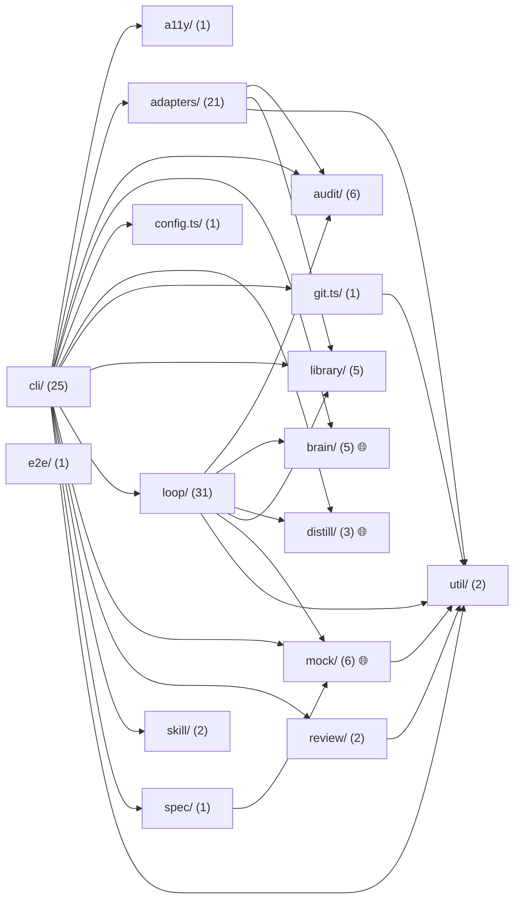

# probevane — Specification

_Generated by probevane (node-vitest) on 2026-06-25._

## Overview

- 113 modules (110 util, 3 fetcher); 3 touch the network
- 3 network endpoint(s)
- test coverage: 31.25% statements, 73.66% branches

## Module graph

```
⚙️ adapters/adapter.ts
⚙️ brain/brain.ts
⚙️ cli/a11y.ts
├─ ⚙️ audit/core.ts
└─ ⚙️ a11y/rules.ts
⚙️ cli/audit.ts
├─ ⚙️ adapters/registry.ts
│  ├─ ⚙️ adapters/react-vitest-playwright/index.ts
│  │  ├─ ⚙️ adapters/react-vitest-playwright/detect.ts
│  │  ├─ ⚙️ adapters/react-vitest-playwright/install.ts
│  │  │  └─ ⚙️ util/exec.ts
│  │  ├─ ⚙️ adapters/react-vitest-playwright/discover.ts
│  │  ├─ ⚙️ adapters/react-vitest-playwright/run.ts
│  │  │  └─ ⚙️ adapters/vitest-runner.ts
│  │  │     └─ ⚙️ util/exec.ts ↺
│  │  ├─ ⚙️ adapters/react-vitest-playwright/probe.ts
│  │  │  └─ ⚙️ adapters/ast-probe.ts
│  │  ├─ ⚙️ audit/rules-js.ts
│  │  ├─ ⚙️ util/specfiles.ts
│  │  └─ ⚙️ library/prompt.ts
│  ├─ ⚙️ adapters/python-pytest/index.ts
│  │  ├─ ⚙️ util/exec.ts ↺
│  │  ├─ ⚙️ audit/rules-py.ts
│  │  └─ ⚙️ library/prompt.ts ↺
│  ├─ ⚙️ adapters/vue-vitest-playwright/index.ts
│  │  ├─ ⚙️ adapters/vue-vitest-playwright/install.ts
│  │  │  └─ ⚙️ util/exec.ts ↺
│  │  ├─ ⚙️ adapters/vue-vitest-playwright/probe.ts
│  │  │  └─ ⚙️ adapters/ast-probe.ts ↺
│  │  ├─ ⚙️ adapters/vue-vitest-playwright/run.ts
│  │  │  └─ ⚙️ adapters/vitest-runner.ts ↺
│  │  ├─ ⚙️ util/specfiles.ts ↺
│  │  ├─ ⚙️ library/prompt.ts ↺
│  │  └─ ⚙️ audit/rules-vue.ts
│  │     └─ ⚙️ audit/rules-js.ts ↺
│  ├─ ⚙️ adapters/go-test/index.ts
│  │  ├─ ⚙️ util/exec.ts ↺
│  │  ├─ ⚙️ audit/rules-go.ts
│  │  └─ ⚙️ library/prompt.ts ↺
│  ├─ ⚙️ adapters/svelte-vitest/index.ts
│  │  ├─ ⚙️ util/exec.ts ↺
│  │  ├─ ⚙️ adapters/svelte-vitest/run.ts
│  │  │  └─ ⚙️ adapters/vitest-runner.ts ↺
│  │  ├─ ⚙️ util/specfiles.ts ↺
│  │  ├─ ⚙️ library/prompt.ts ↺
│  │  ├─ ⚙️ audit/rules-js.ts ↺
│  │  └─ ⚙️ adapters/ast-probe.ts ↺
│  ├─ ⚙️ adapters/node-vitest/index.ts
│  │  ├─ ⚙️ util/exec.ts ↺
│  │  ├─ ⚙️ adapters/vitest-runner.ts ↺
│  │  ├─ ⚙️ util/specfiles.ts ↺
│  │  ├─ ⚙️ library/prompt.ts ↺
│  │  ├─ ⚙️ audit/rules-js.ts ↺
│  │  └─ ⚙️ adapters/ast-probe.ts ↺
│  ├─ ⚙️ adapters/rust-cargo/index.ts
│  │  ├─ ⚙️ util/exec.ts ↺
│  │  ├─ ⚙️ audit/rules-rust.ts
│  │  └─ ⚙️ library/prompt.ts ↺
│  └─ ⚙️ adapters/angular/index.ts
│     ├─ ⚙️ util/exec.ts ↺
│     ├─ ⚙️ audit/rules-js.ts ↺
│     ├─ ⚙️ adapters/ast-probe.ts ↺
│     └─ ⚙️ library/prompt.ts ↺
└─ ⚙️ audit/core.ts ↺
⚙️ cli/bench.ts
├─ ⚙️ adapters/registry.ts ↺
├─ ⚙️ loop/passk.ts
│  └─ ⚙️ audit/core.ts ↺
└─ ⚙️ loop/mutation.ts
⚙️ cli/ci.ts
├─ ⚙️ adapters/registry.ts ↺
├─ ⚙️ config.ts
├─ ⚙️ git.ts
│  └─ ⚙️ util/exec.ts ↺
├─ ⚙️ review/diff-review.ts
│  └─ ⚙️ util/exec.ts ↺
├─ ⚙️ review/verify.ts
├─ ⚙️ brain/select.ts
│  ├─ ⚙️ brain/anthropic-sdk.ts
│  ├─ 🌐 brain/openai-compat.ts 🌐net
│  └─ ⚙️ brain/replay.ts
└─ ⚙️ util/exec.ts ↺
⚙️ cli/coverage.ts
└─ ⚙️ adapters/registry.ts ↺
⚙️ cli/distill.ts
├─ ⚙️ distill/collect.ts
├─ ⚙️ distill/dataset.ts
├─ 🌐 distill/bases.ts 🌐net
├─ ⚙️ adapters/registry.ts ↺
├─ ⚙️ git.ts ↺
└─ ⚙️ loop/passk.ts ↺
⚙️ cli/eval.ts
├─ ⚙️ adapters/registry.ts ↺
└─ ⚙️ library/improvement-log.ts
⚙️ cli/feature.ts
├─ ⚙️ adapters/registry.ts ↺
├─ ⚙️ config.ts ↺
└─ ⚙️ loop/run-path.ts
   ├─ ⚙️ brain/select.ts ↺
   ├─ ⚙️ loop/complexity.ts
   │  └─ ⚙️ mock/graph.ts
   ├─ ⚙️ loop/profiles.ts
   │  ├─ ⚙️ loop/runes/context_inject.ts
   │  │  ├─ ⚙️ library/prompt.ts ↺
   │  │  ├─ ⚙️ library/retrieve.ts
   │  │  │  └─ ⚙️ library/store.ts
   │  │  └─ ⚙️ library/caveats.ts
   │  │     └─ ⚙️ library/store.ts ↺
   │  ├─ ⚙️ loop/runes/path_guard.ts
   │  │  ├─ ⚙️ loop/rune.ts
   │  │  └─ ⚙️ loop/tools.ts
   │  ├─ ⚙️ loop/runes/plan_first.ts
   │  │  ├─ ⚙️ loop/rune.ts ↺
   │  │  └─ ⚙️ loop/tools.ts ↺
   │  ├─ ⚙️ loop/runes/no_regression.ts
   │  │  └─ ⚙️ loop/rune.ts ↺
   │  ├─ ⚙️ loop/runes/validation_gate.ts
   │  │  ├─ ⚙️ loop/rune.ts ↺
   │  │  └─ ⚙️ util/exec.ts ↺
   │  ├─ ⚙️ loop/runes/audit_gate.ts
   │  │  ├─ ⚙️ loop/rune.ts ↺
   │  │  └─ ⚙️ audit/core.ts ↺
   │  ├─ ⚙️ loop/runes/acceptance_gate.ts
   │  │  ├─ ⚙️ loop/rune.ts ↺
   │  │  ├─ ⚙️ util/exec.ts ↺
   │  │  └─ ⚙️ loop/runes/validation_gate.ts ↺
   │  ├─ ⚙️ loop/runes/hermetic_gate.ts
   │  │  └─ ⚙️ loop/rune.ts ↺
   │  ├─ ⚙️ loop/runes/mutation_gate.ts
   │  │  ├─ ⚙️ loop/rune.ts ↺
   │  │  └─ ⚙️ loop/mutation.ts ↺
   │  ├─ ⚙️ loop/runes/a11y_gate.ts
   │  │  ├─ ⚙️ loop/rune.ts ↺
   │  │  └─ ⚙️ loop/runes/validation_gate.ts ↺
   │  ├─ ⚙️ loop/runes/visual_gate.ts
   │  │  ├─ ⚙️ loop/rune.ts ↺
   │  │  └─ ⚙️ loop/runes/validation_gate.ts ↺
   │  ├─ ⚙️ loop/runes/flake_gate.ts
   │  │  ├─ ⚙️ loop/rune.ts ↺
   │  │  └─ ⚙️ loop/runes/validation_gate.ts ↺
   │  ├─ ⚙️ loop/runes/behavior_lock.ts
   │  │  ├─ ⚙️ loop/rune.ts ↺
   │  │  ├─ ⚙️ util/exec.ts ↺
   │  │  └─ ⚙️ loop/runes/validation_gate.ts ↺
   │  ├─ ⚙️ loop/runes/red_first.ts
   │  │  └─ ⚙️ loop/rune.ts ↺
   │  ├─ ⚙️ loop/runes/session_diary.ts
   │  ├─ ⚙️ loop/runes/caveat_harvest.ts
   │  │  └─ ⚙️ library/caveats.ts ↺
   │  └─ ⚙️ loop/runes/distill_trace.ts
   │     └─ ⚙️ distill/collect.ts ↺
   └─ ⚙️ loop/engine.ts
      ├─ ⚙️ loop/ctx.ts
      ├─ ⚙️ loop/rune.ts ↺
      ├─ ⚙️ loop/tools.ts ↺
      ├─ ⚙️ util/exec.ts ↺
      └─ ⚙️ loop/events.ts
⚙️ cli/fix.ts
├─ ⚙️ adapters/registry.ts ↺
├─ ⚙️ config.ts ↺
└─ ⚙️ loop/run-path.ts ↺
⚙️ cli/generate.ts
├─ ⚙️ adapters/registry.ts ↺
├─ ⚙️ brain/anthropic-sdk.ts ↺
├─ ⚙️ loop/run-generation.ts
│  ├─ ⚙️ loop/profiles.ts ↺
│  ├─ ⚙️ loop/engine.ts ↺
│  ├─ ⚙️ library/retrieve.ts ↺
│  ├─ ⚙️ loop/runes/mock_inject.ts
│  ├─ ⚙️ mock/index.ts
│  │  ├─ ⚙️ mock/graph.ts ↺
│  │  ├─ 🌐 mock/synth.ts 🌐net
│  │  ├─ ⚙️ mock/contract.ts
│  │  │  └─ ⚙️ util/exec.ts ↺
│  │  └─ ⚙️ mock/store.ts
│  ├─ ⚙️ brain/select.ts ↺
│  └─ ⚙️ loop/complexity.ts ↺
└─ ⚙️ config.ts ↺
⚙️ cli/graph.ts
├─ ⚙️ mock/index.ts ↺
└─ ⚙️ mock/render.ts
⚙️ cli/init.ts
└─ ⚙️ adapters/registry.ts ↺
⚙️ cli/learn.ts
├─ ⚙️ adapters/registry.ts ↺
├─ ⚙️ audit/core.ts ↺
└─ ⚙️ library/store.ts ↺
⚙️ cli/mock.ts
└─ ⚙️ mock/index.ts ↺
⚙️ cli/peek.ts
├─ ⚙️ loop/events.ts ↺
└─ ⚙️ loop/observe.ts
⚙️ cli/plan.ts
⚙️ cli/refactor.ts
├─ ⚙️ adapters/registry.ts ↺
├─ ⚙️ config.ts ↺
└─ ⚙️ loop/run-path.ts ↺
⚙️ cli/repair.ts
├─ ⚙️ adapters/registry.ts ↺
├─ ⚙️ config.ts ↺
├─ ⚙️ loop/run-path.ts ↺
└─ ⚙️ git.ts ↺
⚙️ cli/review.ts
├─ ⚙️ adapters/registry.ts ↺
└─ ⚙️ audit/core.ts ↺
⚙️ cli/run.ts
└─ ⚙️ adapters/registry.ts ↺
⚙️ cli/serve.ts
└─ ⚙️ loop/observe.ts ↺
⚙️ cli/skill.ts
├─ ⚙️ skill/build.ts
│  └─ ⚙️ skill/catalog.ts
└─ ⚙️ skill/catalog.ts ↺
⚙️ cli/spec.ts
├─ ⚙️ adapters/registry.ts ↺
├─ ⚙️ brain/anthropic-sdk.ts ↺
└─ ⚙️ spec/build.ts
   ├─ ⚙️ mock/graph.ts ↺
   ├─ ⚙️ mock/index.ts ↺
   └─ ⚙️ mock/render.ts ↺
⚙️ cli/status.ts
└─ ⚙️ adapters/registry.ts ↺
⚙️ cli/watch.ts
├─ ⚙️ adapters/registry.ts ↺
├─ ⚙️ config.ts ↺
└─ ⚙️ git.ts ↺
⚙️ loop/types.ts
```



## Modules

### src/a11y/rules.ts — util

  - exported functions: a11yRules(): AuditRule[]
  - pure vitest unit test; `import { describe, it, expect } from "vitest"` explicitly; import the function and assert real values.

### src/adapters/adapter.ts — util

### src/util/exec.ts — util

  - exported functions: capOutput(s: string, headLines, tailLines): string; sh(cmd: string, cwd: string, timeoutMs): Promise<ExecResult>
  - pure vitest unit test; `import { describe, it, expect } from "vitest"` explicitly; import the function and assert real values.

### src/audit/rules-js.ts — util

  - exported functions: jsAuditRules(): AuditRule[]
  - pure vitest unit test; `import { describe, it, expect } from "vitest"` explicitly; import the function and assert real values.

### src/adapters/ast-probe.ts — util

  - exported functions: astExtract(src: string, fileName): AstFacts | null
  - pure vitest unit test; `import { describe, it, expect } from "vitest"` explicitly; import the function and assert real values.

### src/library/prompt.ts — util

  - exported functions: async loadPrompt(name: string): Promise<string>
  - pure vitest unit test; `import { describe, it, expect } from "vitest"` explicitly; import the function and assert real values.

### src/adapters/angular/index.ts — util

- depends on: src/util/exec.ts, src/audit/rules-js.ts, src/adapters/ast-probe.ts, src/library/prompt.ts

  - exported functions: angularAdapter (ObjectLiteral)
  - pure vitest unit test; `import { describe, it, expect } from "vitest"` explicitly; import the function and assert real values.

### src/audit/rules-go.ts — util

  - exported functions: goAuditRules(): AuditRule[]
  - pure vitest unit test; `import { describe, it, expect } from "vitest"` explicitly; import the function and assert real values.

### src/adapters/go-test/index.ts — util

- depends on: src/util/exec.ts, src/audit/rules-go.ts, src/library/prompt.ts

  - exported functions: goAdapter (ObjectLiteral)
  - pure vitest unit test; `import { describe, it, expect } from "vitest"` explicitly; import the function and assert real values.

### src/adapters/vitest-runner.ts — util

- depends on: src/util/exec.ts

  - exported functions: async runVitest(dir: string, files: string[]): Promise<RunResult>; async runPlaywright(dir: string, files: string[]): Promise<RunResult>; mergeResults(parts: RunResult[]): RunResult; async coverageVitest(dir: string): Promise<CoverageResult>
  - pure vitest unit test; `import { describe, it, expect } from "vitest"` explicitly; import the function and assert real values.

### src/util/specfiles.ts — util

  - exported functions: async findSpecFiles(dir: string, sub): Promise<string[]>
  - pure vitest unit test; `import { describe, it, expect } from "vitest"` explicitly; import the function and assert real values.

### src/adapters/node-vitest/index.ts — util

- depends on: src/util/exec.ts, src/adapters/vitest-runner.ts, src/util/specfiles.ts, src/library/prompt.ts, src/audit/rules-js.ts, src/adapters/ast-probe.ts

  - exported functions: nodeAdapter (ObjectLiteral)
  - pure vitest unit test; `import { describe, it, expect } from "vitest"` explicitly; import the function and assert real values.

### src/audit/rules-py.ts — util

  - exported functions: pyAuditRules(): AuditRule[]
  - pure vitest unit test; `import { describe, it, expect } from "vitest"` explicitly; import the function and assert real values.

### src/adapters/python-pytest/index.ts — util

- depends on: src/util/exec.ts, src/audit/rules-py.ts, src/library/prompt.ts

  - exported functions: pythonAdapter (ObjectLiteral)
  - pure vitest unit test; `import { describe, it, expect } from "vitest"` explicitly; import the function and assert real values.

### src/adapters/react-vitest-playwright/detect.ts — util

  - exported functions: async detectReact(dir: string): Promise<number>
  - pure vitest unit test; `import { describe, it, expect } from "vitest"` explicitly; import the function and assert real values.

### src/adapters/react-vitest-playwright/discover.ts — util

  - exported functions: async discoverReact(dir: string, kind: TestKind): Promise<TestTarget[]>
  - pure vitest unit test; `import { describe, it, expect } from "vitest"` explicitly; import the function and assert real values.

### src/adapters/react-vitest-playwright/install.ts — util

- depends on: src/util/exec.ts

  - exported functions: async installReact(dir: string): Promise<void>
  - pure vitest unit test; `import { describe, it, expect } from "vitest"` explicitly; import the function and assert real values.

### src/adapters/react-vitest-playwright/run.ts — util

- depends on: src/adapters/vitest-runner.ts

  - exported functions: async runReact(dir: string, scope: RunScope, files: string[]): Promise<RunResult>; coverageReact(dir: string): Promise<CoverageResult>
  - pure vitest unit test; `import { describe, it, expect } from "vitest"` explicitly; import the function and assert real values.

### src/adapters/react-vitest-playwright/probe.ts — util

- depends on: src/adapters/ast-probe.ts

  - exported functions: async probeReactUnit(dir: string, target: TestTarget): Promise<ProbeResult>; async probeReactE2e(dir: string, target: TestTarget): Promise<ProbeResult>
  - pure vitest unit test; `import { describe, it, expect } from "vitest"` explicitly; import the function and assert real values.

### src/adapters/react-vitest-playwright/index.ts — util

- depends on: src/adapters/react-vitest-playwright/detect.ts, src/adapters/react-vitest-playwright/install.ts, src/adapters/react-vitest-playwright/discover.ts, src/adapters/react-vitest-playwright/run.ts, src/adapters/react-vitest-playwright/probe.ts, src/audit/rules-js.ts, src/util/specfiles.ts, src/library/prompt.ts

  - exported functions: reactAdapter (ObjectLiteral)
  - pure vitest unit test; `import { describe, it, expect } from "vitest"` explicitly; import the function and assert real values.

### src/adapters/vue-vitest-playwright/install.ts — util

- depends on: src/util/exec.ts

  - exported functions: async installVue(dir: string): Promise<void>
  - pure vitest unit test; `import { describe, it, expect } from "vitest"` explicitly; import the function and assert real values.

### src/adapters/vue-vitest-playwright/probe.ts — util

- depends on: src/adapters/ast-probe.ts

  - exported functions: async probeVueUnit(dir: string, target: TestTarget): Promise<ProbeResult>; async discoverVue(dir: string, _kind: string): Promise<TestTarget[]>
  - pure vitest unit test; `import { describe, it, expect } from "vitest"` explicitly; import the function and assert real values.

### src/adapters/vue-vitest-playwright/run.ts — util

- depends on: src/adapters/vitest-runner.ts

  - exported functions: async runVue(dir: string, scope: RunScope, files: string[]): Promise<RunResult>; coverageVue(dir: string): Promise<CoverageResult>
  - pure vitest unit test; `import { describe, it, expect } from "vitest"` explicitly; import the function and assert real values.

### src/audit/rules-vue.ts — util

- depends on: src/audit/rules-js.ts

  - exported functions: vueAuditRules(): AuditRule[]
  - pure vitest unit test; `import { describe, it, expect } from "vitest"` explicitly; import the function and assert real values.

### src/adapters/vue-vitest-playwright/index.ts — util

- depends on: src/adapters/vue-vitest-playwright/install.ts, src/adapters/vue-vitest-playwright/probe.ts, src/adapters/vue-vitest-playwright/run.ts, src/util/specfiles.ts, src/library/prompt.ts, src/audit/rules-vue.ts

  - exported functions: vueAdapter (ObjectLiteral)
  - pure vitest unit test; `import { describe, it, expect } from "vitest"` explicitly; import the function and assert real values.

### src/adapters/svelte-vitest/run.ts — util

- depends on: src/adapters/vitest-runner.ts

  - exported functions: runSvelte(dir: string, _scope: RunScope, files: string[]): Promise<RunResult>; coverageSvelte(dir: string): Promise<CoverageResult>
  - pure vitest unit test; `import { describe, it, expect } from "vitest"` explicitly; import the function and assert real values.

### src/adapters/svelte-vitest/index.ts — util

- depends on: src/util/exec.ts, src/adapters/svelte-vitest/run.ts, src/util/specfiles.ts, src/library/prompt.ts, src/audit/rules-js.ts, src/adapters/ast-probe.ts

  - exported functions: svelteAdapter (ObjectLiteral)
  - pure vitest unit test; `import { describe, it, expect } from "vitest"` explicitly; import the function and assert real values.

### src/audit/rules-rust.ts — util

  - exported functions: rustAuditRules(): AuditRule[]
  - pure vitest unit test; `import { describe, it, expect } from "vitest"` explicitly; import the function and assert real values.

### src/adapters/rust-cargo/index.ts — util

- depends on: src/util/exec.ts, src/audit/rules-rust.ts, src/library/prompt.ts

  - exported functions: rustAdapter (ObjectLiteral)
  - pure vitest unit test; `import { describe, it, expect } from "vitest"` explicitly; import the function and assert real values.

### src/adapters/registry.ts — util

- depends on: src/adapters/react-vitest-playwright/index.ts, src/adapters/python-pytest/index.ts, src/adapters/vue-vitest-playwright/index.ts, src/adapters/go-test/index.ts, src/adapters/svelte-vitest/index.ts, src/adapters/node-vitest/index.ts, src/adapters/rust-cargo/index.ts, src/adapters/angular/index.ts

  - exported functions: async selectAdapter(dir: string): Promise<StackAdapter | null>; async selectAdapterOrThrow(dir: string): Promise<StackAdapter>; ADAPTERS (ArrayLiteral)
  - pure vitest unit test; `import { describe, it, expect } from "vitest"` explicitly; import the function and assert real values.

### src/audit/core.ts — util

  - exported functions: auditSource(file: string, source: string, rules: AuditRule[]): Violation[]; async auditFiles(files: string[], rules: AuditRule[]): Promise<AuditReport>; formatViolations(v: Violation[]): string
  - pure vitest unit test; `import { describe, it, expect } from "vitest"` explicitly; import the function and assert real values.

### src/brain/anthropic-sdk.ts — util

  - exported functions: anthropicBrain(model): Brain
  - pure vitest unit test; `import { describe, it, expect } from "vitest"` explicitly; import the function and assert real values.

### src/brain/brain.ts — util

### src/brain/openai-compat.ts — fetcher 🌐

  - exported functions: openaiCompatBrain(model: string): Brain; toApiMessages(req: BrainRequest): any[]; fromApi(resp: any): BrainResponse
  - pure vitest unit test; `import { describe, it, expect } from "vitest"` explicitly; import the function and assert real values.

### src/brain/replay.ts — util

  - exported functions: recordingBrain(inner: Brain, cassettePath: string): Brain; replayBrain(cassettePath: string, model): Brain
  - pure vitest unit test; `import { describe, it, expect } from "vitest"` explicitly; import the function and assert real values.

### src/brain/select.ts — util

- depends on: src/brain/anthropic-sdk.ts, src/brain/openai-compat.ts, src/brain/replay.ts

  - exported functions: brainFor(model: string): Brain
  - pure vitest unit test; `import { describe, it, expect } from "vitest"` explicitly; import the function and assert real values.

### src/cli/a11y.ts — util

- depends on: src/audit/core.ts, src/a11y/rules.ts

### src/cli/audit.ts — util

- depends on: src/adapters/registry.ts, src/audit/core.ts

### src/loop/passk.ts — util

- depends on: src/audit/core.ts

  - exported functions: async scoreSuite(dir: string, adapter: StackAdapter): Promise<SuiteScore>; selectBest(candidates: Candidate<T>[]): Candidate<T> | null; async passKGenerate(opts: PassKOptions): Promise<{ best: Candidate<string> | null; all: Candidate<string>[] }>; readdir
  - pure vitest unit test; `import { describe, it, expect } from "vitest"` explicitly; import the function and assert real values.

### src/loop/mutation.ts — util

  - exported functions: async mutationScore(dir: string, adapter: StackAdapter, maxMutants, maxTargets): Promise<MutationResult>; MUTATIONS (ArrayLiteral)
  - pure vitest unit test; `import { describe, it, expect } from "vitest"` explicitly; import the function and assert real values.

### src/cli/bench.ts — util

- depends on: src/adapters/registry.ts, src/loop/passk.ts, src/loop/mutation.ts

### src/config.ts — util

  - exported functions: async loadConfig(dir: string): Promise<ProbevaneConfig>; pick(vals: (T | undefined)[]): T | undefined
  - pure vitest unit test; `import { describe, it, expect } from "vitest"` explicitly; import the function and assert real values.

### src/git.ts — util

- depends on: src/util/exec.ts

  - exported functions: async changedFiles(dir: string, ref): Promise<string[]>; isSourceFile(f: string): boolean; specCandidatesFor(source: string): string[]
  - pure vitest unit test; `import { describe, it, expect } from "vitest"` explicitly; import the function and assert real values.

### src/review/diff-review.ts — util

- depends on: src/util/exec.ts

  - exported functions: async getDiff(dir: string, base: string): Promise<string>; async reviewDiffText(diff: string, brain: Brain): Promise<Finding[]>; async reviewDiff(dir: string, base: string, brain: Brain): Promise<Finding[]>; parseFindings(text: string): Finding[]; findingsMarkdown(findings: Finding[]): string; findingsTask(findings: Finding[]): string
  - pure vitest unit test; `import { describe, it, expect } from "vitest"` explicitly; import the function and assert real values.

### src/review/verify.ts — util

  - exported functions: async groundFindings(dir: string, findings: Finding[]): Promise<Finding[]>; async verifyFindings(findings: Finding[], diff: string, brain: Brain): Promise<Finding[]>; parseVerdicts(text: string): Map<number, boolean>
  - pure vitest unit test; `import { describe, it, expect } from "vitest"` explicitly; import the function and assert real values.

### src/cli/ci.ts — util

- depends on: src/adapters/registry.ts, src/config.ts, src/git.ts, src/review/diff-review.ts, src/review/verify.ts, src/brain/select.ts, src/util/exec.ts

### src/cli/coverage.ts — util

- depends on: src/adapters/registry.ts

### src/distill/collect.ts — util

  - exported functions: redact(text: string): string; async recordTrace(ctx: RunCtx, now: string): Promise<number>; async readTraces(path): Promise<Trace[]>; TRACES_PATH (Call)
  - pure vitest unit test; `import { describe, it, expect } from "vitest"` explicitly; import the function and assert real values.

### src/distill/dataset.ts — util

  - exported functions: buildExamples(traces: Trace[]): ChatExample[]; splitExamples(ex: ChatExample[]): { train: ChatExample[]; val: ChatExample[] }; statsByStack(traces: Trace[]): Record<string, number>
  - pure vitest unit test; `import { describe, it, expect } from "vitest"` explicitly; import the function and assert real values.

### src/distill/bases.ts — fetcher 🌐

  - exported functions: async cpuGenerate(model: string, system: string, user: string, numPredict): Promise<{ text: string; ms: number; tokPerSec: number }>; stripFences(text: string): string; async basePrompt(dir: string, sourcePath: string, instruction: string): Promise<string>; baseValue(r: { green: boolean; tests: number; coverage: number; auditErrors: number }): number
  - pure vitest unit test; `import { describe, it, expect } from "vitest"` explicitly; import the function and assert real values.

### src/cli/distill.ts — util

- depends on: src/distill/collect.ts, src/distill/dataset.ts, src/distill/bases.ts, src/adapters/registry.ts, src/git.ts, src/loop/passk.ts

### src/library/improvement-log.ts — util

  - exported functions: async appendLog(logPath: string, row: LogRow): Promise<void>; async readLog(logPath: string): Promise<Record<string, string>[]>; LOG_COLUMNS (As)
  - pure vitest unit test; `import { describe, it, expect } from "vitest"` explicitly; import the function and assert real values.

### src/cli/eval.ts — util

- depends on: src/adapters/registry.ts, src/library/improvement-log.ts

### src/mock/graph.ts — util

  - exported functions: async buildGraph(dir: string): Promise<ModuleGraph>
  - pure vitest unit test; `import { describe, it, expect } from "vitest"` explicitly; import the function and assert real values.

### src/loop/complexity.ts — util

- depends on: src/mock/graph.ts

  - exported functions: async assessComplexity(dir: string, targets: TestTarget[]): Promise<Complexity>; routeModels(choice: string, complex: boolean): { primary?: string; takeover?: string }
  - pure vitest unit test; `import { describe, it, expect } from "vitest"` explicitly; import the function and assert real values.

### src/library/store.ts — util

  - exported functions: async saveExample(m: ExampleMeta, contents: string): Promise<string>; async readIndex(): Promise<IndexRow[]>; async readExample(relPath: string): Promise<string>; async libraryExists(): Promise<boolean>; LIB_ROOT (Binary)
  - pure vitest unit test; `import { describe, it, expect } from "vitest"` explicitly; import the function and assert real values.

### src/library/retrieve.ts — util

- depends on: src/library/store.ts

  - exported functions: async retrieveFewShot(q: RetrieveQuery): Promise<Example[]>
  - pure vitest unit test; `import { describe, it, expect } from "vitest"` explicitly; import the function and assert real values.

### src/library/caveats.ts — util

- depends on: src/library/store.ts

  - exported functions: async recentCaveats(limit): Promise<string[]>; CAVEATS_PATH (Call)
  - pure vitest unit test; `import { describe, it, expect } from "vitest"` explicitly; import the function and assert real values.

### src/loop/runes/context_inject.ts — util

- depends on: src/library/prompt.ts, src/library/retrieve.ts, src/library/caveats.ts

  - exported functions: contextInject(kind: 'unit' | 'e2e'): Rune
  - pure vitest unit test; `import { describe, it, expect } from "vitest"` explicitly; import the function and assert real values.

### src/loop/rune.ts — util

  - exported functions: block(reason: string, inject: string): RuneDecision; async firstBlockBefore(runes: Rune[], call: ToolCall, ctx: RunCtx): Promise<RuneDecision>; async firstBlockStop(runes: Rune[], ctx: RunCtx): Promise<RuneDecision>; ALLOW (ObjectLiteral)
  - pure vitest unit test; `import { describe, it, expect } from "vitest"` explicitly; import the function and assert real values.

### src/loop/tools.ts — util

  - exported functions: async execTool(call: ToolCall, ctx: RunCtx): Promise<string>; async pathExists(p: string): Promise<boolean>; TOOL_SPECS (ArrayLiteral); WRITE_TOOLS (New); join
  - pure vitest unit test; `import { describe, it, expect } from "vitest"` explicitly; import the function and assert real values.

### src/loop/runes/path_guard.ts — util

- depends on: src/loop/rune.ts, src/loop/tools.ts

  - exported functions: pathGuard (ObjectLiteral)
  - pure vitest unit test; `import { describe, it, expect } from "vitest"` explicitly; import the function and assert real values.

### src/loop/runes/plan_first.ts — util

- depends on: src/loop/rune.ts, src/loop/tools.ts

  - exported functions: planFirst (ObjectLiteral)
  - pure vitest unit test; `import { describe, it, expect } from "vitest"` explicitly; import the function and assert real values.

### src/loop/runes/no_regression.ts — util

- depends on: src/loop/rune.ts

  - exported functions: noRegression(): Rune
  - pure vitest unit test; `import { describe, it, expect } from "vitest"` explicitly; import the function and assert real values.

### src/loop/runes/validation_gate.ts — util

- depends on: src/loop/rune.ts, src/util/exec.ts

  - exported functions: validationGate(scope: RunScope, full): Rune; countTsErrors(output: string): number; newSpecs(ctx: RunCtx): string[]
  - pure vitest unit test; `import { describe, it, expect } from "vitest"` explicitly; import the function and assert real values.

### src/loop/runes/audit_gate.ts — util

- depends on: src/loop/rune.ts, src/audit/core.ts

  - exported functions: auditGate (ObjectLiteral)
  - pure vitest unit test; `import { describe, it, expect } from "vitest"` explicitly; import the function and assert real values.

### src/loop/runes/acceptance_gate.ts — util

- depends on: src/loop/rune.ts, src/util/exec.ts, src/loop/runes/validation_gate.ts

  - exported functions: acceptanceGate(opts: AcceptanceOpts): Rune
  - pure vitest unit test; `import { describe, it, expect } from "vitest"` explicitly; import the function and assert real values.

### src/loop/runes/hermetic_gate.ts — util

- depends on: src/loop/rune.ts

  - exported functions: hermeticGate (ObjectLiteral)
  - pure vitest unit test; `import { describe, it, expect } from "vitest"` explicitly; import the function and assert real values.

### src/loop/runes/mutation_gate.ts — util

- depends on: src/loop/rune.ts, src/loop/mutation.ts

  - exported functions: mutationGate(opts: { enforce: boolean; minScore?: number; maxMutants?: number }): Rune
  - pure vitest unit test; `import { describe, it, expect } from "vitest"` explicitly; import the function and assert real values.

### src/loop/runes/a11y_gate.ts — util

- depends on: src/loop/rune.ts, src/loop/runes/validation_gate.ts

  - exported functions: a11yGate (ObjectLiteral)
  - pure vitest unit test; `import { describe, it, expect } from "vitest"` explicitly; import the function and assert real values.

### src/loop/runes/visual_gate.ts — util

- depends on: src/loop/rune.ts, src/loop/runes/validation_gate.ts

  - exported functions: visualGate (ObjectLiteral)
  - pure vitest unit test; `import { describe, it, expect } from "vitest"` explicitly; import the function and assert real values.

### src/loop/runes/flake_gate.ts — util

- depends on: src/loop/rune.ts, src/loop/runes/validation_gate.ts

  - exported functions: flakeGate(runs): Rune
  - pure vitest unit test; `import { describe, it, expect } from "vitest"` explicitly; import the function and assert real values.

### src/loop/runes/behavior_lock.ts — util

- depends on: src/loop/rune.ts, src/util/exec.ts, src/loop/runes/validation_gate.ts

  - exported functions: behaviorLock(): Rune
  - pure vitest unit test; `import { describe, it, expect } from "vitest"` explicitly; import the function and assert real values.

### src/loop/runes/red_first.ts — util

- depends on: src/loop/rune.ts

  - exported functions: redFirst(): Rune
  - pure vitest unit test; `import { describe, it, expect } from "vitest"` explicitly; import the function and assert real values.

### src/loop/runes/session_diary.ts — util

  - exported functions: sessionDiary (ObjectLiteral)
  - pure vitest unit test; `import { describe, it, expect } from "vitest"` explicitly; import the function and assert real values.

### src/loop/runes/caveat_harvest.ts — util

- depends on: src/library/caveats.ts

  - exported functions: caveatHarvest (ObjectLiteral)
  - pure vitest unit test; `import { describe, it, expect } from "vitest"` explicitly; import the function and assert real values.

### src/loop/runes/distill_trace.ts — util

- depends on: src/distill/collect.ts

  - exported functions: distillTrace (ObjectLiteral)
  - pure vitest unit test; `import { describe, it, expect } from "vitest"` explicitly; import the function and assert real values.

### src/loop/profiles.ts — util

- depends on: src/loop/runes/context_inject.ts, src/loop/runes/path_guard.ts, src/loop/runes/plan_first.ts, src/loop/runes/no_regression.ts, src/loop/runes/validation_gate.ts, src/loop/runes/audit_gate.ts, src/loop/runes/acceptance_gate.ts, src/loop/runes/hermetic_gate.ts, src/loop/runes/mutation_gate.ts, src/loop/runes/a11y_gate.ts, src/loop/runes/visual_gate.ts, src/loop/runes/flake_gate.ts, src/loop/runes/behavior_lock.ts, src/loop/runes/red_first.ts, src/loop/runes/session_diary.ts, src/loop/runes/caveat_harvest.ts, src/loop/runes/distill_trace.ts

  - exported functions: profile(name: ProfileName, opts: ProfileOpts): Rune[]
  - pure vitest unit test; `import { describe, it, expect } from "vitest"` explicitly; import the function and assert real values.

### src/loop/ctx.ts — util

  - exported functions: RunCtx
  - pure vitest unit test; `import { describe, it, expect } from "vitest"` explicitly; import the function and assert real values.

### src/loop/events.ts — util

  - exported functions: formatEvent(ev: LoopEvent): string; parseEvents(text: string): LoopEvent[]
  - pure vitest unit test; `import { describe, it, expect } from "vitest"` explicitly; import the function and assert real values.

### src/loop/engine.ts — util

- depends on: src/loop/ctx.ts, src/loop/rune.ts, src/loop/tools.ts, src/util/exec.ts, src/loop/events.ts

  - exported functions: async runLoop(opts: RunOptions): Promise<RunOutcome>
  - pure vitest unit test; `import { describe, it, expect } from "vitest"` explicitly; import the function and assert real values.

### src/loop/run-path.ts — util

- depends on: src/brain/select.ts, src/loop/complexity.ts, src/loop/profiles.ts, src/loop/engine.ts

  - exported functions: async runPath(opts: RunPathOpts): Promise<RunOutcome>
  - pure vitest unit test; `import { describe, it, expect } from "vitest"` explicitly; import the function and assert real values.

### src/cli/feature.ts — util

- depends on: src/adapters/registry.ts, src/config.ts, src/loop/run-path.ts

### src/cli/fix.ts — util

- depends on: src/adapters/registry.ts, src/config.ts, src/loop/run-path.ts

### src/loop/runes/mock_inject.ts — util

  - exported functions: mockInject(plan: MockPlan): Rune
  - pure vitest unit test; `import { describe, it, expect } from "vitest"` explicitly; import the function and assert real values.

### src/mock/synth.ts — fetcher 🌐

  - exported functions: async synthForModule(dir: string, node: ModuleNode, graph: ModuleGraph, openapi: any | null): Promise<MockBundle>; async loadOpenapi(dir: string): Promise<any | null>; sampleSchema(schema: any, comps: Record<string, any>, depth): unknown
  - pure vitest unit test; `import { describe, it, expect } from "vitest"` explicitly; import the function and assert real values.

### src/mock/contract.ts — util

- depends on: src/util/exec.ts

  - exported functions: async materializeFixtures(dir: string, plan: MockPlan): Promise<Record<string, unknown>>; async captureContracts(dir: string, graph: ModuleGraph, fixtures: Record<string, unknown>): Promise<Record<string, unknown>>; async writeContracts(dir: string, contracts: Contracts): Promise<void>; async readContracts(dir: string): Promise<Contracts | null>
  - pure vitest unit test; `import { describe, it, expect } from "vitest"` explicitly; import the function and assert real values.

### src/mock/store.ts — util

  - exported functions: async writeMocks(dir: string, handlers: HandlerSpec[], fixtures: Record<string, unknown>): Promise<string>
  - pure vitest unit test; `import { describe, it, expect } from "vitest"` explicitly; import the function and assert real values.

### src/mock/index.ts — util

- depends on: src/mock/graph.ts, src/mock/synth.ts, src/mock/contract.ts, src/mock/store.ts

  - exported functions: async buildMockPlan(dir: string): Promise<MockPlan>; async buildChain(dir: string): Promise<MockPlan>; MockBundle; HandlerSpec; ModuleGraph; ModuleNode; buildGraph
  - pure vitest unit test; `import { describe, it, expect } from "vitest"` explicitly; import the function and assert real values.

### src/loop/run-generation.ts — util

- depends on: src/loop/profiles.ts, src/loop/engine.ts, src/library/retrieve.ts, src/loop/runes/mock_inject.ts, src/mock/index.ts, src/brain/select.ts, src/loop/complexity.ts

  - exported functions: async generateTests(opts: GenerateOpts): Promise<RunOutcome>
  - pure vitest unit test; `import { describe, it, expect } from "vitest"` explicitly; import the function and assert real values.

### src/cli/generate.ts — util

- depends on: src/adapters/registry.ts, src/brain/anthropic-sdk.ts, src/loop/run-generation.ts, src/config.ts

### src/mock/render.ts — util

  - exported functions: toMermaid(graph: ModuleGraph): string; toAscii(graph: ModuleGraph): string; graphSummary(graph: ModuleGraph): string
  - pure vitest unit test; `import { describe, it, expect } from "vitest"` explicitly; import the function and assert real values.

### src/cli/graph.ts — util

- depends on: src/mock/index.ts, src/mock/render.ts

### src/cli/init.ts — util

- depends on: src/adapters/registry.ts

### src/cli/learn.ts — util

- depends on: src/adapters/registry.ts, src/audit/core.ts, src/library/store.ts

### src/cli/mock.ts — util

- depends on: src/mock/index.ts

### src/loop/observe.ts — util

  - exported functions: sseFrame(payload: string): string; tailFrom(content: string, offset: number): { lines: string[]; offset: number }; latestPerRun(events: LoopEvent[]): Map<string, LoopEvent>; runStatus(e: LoopEvent): string
  - pure vitest unit test; `import { describe, it, expect } from "vitest"` explicitly; import the function and assert real values.

### src/cli/peek.ts — util

- depends on: src/loop/events.ts, src/loop/observe.ts

### src/cli/plan.ts — util

### src/cli/refactor.ts — util

- depends on: src/adapters/registry.ts, src/config.ts, src/loop/run-path.ts

### src/cli/repair.ts — util

- depends on: src/adapters/registry.ts, src/config.ts, src/loop/run-path.ts, src/git.ts

### src/cli/review.ts — util

- depends on: src/adapters/registry.ts, src/audit/core.ts

### src/cli/run.ts — util

- depends on: src/adapters/registry.ts

### src/cli/serve.ts — util

- depends on: src/loop/observe.ts

### src/skill/catalog.ts — util

  - exported functions: async binCommands(): Promise<string[]>; COMMANDS (ArrayLiteral); UNDOCUMENTED (New)
  - pure vitest unit test; `import { describe, it, expect } from "vitest"` explicitly; import the function and assert real values.

### src/skill/build.ts — util

- depends on: src/skill/catalog.ts

  - exported functions: buildWikiCommands(): string; buildSkill(): string; SKILL_PATH (StringLiteral); WIKI_COMMANDS_PATH (StringLiteral)
  - pure vitest unit test; `import { describe, it, expect } from "vitest"` explicitly; import the function and assert real values.

### src/cli/skill.ts — util

- depends on: src/skill/build.ts, src/skill/catalog.ts

### src/spec/build.ts — util

- depends on: src/mock/graph.ts, src/mock/index.ts, src/mock/render.ts

  - exported functions: async buildSpec(opts: SpecOptions): Promise<string>
  - pure vitest unit test; `import { describe, it, expect } from "vitest"` explicitly; import the function and assert real values.

### src/cli/spec.ts — util

- depends on: src/adapters/registry.ts, src/brain/anthropic-sdk.ts, src/spec/build.ts

### src/cli/status.ts — util

- depends on: src/adapters/registry.ts

### src/cli/watch.ts — util

- depends on: src/adapters/registry.ts, src/config.ts, src/git.ts

### src/e2e/checkpoint.ts — util

- depends on: src/e2e/checkpoint.ts

  - exported functions: async checkpoint(page: Page, name: string, opts: CheckpointOpts): Promise<void>
  - pure vitest unit test; `import { describe, it, expect } from "vitest"` explicitly; import the function and assert real values.

### src/loop/types.ts — util

## API surface

- `POST :baseUrl/chat/completions`
- `POST :OLLAMA/api/chat`
- `GET  or `
