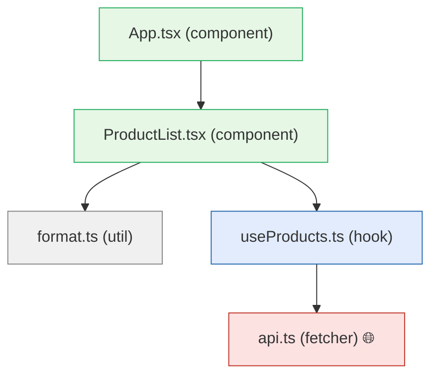

# react-shop — Specification

_Generated by probevane (react-vitest-playwright) on 2026-06-24._

## Overview

- 5 modules (2 component, 1 fetcher, 1 util, 1 hook); 1 touch the network
- 2 network endpoint(s)
- test coverage: 0% statements, 40% branches

## Module graph

```
🧩 App.tsx
└─ 🧩 ProductList.tsx
   ├─ 🪝 useProducts.ts
   │  └─ 🌐 api.ts 🌐net
   └─ ⚙️ format.ts
```



## Modules

### src/api.ts — fetcher 🌐

Fetches product data from an external source with functions to retrieve all products or a specific product by ID.

  - Exported functions: fetchProducts(); fetchProduct(id: number)

### src/useProducts.ts — hook

Custom React hook that manages product fetching and state.

- depends on: src/api.ts

  - Exported functions: useProducts()

### src/format.ts — util

Utility module providing functions to format prices, calculate cart totals, and filter products by stock status.

  - Exported functions: formatPrice(cents: number); cartTotal(items: CartItem[]); inStockOnly(products: Product[])

### src/ProductList.tsx — component

React component that displays a list of products with accessibility features including status alerts and product information labels.

- depends on: src/useProducts.ts, src/format.ts

  - React components: ProductList
  - aria-labels present: status, count, product ${p.name}
  - roles present: alert

### src/App.tsx — component

Root React component that serves as the main application entry point.

- depends on: src/ProductList.tsx

  - React components: App

## API surface

- `GET /api/products`
- `GET /api/products/:id`
