# realworld — Specification

_Generated by probevane (react-vitest-playwright) on 2026-06-24._

## Overview

- 44 modules (19 util, 4 fetcher, 21 component); 4 touch the network
- 19 network endpoint(s)

## Module graph

```
🧩 index.tsx
└─ 🌐 components/App/App.tsx 🌐net
   ├─ 🌐 services/conduit.ts 🌐net
   │  ├─ ⚙️ config/settings.ts
   │  ├─ ⚙️ types/article.ts
   │  │  └─ ⚙️ types/profile.ts
   │  │     └─ 🌐 types/user.ts 🌐net
   │  │        ├─ ⚙️ components/App/App.slice.ts
   │  │        │  └─ 🌐 types/user.ts 🌐net ↺
   │  │        └─ ⚙️ state/store.ts
   │  │           ├─ ⚙️ components/App/App.slice.ts ↺
   │  │           ├─ ⚙️ components/Pages/Home/Home.slice.ts
   │  │           ├─ ⚙️ components/Pages/Login/Login.slice.ts
   │  │           │  └─ ⚙️ types/error.ts
   │  │           ├─ ⚙️ components/Pages/Settings/Settings.slice.ts
   │  │           │  ├─ 🌐 types/user.ts 🌐net ↺
   │  │           │  ├─ ⚙️ components/App/App.slice.ts ↺
   │  │           │  └─ ⚙️ types/error.ts ↺
   │  │           ├─ ⚙️ components/Pages/Register/Register.slice.ts
   │  │           │  ├─ ⚙️ types/error.ts ↺
   │  │           │  └─ 🌐 types/user.ts 🌐net ↺
   │  │           ├─ 🧩 components/ArticleEditor/ArticleEditor.slice.tsx
   │  │           │  ├─ ⚙️ types/article.ts ↺
   │  │           │  └─ ⚙️ types/error.ts ↺
   │  │           ├─ ⚙️ components/ArticlesViewer/ArticlesViewer.slice.ts
   │  │           │  └─ ⚙️ types/article.ts ↺
   │  │           ├─ ⚙️ components/Pages/ProfilePage/ProfilePage.slice.ts
   │  │           │  └─ ⚙️ types/profile.ts ↺
   │  │           └─ ⚙️ components/Pages/ArticlePage/ArticlePage.slice.ts
   │  │              ├─ ⚙️ types/article.ts ↺
   │  │              ├─ ⚙️ types/comment.ts
   │  │              │  └─ ⚙️ types/profile.ts ↺
   │  │              └─ ⚙️ types/profile.ts ↺
   │  ├─ ⚙️ types/comment.ts ↺
   │  ├─ ⚙️ types/error.ts ↺
   │  ├─ ⚙️ types/object.ts
   │  ├─ ⚙️ types/profile.ts ↺
   │  └─ 🌐 types/user.ts 🌐net ↺
   ├─ ⚙️ state/store.ts ↺
   ├─ ⚙️ state/storeHooks.ts
   │  └─ ⚙️ state/store.ts ↺
   ├─ 🧩 components/Pages/EditArticle/EditArticle.tsx
   │  ├─ 🌐 services/conduit.ts 🌐net ↺
   │  ├─ ⚙️ state/store.ts ↺
   │  ├─ ⚙️ state/storeHooks.ts ↺
   │  ├─ 🧩 components/ArticleEditor/ArticleEditor.tsx
   │  │  ├─ ⚙️ state/store.ts ↺
   │  │  ├─ ⚙️ state/storeHooks.ts ↺
   │  │  ├─ 🧩 types/genericFormField.tsx
   │  │  ├─ 🧩 components/ContainerPage/ContainerPage.tsx
   │  │  ├─ 🧩 components/GenericForm/GenericForm.tsx
   │  │  │  ├─ 🧩 components/FormGroup/FormGroup.tsx
   │  │  │  ├─ 🧩 types/genericFormField.tsx ↺
   │  │  │  ├─ ⚙️ types/error.ts ↺
   │  │  │  └─ 🧩 components/Errors/Errors.tsx
   │  │  │     └─ ⚙️ types/error.ts ↺
   │  │  └─ 🧩 components/ArticleEditor/ArticleEditor.slice.tsx ↺
   │  └─ 🧩 components/ArticleEditor/ArticleEditor.slice.tsx ↺
   ├─ 🧩 components/Footer/Footer.tsx
   ├─ 🧩 components/Header/Header.tsx
   │  ├─ ⚙️ state/storeHooks.ts ↺
   │  └─ 🌐 types/user.ts 🌐net ↺
   ├─ 🧩 components/Pages/Home/Home.tsx
   │  ├─ 🌐 services/conduit.ts 🌐net ↺
   │  ├─ ⚙️ state/store.ts ↺
   │  ├─ ⚙️ state/storeHooks.ts ↺
   │  ├─ ⚙️ types/article.ts ↺
   │  ├─ 🧩 components/ArticlesViewer/ArticlesViewer.tsx
   │  │  ├─ 🌐 services/conduit.ts 🌐net ↺
   │  │  ├─ ⚙️ state/store.ts ↺
   │  │  ├─ ⚙️ state/storeHooks.ts ↺
   │  │  ├─ ⚙️ types/article.ts ↺
   │  │  ├─ ⚙️ types/style.ts
   │  │  ├─ 🧩 components/ArticlePreview/ArticlePreview.tsx
   │  │  │  └─ ⚙️ types/article.ts ↺
   │  │  ├─ 🧩 components/Pagination/Pagination.tsx
   │  │  └─ ⚙️ components/ArticlesViewer/ArticlesViewer.slice.ts ↺
   │  ├─ ⚙️ components/ArticlesViewer/ArticlesViewer.slice.ts ↺
   │  ├─ 🧩 components/ContainerPage/ContainerPage.tsx ↺
   │  └─ ⚙️ components/Pages/Home/Home.slice.ts ↺
   ├─ 🧩 components/Pages/Login/Login.tsx
   │  ├─ 🌐 services/conduit.ts 🌐net ↺
   │  ├─ ⚙️ state/store.ts ↺
   │  ├─ ⚙️ state/storeHooks.ts ↺
   │  ├─ 🌐 types/user.ts 🌐net ↺
   │  ├─ 🧩 types/genericFormField.tsx ↺
   │  ├─ 🧩 components/GenericForm/GenericForm.tsx ↺
   │  ├─ ⚙️ components/Pages/Login/Login.slice.ts ↺
   │  └─ 🧩 components/ContainerPage/ContainerPage.tsx ↺
   ├─ 🧩 components/Pages/NewArticle/NewArticle.tsx
   │  ├─ 🌐 services/conduit.ts 🌐net ↺
   │  ├─ ⚙️ state/store.ts ↺
   │  ├─ 🧩 components/ArticleEditor/ArticleEditor.tsx ↺
   │  └─ 🧩 components/ArticleEditor/ArticleEditor.slice.tsx ↺
   ├─ 🧩 components/Pages/Register/Register.tsx
   │  ├─ ⚙️ state/store.ts ↺
   │  ├─ ⚙️ state/storeHooks.ts ↺
   │  ├─ 🧩 types/genericFormField.tsx ↺
   │  ├─ 🧩 components/GenericForm/GenericForm.tsx ↺
   │  ├─ ⚙️ components/Pages/Register/Register.slice.ts ↺
   │  ├─ 🌐 types/user.ts 🌐net ↺
   │  ├─ 🌐 services/conduit.ts 🌐net ↺
   │  └─ 🧩 components/ContainerPage/ContainerPage.tsx ↺
   ├─ 🌐 components/Pages/Settings/Settings.tsx 🌐net
   │  ├─ 🌐 services/conduit.ts 🌐net ↺
   │  ├─ ⚙️ state/store.ts ↺
   │  ├─ ⚙️ state/storeHooks.ts ↺
   │  ├─ 🌐 types/user.ts 🌐net ↺
   │  ├─ 🧩 types/genericFormField.tsx ↺
   │  ├─ ⚙️ components/App/App.slice.ts ↺
   │  ├─ 🧩 components/GenericForm/GenericForm.tsx ↺
   │  ├─ ⚙️ components/Pages/Settings/Settings.slice.ts ↺
   │  └─ 🧩 components/ContainerPage/ContainerPage.tsx ↺
   ├─ ⚙️ components/App/App.slice.ts ↺
   ├─ 🧩 components/Pages/ProfilePage/ProfilePage.tsx
   │  ├─ 🌐 services/conduit.ts 🌐net ↺
   │  ├─ ⚙️ state/store.ts ↺
   │  ├─ ⚙️ state/storeHooks.ts ↺
   │  ├─ ⚙️ types/location.ts
   │  ├─ ⚙️ types/profile.ts ↺
   │  ├─ 🧩 components/ArticlesViewer/ArticlesViewer.tsx ↺
   │  ├─ ⚙️ components/ArticlesViewer/ArticlesViewer.slice.ts ↺
   │  ├─ 🧩 components/UserInfo/UserInfo.tsx
   │  │  ├─ ⚙️ state/storeHooks.ts ↺
   │  │  └─ ⚙️ types/profile.ts ↺
   │  └─ ⚙️ components/Pages/ProfilePage/ProfilePage.slice.ts ↺
   └─ 🧩 components/Pages/ArticlePage/ArticlePage.tsx
      ├─ 🌐 services/conduit.ts 🌐net ↺
      ├─ ⚙️ state/store.ts ↺
      ├─ ⚙️ state/storeHooks.ts ↺
      ├─ ⚙️ types/article.ts ↺
      ├─ ⚙️ types/comment.ts ↺
      ├─ ⚙️ types/location.ts ↺
      ├─ ⚙️ types/style.ts ↺
      ├─ 🌐 types/user.ts 🌐net ↺
      ├─ 🧩 components/ArticlePreview/ArticlePreview.tsx ↺
      └─ ⚙️ components/Pages/ArticlePage/ArticlePage.slice.ts ↺
⚙️ setupTests.ts
```



```mermaid
graph TD
  src_components_App_App_slice_ts["components/App/App.slice.ts (util)"]:::util
  src_components_App_App_tsx["components/App/App.tsx (fetcher) 🌐"]:::fetcher
  src_components_ArticleEditor_ArticleEditor_slice_tsx["components/ArticleEditor/ArticleEditor.slice.tsx (component)"]:::component
  src_components_ArticleEditor_ArticleEditor_tsx["components/ArticleEditor/ArticleEditor.tsx (component)"]:::component
  src_components_ArticlePreview_ArticlePreview_tsx["components/ArticlePreview/ArticlePreview.tsx (component)"]:::component
  src_components_ArticlesViewer_ArticlesViewer_slice_ts["components/ArticlesViewer/ArticlesViewer.slice.ts (util)"]:::util
  src_components_ArticlesViewer_ArticlesViewer_tsx["components/ArticlesViewer/ArticlesViewer.tsx (component)"]:::component
  src_components_ContainerPage_ContainerPage_tsx["components/ContainerPage/ContainerPage.tsx (component)"]:::component
  src_components_Errors_Errors_tsx["components/Errors/Errors.tsx (component)"]:::component
  src_components_Footer_Footer_tsx["components/Footer/Footer.tsx (component)"]:::component
  src_components_FormGroup_FormGroup_tsx["components/FormGroup/FormGroup.tsx (component)"]:::component
  src_components_GenericForm_GenericForm_tsx["components/GenericForm/GenericForm.tsx (component)"]:::component
  src_components_Header_Header_tsx["components/Header/Header.tsx (component)"]:::component
  src_components_Pages_ArticlePage_ArticlePage_slice_ts["components/Pages/ArticlePage/ArticlePage.slice.ts (util)"]:::util
  src_components_Pages_ArticlePage_ArticlePage_tsx["components/Pages/ArticlePage/ArticlePage.tsx (component)"]:::component
  src_components_Pages_EditArticle_EditArticle_tsx["components/Pages/EditArticle/EditArticle.tsx (component)"]:::component
  src_components_Pages_Home_Home_slice_ts["components/Pages/Home/Home.slice.ts (util)"]:::util
  src_components_Pages_Home_Home_tsx["components/Pages/Home/Home.tsx (component)"]:::component
  src_components_Pages_Login_Login_slice_ts["components/Pages/Login/Login.slice.ts (util)"]:::util
  src_components_Pages_Login_Login_tsx["components/Pages/Login/Login.tsx (component)"]:::component
  src_components_Pages_NewArticle_NewArticle_tsx["components/Pages/NewArticle/NewArticle.tsx (component)"]:::component
  src_components_Pages_ProfilePage_ProfilePage_slice_ts["components/Pages/ProfilePage/ProfilePage.slice.ts (util)"]:::util
  src_components_Pages_ProfilePage_ProfilePage_tsx["components/Pages/ProfilePage/ProfilePage.tsx (component)"]:::component
  src_components_Pages_Register_Register_slice_ts["components/Pages/Register/Register.slice.ts (util)"]:::util
  src_components_Pages_Register_Register_tsx["components/Pages/Register/Register.tsx (component)"]:::component
  src_components_Pages_Settings_Settings_slice_ts["components/Pages/Settings/Settings.slice.ts (util)"]:::util
  src_components_Pages_Settings_Settings_tsx["components/Pages/Settings/Settings.tsx (fetcher) 🌐"]:::fetcher
  src_components_Pagination_Pagination_tsx["components/Pagination/Pagination.tsx (component)"]:::component
  src_components_UserInfo_UserInfo_tsx["components/UserInfo/UserInfo.tsx (component)"]:::component
  src_config_settings_ts["config/settings.ts (util)"]:::util
  src_index_tsx["index.tsx (component)"]:::component
  src_services_conduit_ts["services/conduit.ts (fetcher) 🌐"]:::fetcher
  src_setupTests_ts["setupTests.ts (util)"]:::util
  src_state_store_ts["state/store.ts (util)"]:::util
  src_state_storeHooks_ts["state/storeHooks.ts (util)"]:::util
  src_types_article_ts["types/article.ts (util)"]:::util
  src_types_comment_ts["types/comment.ts (util)"]:::util
  src_types_error_ts["types/error.ts (util)"]:::util
  src_types_genericFormField_tsx["types/genericFormField.tsx (component)"]:::component
  src_types_location_ts["types/location.ts (util)"]:::util
  src_types_object_ts["types/object.ts (util)"]:::util
  src_types_profile_ts["types/profile.ts (util)"]:::util
  src_types_style_ts["types/style.ts (util)"]:::util
  src_types_user_ts["types/user.ts (fetcher) 🌐"]:::fetcher
  src_components_App_App_slice_ts --> src_types_user_ts
  src_components_App_App_tsx --> src_services_conduit_ts
  src_components_App_App_tsx --> src_state_store_ts
  src_components_App_App_tsx --> src_state_storeHooks_ts
  src_components_App_App_tsx --> src_components_Pages_EditArticle_EditArticle_tsx
  src_components_App_App_tsx --> src_components_Footer_Footer_tsx
  src_components_App_App_tsx --> src_components_Header_Header_tsx
  src_components_App_App_tsx --> src_components_Pages_Home_Home_tsx
  src_components_App_App_tsx --> src_components_Pages_Login_Login_tsx
  src_components_App_App_tsx --> src_components_Pages_NewArticle_NewArticle_tsx
  src_components_App_App_tsx --> src_components_Pages_Register_Register_tsx
  src_components_App_App_tsx --> src_components_Pages_Settings_Settings_tsx
  src_components_App_App_tsx --> src_components_App_App_slice_ts
  src_components_App_App_tsx --> src_components_Pages_ProfilePage_ProfilePage_tsx
  src_components_App_App_tsx --> src_components_Pages_ArticlePage_ArticlePage_tsx
  src_components_ArticleEditor_ArticleEditor_slice_tsx --> src_types_article_ts
  src_components_ArticleEditor_ArticleEditor_slice_tsx --> src_types_error_ts
  src_components_ArticleEditor_ArticleEditor_tsx --> src_state_store_ts
  src_components_ArticleEditor_ArticleEditor_tsx --> src_state_storeHooks_ts
  src_components_ArticleEditor_ArticleEditor_tsx --> src_types_genericFormField_tsx
  src_components_ArticleEditor_ArticleEditor_tsx --> src_components_ContainerPage_ContainerPage_tsx
  src_components_ArticleEditor_ArticleEditor_tsx --> src_components_GenericForm_GenericForm_tsx
  src_components_ArticleEditor_ArticleEditor_tsx --> src_components_ArticleEditor_ArticleEditor_slice_tsx
  src_components_ArticlePreview_ArticlePreview_tsx --> src_types_article_ts
  src_components_ArticlesViewer_ArticlesViewer_slice_ts --> src_types_article_ts
  src_components_ArticlesViewer_ArticlesViewer_tsx --> src_services_conduit_ts
  src_components_ArticlesViewer_ArticlesViewer_tsx --> src_state_store_ts
  src_components_ArticlesViewer_ArticlesViewer_tsx --> src_state_storeHooks_ts
  src_components_ArticlesViewer_ArticlesViewer_tsx --> src_types_article_ts
  src_components_ArticlesViewer_ArticlesViewer_tsx --> src_types_style_ts
  src_components_ArticlesViewer_ArticlesViewer_tsx --> src_components_ArticlePreview_ArticlePreview_tsx
  src_components_ArticlesViewer_ArticlesViewer_tsx --> src_components_Pagination_Pagination_tsx
  src_components_ArticlesViewer_ArticlesViewer_tsx --> src_components_ArticlesViewer_ArticlesViewer_slice_ts
  src_components_Errors_Errors_tsx --> src_types_error_ts
  src_components_GenericForm_GenericForm_tsx --> src_components_FormGroup_FormGroup_tsx
  src_components_GenericForm_GenericForm_tsx --> src_types_genericFormField_tsx
  src_components_GenericForm_GenericForm_tsx --> src_types_error_ts
  src_components_GenericForm_GenericForm_tsx --> src_components_Errors_Errors_tsx
  src_components_Header_Header_tsx --> src_state_storeHooks_ts
  src_components_Header_Header_tsx --> src_types_user_ts
  src_components_Pages_ArticlePage_ArticlePage_slice_ts --> src_types_article_ts
  src_components_Pages_ArticlePage_ArticlePage_slice_ts --> src_types_comment_ts
  src_components_Pages_ArticlePage_ArticlePage_slice_ts --> src_types_profile_ts
  src_components_Pages_ArticlePage_ArticlePage_tsx --> src_services_conduit_ts
  src_components_Pages_ArticlePage_ArticlePage_tsx --> src_state_store_ts
  src_components_Pages_ArticlePage_ArticlePage_tsx --> src_state_storeHooks_ts
  src_components_Pages_ArticlePage_ArticlePage_tsx --> src_types_article_ts
  src_components_Pages_ArticlePage_ArticlePage_tsx --> src_types_comment_ts
  src_components_Pages_ArticlePage_ArticlePage_tsx --> src_types_location_ts
  src_components_Pages_ArticlePage_ArticlePage_tsx --> src_types_style_ts
  src_components_Pages_ArticlePage_ArticlePage_tsx --> src_types_user_ts
  src_components_Pages_ArticlePage_ArticlePage_tsx --> src_components_ArticlePreview_ArticlePreview_tsx
  src_components_Pages_ArticlePage_ArticlePage_tsx --> src_components_Pages_ArticlePage_ArticlePage_slice_ts
  src_components_Pages_EditArticle_EditArticle_tsx --> src_services_conduit_ts
  src_components_Pages_EditArticle_EditArticle_tsx --> src_state_store_ts
  src_components_Pages_EditArticle_EditArticle_tsx --> src_state_storeHooks_ts
  src_components_Pages_EditArticle_EditArticle_tsx --> src_components_ArticleEditor_ArticleEditor_tsx
  src_components_Pages_EditArticle_EditArticle_tsx --> src_components_ArticleEditor_ArticleEditor_slice_tsx
  src_components_Pages_Home_Home_tsx --> src_services_conduit_ts
  src_components_Pages_Home_Home_tsx --> src_state_store_ts
  src_components_Pages_Home_Home_tsx --> src_state_storeHooks_ts
  src_components_Pages_Home_Home_tsx --> src_types_article_ts
  src_components_Pages_Home_Home_tsx --> src_components_ArticlesViewer_ArticlesViewer_tsx
  src_components_Pages_Home_Home_tsx --> src_components_ArticlesViewer_ArticlesViewer_slice_ts
  src_components_Pages_Home_Home_tsx --> src_components_ContainerPage_ContainerPage_tsx
  src_components_Pages_Home_Home_tsx --> src_components_Pages_Home_Home_slice_ts
  src_components_Pages_Login_Login_slice_ts --> src_types_error_ts
  src_components_Pages_Login_Login_tsx --> src_services_conduit_ts
  src_components_Pages_Login_Login_tsx --> src_state_store_ts
  src_components_Pages_Login_Login_tsx --> src_state_storeHooks_ts
  src_components_Pages_Login_Login_tsx --> src_types_user_ts
  src_components_Pages_Login_Login_tsx --> src_types_genericFormField_tsx
  src_components_Pages_Login_Login_tsx --> src_components_GenericForm_GenericForm_tsx
  src_components_Pages_Login_Login_tsx --> src_components_Pages_Login_Login_slice_ts
  src_components_Pages_Login_Login_tsx --> src_components_ContainerPage_ContainerPage_tsx
  src_components_Pages_NewArticle_NewArticle_tsx --> src_services_conduit_ts
  src_components_Pages_NewArticle_NewArticle_tsx --> src_state_store_ts
  src_components_Pages_NewArticle_NewArticle_tsx --> src_components_ArticleEditor_ArticleEditor_tsx
  src_components_Pages_NewArticle_NewArticle_tsx --> src_components_ArticleEditor_ArticleEditor_slice_tsx
  src_components_Pages_ProfilePage_ProfilePage_slice_ts --> src_types_profile_ts
  src_components_Pages_ProfilePage_ProfilePage_tsx --> src_services_conduit_ts
  src_components_Pages_ProfilePage_ProfilePage_tsx --> src_state_store_ts
  src_components_Pages_ProfilePage_ProfilePage_tsx --> src_state_storeHooks_ts
  src_components_Pages_ProfilePage_ProfilePage_tsx --> src_types_location_ts
  src_components_Pages_ProfilePage_ProfilePage_tsx --> src_types_profile_ts
  src_components_Pages_ProfilePage_ProfilePage_tsx --> src_components_ArticlesViewer_ArticlesViewer_tsx
  src_components_Pages_ProfilePage_ProfilePage_tsx --> src_components_ArticlesViewer_ArticlesViewer_slice_ts
  src_components_Pages_ProfilePage_ProfilePage_tsx --> src_components_UserInfo_UserInfo_tsx
  src_components_Pages_ProfilePage_ProfilePage_tsx --> src_components_Pages_ProfilePage_ProfilePage_slice_ts
  src_components_Pages_Register_Register_slice_ts --> src_types_error_ts
  src_components_Pages_Register_Register_slice_ts --> src_types_user_ts
  src_components_Pages_Register_Register_tsx --> src_state_store_ts
  src_components_Pages_Register_Register_tsx --> src_state_storeHooks_ts
  src_components_Pages_Register_Register_tsx --> src_types_genericFormField_tsx
  src_components_Pages_Register_Register_tsx --> src_components_GenericForm_GenericForm_tsx
  src_components_Pages_Register_Register_tsx --> src_components_Pages_Register_Register_slice_ts
  src_components_Pages_Register_Register_tsx --> src_types_user_ts
  src_components_Pages_Register_Register_tsx --> src_services_conduit_ts
  src_components_Pages_Register_Register_tsx --> src_components_ContainerPage_ContainerPage_tsx
  src_components_Pages_Settings_Settings_slice_ts --> src_types_user_ts
  src_components_Pages_Settings_Settings_slice_ts --> src_components_App_App_slice_ts
  src_components_Pages_Settings_Settings_slice_ts --> src_types_error_ts
  src_components_Pages_Settings_Settings_tsx --> src_services_conduit_ts
  src_components_Pages_Settings_Settings_tsx --> src_state_store_ts
  src_components_Pages_Settings_Settings_tsx --> src_state_storeHooks_ts
  src_components_Pages_Settings_Settings_tsx --> src_types_user_ts
  src_components_Pages_Settings_Settings_tsx --> src_types_genericFormField_tsx
  src_components_Pages_Settings_Settings_tsx --> src_components_App_App_slice_ts
  src_components_Pages_Settings_Settings_tsx --> src_components_GenericForm_GenericForm_tsx
  src_components_Pages_Settings_Settings_tsx --> src_components_Pages_Settings_Settings_slice_ts
  src_components_Pages_Settings_Settings_tsx --> src_components_ContainerPage_ContainerPage_tsx
  src_components_UserInfo_UserInfo_tsx --> src_state_storeHooks_ts
  src_components_UserInfo_UserInfo_tsx --> src_types_profile_ts
  src_index_tsx --> src_components_App_App_tsx
  src_services_conduit_ts --> src_config_settings_ts
  src_services_conduit_ts --> src_types_article_ts
  src_services_conduit_ts --> src_types_comment_ts
  src_services_conduit_ts --> src_types_error_ts
  src_services_conduit_ts --> src_types_object_ts
  src_services_conduit_ts --> src_types_profile_ts
  src_services_conduit_ts --> src_types_user_ts
  src_state_store_ts --> src_components_App_App_slice_ts
  src_state_store_ts --> src_components_Pages_Home_Home_slice_ts
  src_state_store_ts --> src_components_Pages_Login_Login_slice_ts
  src_state_store_ts --> src_components_Pages_Settings_Settings_slice_ts
  src_state_store_ts --> src_components_Pages_Register_Register_slice_ts
  src_state_store_ts --> src_components_ArticleEditor_ArticleEditor_slice_tsx
  src_state_store_ts --> src_components_ArticlesViewer_ArticlesViewer_slice_ts
  src_state_store_ts --> src_components_Pages_ProfilePage_ProfilePage_slice_ts
  src_state_store_ts --> src_components_Pages_ArticlePage_ArticlePage_slice_ts
  src_state_storeHooks_ts --> src_state_store_ts
  src_types_article_ts --> src_types_profile_ts
  src_types_comment_ts --> src_types_profile_ts
  src_types_profile_ts --> src_types_user_ts
  src_types_user_ts --> src_components_App_App_slice_ts
  src_types_user_ts --> src_state_store_ts
  classDef fetcher fill:#fde2e2,stroke:#c0392b;
  classDef hook fill:#e2ecfd,stroke:#2b6cb0;
  classDef component fill:#e6f7e6,stroke:#27ae60;
  classDef util fill:#f0f0f0,stroke:#888;
```

## Modules

### src/components/Pages/Home/Home.slice.ts — util

### src/types/error.ts — util

### src/components/Pages/Login/Login.slice.ts — util

- depends on: src/types/error.ts

### src/components/Pages/Settings/Settings.slice.ts — util

- depends on: src/types/user.ts, src/components/App/App.slice.ts, src/types/error.ts

### src/components/Pages/Register/Register.slice.ts — util

- depends on: src/types/error.ts, src/types/user.ts

### src/types/profile.ts — util

- depends on: src/types/user.ts

### src/types/article.ts — util

- depends on: src/types/profile.ts

### src/components/ArticleEditor/ArticleEditor.slice.tsx — component

- depends on: src/types/article.ts, src/types/error.ts

### src/components/ArticlesViewer/ArticlesViewer.slice.ts — util

- depends on: src/types/article.ts

### src/components/Pages/ProfilePage/ProfilePage.slice.ts — util

- depends on: src/types/profile.ts

### src/types/comment.ts — util

- depends on: src/types/profile.ts

### src/components/Pages/ArticlePage/ArticlePage.slice.ts — util

- depends on: src/types/article.ts, src/types/comment.ts, src/types/profile.ts

### src/state/store.ts — util

- depends on: src/components/App/App.slice.ts, src/components/Pages/Home/Home.slice.ts, src/components/Pages/Login/Login.slice.ts, src/components/Pages/Settings/Settings.slice.ts, src/components/Pages/Register/Register.slice.ts, src/components/ArticleEditor/ArticleEditor.slice.tsx, src/components/ArticlesViewer/ArticlesViewer.slice.ts, src/components/Pages/ProfilePage/ProfilePage.slice.ts, src/components/Pages/ArticlePage/ArticlePage.slice.ts

  - Exported functions: dispatchOnCall(action: Action)

### src/types/user.ts — fetcher 🌐

- depends on: src/components/App/App.slice.ts, src/state/store.ts

  - Exported functions: loadUserIntoApp(user: User)

### src/components/App/App.slice.ts — util

- depends on: src/types/user.ts

### src/config/settings.ts — util

### src/types/object.ts — util

### src/services/conduit.ts — fetcher 🌐

- depends on: src/config/settings.ts, src/types/article.ts, src/types/comment.ts, src/types/error.ts, src/types/object.ts, src/types/profile.ts, src/types/user.ts

  - Exported functions: getArticles(filters: ArticlesFilters = {}); getTags(); login(email: string, password: string); getUser(); favoriteArticle(slug: string); unfavoriteArticle(slug: string); updateSettings(user: UserSettings); signUp(user: UserForRegistration); createArticle(article: ArticleForEditor); getArticle(slug: string); updateArticle(slug: string, article: ArticleForEditor); getProfile(username: string); followUser(username: string); unfollowUser(username: string); getFeed(filters: FeedFilters = {}); getArticleComments(slug: string); deleteComment(slug: string, commentId: number); createComment(slug: string, body: string); deleteArticle(slug: string)

### src/state/storeHooks.ts — util

- depends on: src/state/store.ts

### src/types/genericFormField.tsx — component

  - Exported functions: buildGenericFormField(data: Partial<GenericFormField> & { name: string })

### src/components/ContainerPage/ContainerPage.tsx — component

  - React components: ContainerPage

### src/components/FormGroup/FormGroup.tsx — component

  - React components: FormGroup, TextAreaFormGroup, ListFormGroup
  - Exported functions: onListFieldKeyUp(onEnter: ()

### src/components/Errors/Errors.tsx — component

- depends on: src/types/error.ts

  - React components: Errors

### src/components/GenericForm/GenericForm.tsx — component

- depends on: src/components/FormGroup/FormGroup.tsx, src/types/genericFormField.tsx, src/types/error.ts, src/components/Errors/Errors.tsx

### src/components/ArticleEditor/ArticleEditor.tsx — component

- depends on: src/state/store.ts, src/state/storeHooks.ts, src/types/genericFormField.tsx, src/components/ContainerPage/ContainerPage.tsx, src/components/GenericForm/GenericForm.tsx, src/components/ArticleEditor/ArticleEditor.slice.tsx

  - React components: ArticleEditor

### src/components/Pages/EditArticle/EditArticle.tsx — component

- depends on: src/services/conduit.ts, src/state/store.ts, src/state/storeHooks.ts, src/components/ArticleEditor/ArticleEditor.tsx, src/components/ArticleEditor/ArticleEditor.slice.tsx

  - React components: EditArticle

### src/components/Footer/Footer.tsx — component

  - React components: Footer

### src/components/Header/Header.tsx — component

- depends on: src/state/storeHooks.ts, src/types/user.ts

  - React components: Header

### src/types/style.ts — util

  - Exported functions: classObjectToClassName(obj: Record<string, boolean>)

### src/components/ArticlePreview/ArticlePreview.tsx — component

- depends on: src/types/article.ts

  - React components: ArticlePreview, TagList

### src/components/Pagination/Pagination.tsx — component

  - React components: Pagination
  - aria-labels present: Go to page number ${index}

### src/components/ArticlesViewer/ArticlesViewer.tsx — component

- depends on: src/services/conduit.ts, src/state/store.ts, src/state/storeHooks.ts, src/types/article.ts, src/types/style.ts, src/components/ArticlePreview/ArticlePreview.tsx, src/components/Pagination/Pagination.tsx, src/components/ArticlesViewer/ArticlesViewer.slice.ts

  - React components: ArticlesViewer

### src/components/Pages/Home/Home.tsx — component

- depends on: src/services/conduit.ts, src/state/store.ts, src/state/storeHooks.ts, src/types/article.ts, src/components/ArticlesViewer/ArticlesViewer.tsx, src/components/ArticlesViewer/ArticlesViewer.slice.ts, src/components/ContainerPage/ContainerPage.tsx, src/components/Pages/Home/Home.slice.ts

  - React components: Home

### src/components/Pages/Login/Login.tsx — component

- depends on: src/services/conduit.ts, src/state/store.ts, src/state/storeHooks.ts, src/types/user.ts, src/types/genericFormField.tsx, src/components/GenericForm/GenericForm.tsx, src/components/Pages/Login/Login.slice.ts, src/components/ContainerPage/ContainerPage.tsx

  - React components: Login

### src/components/Pages/NewArticle/NewArticle.tsx — component

- depends on: src/services/conduit.ts, src/state/store.ts, src/components/ArticleEditor/ArticleEditor.tsx, src/components/ArticleEditor/ArticleEditor.slice.tsx

  - React components: NewArticle

### src/components/Pages/Register/Register.tsx — component

- depends on: src/state/store.ts, src/state/storeHooks.ts, src/types/genericFormField.tsx, src/components/GenericForm/GenericForm.tsx, src/components/Pages/Register/Register.slice.ts, src/types/user.ts, src/services/conduit.ts, src/components/ContainerPage/ContainerPage.tsx

  - React components: Register

### src/components/Pages/Settings/Settings.tsx — fetcher 🌐

- depends on: src/services/conduit.ts, src/state/store.ts, src/state/storeHooks.ts, src/types/user.ts, src/types/genericFormField.tsx, src/components/App/App.slice.ts, src/components/GenericForm/GenericForm.tsx, src/components/Pages/Settings/Settings.slice.ts, src/components/ContainerPage/ContainerPage.tsx

  - React components: Settings

### src/types/location.ts — util

  - Exported functions: redirect(path: string)

### src/components/UserInfo/UserInfo.tsx — component

- depends on: src/state/storeHooks.ts, src/types/profile.ts

  - React components: UserInfo

### src/components/Pages/ProfilePage/ProfilePage.tsx — component

- depends on: src/services/conduit.ts, src/state/store.ts, src/state/storeHooks.ts, src/types/location.ts, src/types/profile.ts, src/components/ArticlesViewer/ArticlesViewer.tsx, src/components/ArticlesViewer/ArticlesViewer.slice.ts, src/components/UserInfo/UserInfo.tsx, src/components/Pages/ProfilePage/ProfilePage.slice.ts

  - React components: ProfilePage

### src/components/Pages/ArticlePage/ArticlePage.tsx — component

- depends on: src/services/conduit.ts, src/state/store.ts, src/state/storeHooks.ts, src/types/article.ts, src/types/comment.ts, src/types/location.ts, src/types/style.ts, src/types/user.ts, src/components/ArticlePreview/ArticlePreview.tsx, src/components/Pages/ArticlePage/ArticlePage.slice.ts

  - React components: ArticlePage
  - aria-labels present: Delete comment ${index + 1}

### src/components/App/App.tsx — fetcher 🌐

- depends on: src/services/conduit.ts, src/state/store.ts, src/state/storeHooks.ts, src/components/Pages/EditArticle/EditArticle.tsx, src/components/Footer/Footer.tsx, src/components/Header/Header.tsx, src/components/Pages/Home/Home.tsx, src/components/Pages/Login/Login.tsx, src/components/Pages/NewArticle/NewArticle.tsx, src/components/Pages/Register/Register.tsx, src/components/Pages/Settings/Settings.tsx, src/components/App/App.slice.ts, src/components/Pages/ProfilePage/ProfilePage.tsx, src/components/Pages/ArticlePage/ArticlePage.tsx

  - React components: App

### src/index.tsx — component

- depends on: src/components/App/App.tsx

### src/setupTests.ts — util

## API surface

- `GET articles`
- `GET tags`
- `POST users/login`
- `GET user`
- `POST articles/:slug/favorite`
- `DELETE articles/:slug/favorite`
- `PUT user`
- `POST users`
- `POST articles`
- `GET articles/:slug`
- `PUT articles/:slug`
- `GET profiles/:username`
- `POST profiles/:username/follow`
- `DELETE profiles/:username/follow`
- `GET articles/feed`
- `GET articles/:slug/comments`
- `DELETE articles/:slug/comments/:commentId`
- `POST articles/:slug/comments`
- `DELETE articles/:slug`
