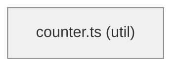

# vue-counter — Specification

_Generated by probevane (vue-vitest-playwright) on 2026-06-24._

## Overview

- 1 modules (1 util); 0 touch the network
- test coverage: 100% statements, 100% branches

## Module graph

```
⚙️ counter.ts
```



## Modules

### src/counter.ts — util

  - exported functions: increment(n: number, step = 1); clamp(n: number, min: number, max: number); isEven(n: number)
